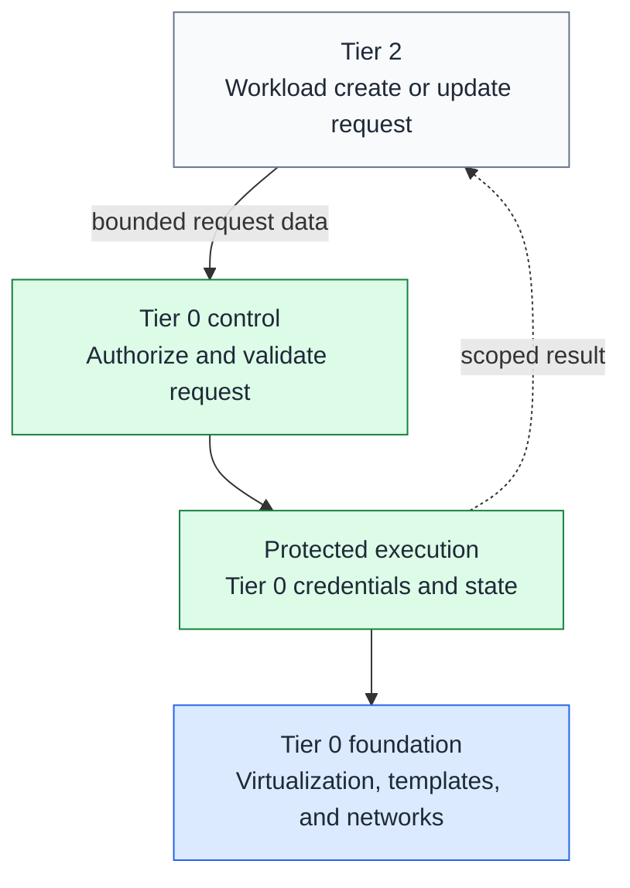

# Infrastructure control

Tier 0 owns the hardware-facing control plane. Workload owners describe what
they need; Tier 0 controls how infrastructure operations are authorized and run.
This applies across all tiers, not only to the machines hosting Tier 0 itself.

## Table of contents

- [Ownership](#ownership)
- [Bootstrap before workloads](#bootstrap-before-workloads)
- [Delegated provisioning](#delegated-provisioning)
- [Request boundary](#request-boundary)
- [Independent operation](#independent-operation)
- [Implementation boundary](#implementation-boundary)

## Ownership

| Responsibility | Owner |
| --- | --- |
| Physical hosts, virtualization, cluster fabric, and storage administration | Tier 0 |
| Network devices, host bridges, network creation, routing, and firewall policy | Tier 0 |
| All VM template creation, refresh, testing, publication, and retirement | Tier 0 |
| Infrastructure credentials, approved execution code, policy, and controllers | Tier 0 |
| Shared platform definitions and service configuration | Tier 1 |
| Project VM requirements, application configuration, and workload lifecycle intent | Tier 2 |
| Template modules, publication commands, and image-build implementations | Tier 0 |
| Guest Terraform resources, inventory, and deployment state | Each owning tier |
| Baseline roles, generic deployment helpers, sizes, and image references | Shared code; no inventory or Terraform resources |

A workload VM does not become Tier 0 just because it runs on a hypervisor.
Conversely, a provisioning controller remains Tier 0 even when every VM it
manages belongs to Tier 2. Guest network attachments consume approved networks;
they do not grant permission to administer the underlying fabric.

Keep the existing tier-local definitions, inventory, and separate state roots.
Workload ownership does not imply access to infrastructure credentials or raw
state. Under delegated execution, Tier 0 must protect the state backend and
serialize writes for each existing root; never create a second state owner.

## Bootstrap before workloads

**Template creation is Day 0-1 infrastructure automation, not deferred until Day 2.**
The first template must be publishable before any managed VM, control cluster,
hosted source-control service, or CI runner exists.

The [Tier 0 deployment path](../paths/tier-0/README.md#deployment-order) owns the
Day 0-3 checklist: prepare infrastructure and independent bootstrap access,
build the cluster foundation, add control services, then prove access handover
and recovery. Source control, artifacts, execution, and state must be usable
before the services that later provide normal identity and secret integration.

Use a protected local execution host for the first publication. Later scheduled
jobs reuse the same Tier 0-owned lifecycle and state. A template-builder VM can
refresh an existing image, but cannot be the only way to create its own first
template. Keep a direct image-import or external build path available.

The [template lifecycle](../platforms/proxmox/template-lifecycle.md) provides the
reference local commands. Hosted job scheduling is optional; it does not move
template ownership or the first publication into Day 2.

## Delegated provisioning

The target capability is **Tier 2 self-service through Tier 0-owned automation**.
Tier 0 operators enable and configure the provisioning service in their own
GitOps definitions. Tier 2 users may then request approved VM creation and
updates without administering the infrastructure or changing the controller.

Arrows show the request contract, not a dependency on Tier 2 for control-plane
operation. No implementation or request API is shipped yet.

## Request boundary

Tier 0 defines the permitted request fields and operations. The intended flow is:

1. Authenticate the requester and check their project/resource ownership.
2. Validate size, quota, image revision, storage, and network against Tier 0 policy.
3. Record the accepted request revision and plan using Tier 0-reviewed code.
4. Apply under scoped credentials and state locking; return a sanitized result.

Preapproved operations may run automatically. Destructive, privileged, or
out-of-policy changes require a separate approval or rejection. A request is
data, not permission to run arbitrary Terraform, providers, provisioners,
Ansible tasks, shell commands, or cluster manifests with Tier 0 credentials.
Do not execute untrusted repository hooks or workload-controlled CI definitions.

| Requested change | Required boundary |
| --- | --- |
| Create or resize a workload VM | approved image/size, project quota, and assigned network/storage |
| Update a guest OS or application | workload-scoped configuration/credentials and maintenance policy |
| Rebuild or replace a VM | explicit lifecycle action, data protection, and rollback/recovery plan |
| Publish a new base template | separate Tier 0 image lifecycle, never a workload user's publish right |
| Alter hosts, networks, policy, or controller permissions | Tier 0 administration, not workload self-service |

A new template version does not update running VMs. Guest patching, rebuilding,
and infrastructure changes remain distinct operations with recorded outcomes.
Return project-scoped status, not infrastructure tokens, raw plans, or state.

## Independent operation

Tier 0 must start, operate, update, and recover without Tier 2 services.
Requests are optional inputs, not runtime or bootstrap dependencies.

- Keep controller definitions, policy, credentials, approved code, and recovery material under Tier 0 control.
- Retain accepted intent and resource records independently of the request source.
- An unavailable request source pauses new requests; it does not stop Tier 0 or delete workloads.
- Missing request files are not deletion approval; require an explicit authorized lifecycle operation.
- Keep local administrative execution available when the controller or hosted tooling is unavailable.

Normal request delivery can use a higher-tier service, but Tier 0 recovery and
existing-resource control must not require that service. Do not let its users
edit the privileged controller, acceptance policy, or shared execution revision.

## Implementation boundary

Today, the kit provides Tier 0 template publication, control-cluster bootstrap,
and operator-run, per-tier Terraform/Ansible workflows. Those workflows are not
a safe self-service API. Host/network administration still includes manual work;
cluster-service directories remain starters. No provisioning controller is enabled by generation.

Retain these roots while developing delegation; do not relocate live inputs or
state as part of a documentation or generator refresh. Before enabling a
controller, choose the request schema, native execution integration, authorization,
state handoff, and outage tests. Validate tenant isolation and reject arbitrary
code before admitting Tier 2 requests. See [Tier 0 bootstrap](../paths/tier-0/bootstrap.md).
