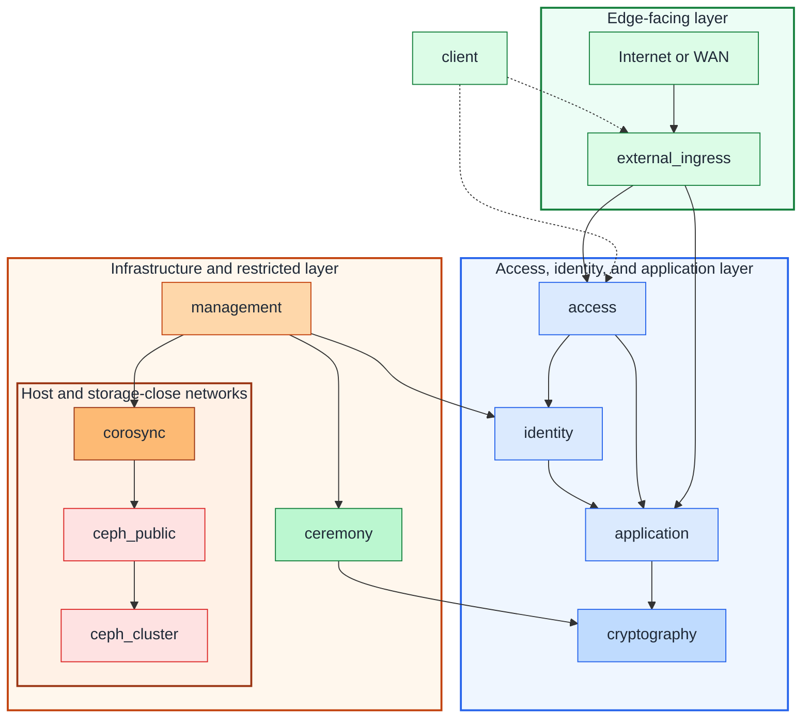

# Network zones and IaC mapping

## Table of contents

- [Purpose](#purpose)
- [Big picture](#big-picture)
- [Zone catalog](#zone-catalog)
- [VLAN ID strategy](#vlan-id-strategy)
- [IaC mapping](#iac-mapping)
- [Stage guidance](#stage-guidance)
- [Proxmox notes](#proxmox-notes)
- [Continue reading](#continue-reading)

## Purpose

Use this document as the shared network reference for the repository.

It gives you one stable set of zone names for:

- architecture and platform planning
- deployable Terraform guest network keys
- Proxmox bridge and VLAN mapping
- later service-specific guides such as the USB HSM lab

Not every zone is required on Day 1. The point is to keep one consistent map so
the repository can grow without renaming networks every time a new sub-project
appears.

## Big picture

Use this pattern model:



Figure: the zone catalog follows the same top-down trust model as the
architecture overview, from public-facing paths at the top to management,
cluster, storage, and custody networks at the bottom.

Use only deployable guest networks in Terraform `network_zones`. Host-only
platform networks stay in platform operations docs and Proxmox host
configuration.

## Zone catalog

Use these zone meanings:

| Zone key | What it is for | Typical users | Guest-facing today |
| --- | --- | --- | --- |
| `client` | reference-only client or endpoint network used when you reason about firewall policy | laptops, workstations, user endpoints, branch clients | reference only |
| `management` | host-management access such as Proxmox UI, API, SSH, IaC runners, bastions, and management endpoints | admins, automation helpers | yes |
| `access` | access, SSO, and controlled user-entry services | Keycloak, SSO portals, VPN, ZTNA, access gateways | yes |
| `identity` | identity, domain, DNS, and directory support services | FreeIPA replicas, Samba AD support, DNS, directory support services | yes |
| `corosync` | cluster membership, quorum, and node coordination | Proxmox cluster nodes | no |
| `ceph_public` | Ceph client-facing storage traffic | hypervisors, storage clients, selected guests | usually no |
| `ceph_cluster` | Ceph replication, recovery, and back-end storage traffic | Ceph nodes only | no |
| `application` | shared internal application traffic and service consumers | Vault, APIs, apps, internal callers | yes |
| `cryptography` | live cryptography and issuing-CA service plane | HSM gateways, issuing CA services, signing APIs, PKI frontends | yes |
| `ceremony` | restricted custody, provisioning, recovery, and root-CA path | offline root CA, recovery hosts, provisioning hosts, ceremony helpers | sometimes |
| `external_ingress` | external ingress, edge proxies, and controlled edge-facing services | proxies, selected edge services | yes |

Practical notes:

- in the current Proxmox pattern, `management` is the host-management network
  used to reach the hypervisor web UI, API, and SSH
- `access` is where you place `Keycloak`, SSO portals, VPN entry points, or
  other controlled user-entry services when they deserve their own subnet or
  VLAN
- domain, DNS, and shared identity services usually live on `identity`, such as
  `FreeIPA` replicas
- `application` is the shared internal application network
- `cryptography` is the live service microsegment for HSM-backed gateways,
  signing services, and the online issuing CA when you keep those systems
  together
- `ceremony` does not mean the USB device itself is networked; it is the
  restricted path around an offline root CA, recovery, provisioning, and
  custody-adjacent systems
- `client` is usually a reference-only zone for firewall rules and access paths
  rather than a repo-managed guest network
- `corosync`, `ceph_public`, and `ceph_cluster` become active when the platform
  grows into clustering or storage separation; keep them out of Terraform
  guest placement unless you intentionally deploy guests onto those networks

## VLAN ID strategy

Use one VLAN ID plan across the environment and decide it early.

The important part is not the exact numbers. The important part is that related
network types stay grouped so they are easier to sort, review, and extend later.

Use a range model such as this:

| VLAN ID range | Suggested use | Example zones |
| --- | --- | --- |
| `2-99` | critical control, access, identity, clustering, and storage | `management`, `access`, `identity`, host-only cluster and storage VLANs |
| `100-199` | shared internal application networks | `application` |
| `200-299` | cryptography and ceremony networks | `cryptography`, `ceremony` |
| `300-399` | edge-facing paths | `external_ingress`, ingress, reverse proxies |
| `400+` | local extensions and future segments | site-specific app, lab, or client-reference networks |

One example based on that pattern is:

| Zone key | Example VLAN ID |
| --- | --- |
| `management` | `10` |
| `access` | `11` |
| `identity` | `12` |
| `corosync` | `20` |
| `ceph_public` | `21` |
| `ceph_cluster` | `22` |
| `application` | `120` |
| `cryptography` | `220` |
| `ceremony` | `221` |
| `external_ingress` | `320` |
| `client` | reference only |

## IaC mapping

Use the same guest-facing keys in Terraform:

```hcl
network_zones = {
  management = {
    bridge    = "vmbr0"
    vlan_id   = 10
    cidr_ipv4 = "10.10.10.0/24"
  }
  access = {
    bridge    = "vmbr0"
    vlan_id   = 11
    cidr_ipv4 = "10.10.11.0/24"
  }
  identity = {
    bridge    = "vmbr0"
    vlan_id   = 12
    cidr_ipv4 = "10.10.12.0/24"
  }
  application = {
    bridge    = "vmbr0"
    vlan_id   = 120
    cidr_ipv4 = "10.20.20.0/24"
  }
  cryptography = {
    bridge    = "vmbr0"
    vlan_id   = 220
    cidr_ipv4 = "10.20.21.0/24"
  }
  ceremony = {
    bridge    = "vmbr0"
    vlan_id   = 221
    cidr_ipv4 = "10.20.22.0/24"
  }
  external_ingress = {
    bridge    = "vmbr0"
    vlan_id   = 320
    cidr_ipv4 = "10.30.30.0/24"
  }
}

default_proxmox_node_name = "pve01"

vm_instances = {
  "signer-gw-1" = {
    size             = "small"
    storage_class    = "local"
    disk_size_gb     = 30
    network_zone_key = "cryptography"
    tags             = ["hsm-gateway"]
  }
}
```

Use these field meanings:

| Field | Meaning | Current repository use |
| --- | --- | --- |
| `default_proxmox_node_name` | default Proxmox host that receives guests | consumed by VM and LXC placement |
| `vm_instances.<key>` | guest hostname and Proxmox VM name | joins Terraform placement with Ansible inventory |
| `vm_instances.<key>.tags` | Proxmox tags for filtering and ownership | consumed by VM and LXC placement |
| `network_zones.<key>.bridge` | Proxmox bridge name for that zone | consumed by VM and LXC placement |
| `network_zones.<key>.vlan_id` | VLAN tag for that zone when your bridge is VLAN-aware | consumed by VM placement and kept as shared reference |
| `network_zones.<key>.cidr_ipv4` | planning subnet for the zone | documentation and operator reference |
| `network_zones.<key>.gateway_ipv4` | default guest gateway when you assign static addresses | consumed when a guest does not override the gateway |
| `network_zones.<key>.notes` | local planning context or reminders | documentation and operator reference |
| `vm_instances.*.network_zone_key` | which zone a VM belongs to | selects the bridge and optional VLAN |
| `lxc_instances.*.network_zone_key` | which zone an LXC belongs to | selects the bridge |

This is the intended split:

- put durable naming and logical intent in `network_zones`
- put guest placement in `vm_instances` or `lxc_instances`
- keep host-only platform networks, switch, firewall, and router
  implementation details outside Terraform

## Stage guidance

Use the catalog progressively:

| Stage | Zones you usually need now | Zones you can leave as reference only |
| --- | --- | --- |
| identity foundation | `management`, `identity`, `cryptography`, optional `ceremony` | `access`, `application`, `external_ingress`, `client`, host-only platform networks |
| early private cloud | `management`, `identity`, `cryptography`, `application`, optional `access`, optional `external_ingress`, optional `ceremony` | `client`, host-only platform networks |
| clustered platform | `management`, `identity`, `application`, optional `access`, optional `external_ingress` | `cryptography`, `ceremony`, `client`, host-only platform networks |
| storage-heavy platform | `management`, `identity`, `application` | `access`, `external_ingress`, `cryptography`, `ceremony`, `client`, host-only platform networks |
| HSM or signing lab | `management`, `identity`, `application`, `cryptography`, optional `ceremony`, optional `external_ingress` | `access`, `client`, host-only platform networks |

This is why the Terraform examples only include networks where automation may
place guests. You do not need to run every network before the repository is
useful.

## Proxmox notes

For Proxmox in this repository:

- your switch and firewall design must already make the segmentation real
- Proxmox bridges expose those segments to guests
- a bridge may carry one flat network or multiple VLANs depending on your host
  design
- if you use VLAN-aware bridges, keep the bridge names stable and move the
  segmentation detail into `vlan_id`

Repository boundary:

- this repo maps guests into named zones
- this repo does not configure the physical switch, router, or firewall
- underlay networking still needs its own operational documentation

## Continue reading

- [Architecture overview](overview.md)
- [Proxmox host networking](../platforms/proxmox/network-prerequisites.md)
- [USB HSM active-active blueprint](../security/usb-hsm-active-active-blueprint.md)
