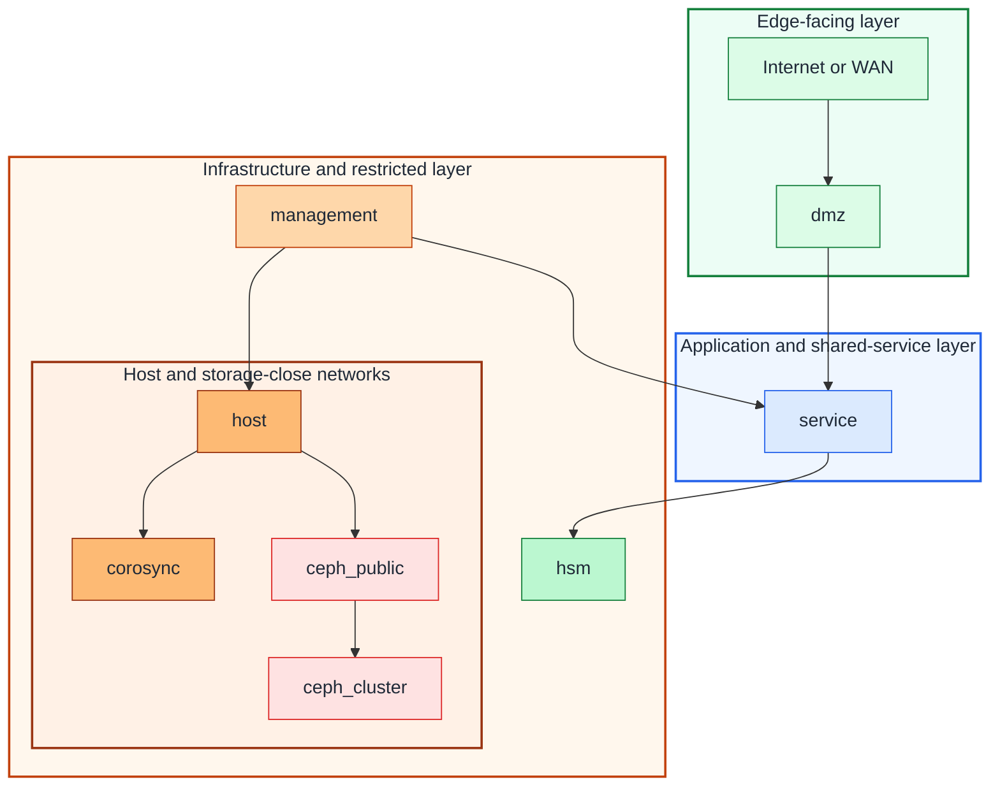

# Network zones and IaC mapping

## Table of contents

- [Purpose](#purpose)
- [Big picture](#big-picture)
- [Zone catalog](#zone-catalog)
- [IaC mapping](#iac-mapping)
- [Stage guidance](#stage-guidance)
- [Proxmox notes](#proxmox-notes)
- [Continue reading](#continue-reading)

## Purpose

Use this document as the shared network reference for the repository.

It gives you one stable set of zone names for:

- architecture and platform planning
- Terraform variable keys
- Proxmox bridge and VLAN mapping
- later service-specific guides such as the Pico HSM lab

Not every zone is required on Day 1. The point is to keep one consistent map so
the repository can grow without renaming networks every time a new sub-project
appears.

## Big picture

Use this pattern model:



Figure: the zone catalog follows the same top-down trust model as the
architecture overview, from public-facing paths at the top to hardware-close
host, cluster, storage, and HSM-related networks at the bottom.

The keys above are the same keys you should use in Terraform `network_zones`.

## Zone catalog

Use these zone meanings:

| Zone key | What it is for | Typical users | Guest-facing today |
| --- | --- | --- | --- |
| `management` | operator access, IaC runners, bastions, management endpoints | admins, automation, bootstrap helpers | yes |
| `host` | hypervisor host OS services when separated from management | Proxmox hosts, host-level agents | usually no |
| `corosync` | cluster membership, quorum, and node coordination | Proxmox cluster nodes | no |
| `ceph_public` | Ceph client-facing storage traffic | hypervisors, storage clients, selected guests | usually no |
| `ceph_cluster` | Ceph replication, recovery, and back-end storage traffic | Ceph nodes only | no |
| `service` | shared services and internal application traffic | Vault, DNS, APIs, apps, internal callers | yes |
| `hsm` | restricted signing, PKCS#11 helper, recovery, or custody-adjacent paths | HSM helpers, signing gateways, recovery hosts | sometimes |
| `dmz` | ingress, reverse proxies, externally exposed services | proxies, gateways, selected edge services | yes |

Practical notes:

- domain, DNS, and identity services usually live on `service` unless you split
  out a dedicated shared-services segment later
- `hsm` does not mean the USB device itself is networked; it is the restricted
  path around helper, recovery, or signing-adjacent systems
- `host`, `corosync`, `ceph_public`, and `ceph_cluster` are often planning
  references before they are guest-facing Terraform inputs

## IaC mapping

Use the same keys in Terraform:

```hcl
network_zones = {
  management = {
    bridge    = "vmbr0"
    vlan_id   = 10
    cidr_ipv4 = "10.10.10.0/24"
  }
  service = {
    bridge    = "vmbr0"
    vlan_id   = 20
    cidr_ipv4 = "10.20.20.0/24"
  }
  dmz = {
    bridge    = "vmbr0"
    vlan_id   = 30
    cidr_ipv4 = "10.30.30.0/24"
  }
}

vm_instances = {
  vault01 = {
    name             = "vault01"
    node_name        = "pve01"
    network_zone_key = "service"
    ipv4_address     = "dhcp"
  }
}
```

Use these field meanings:

| Field | Meaning | Current repository use |
| --- | --- | --- |
| `network_zones.<key>.bridge` | Proxmox bridge name for that zone | consumed by VM and LXC placement |
| `network_zones.<key>.vlan_id` | VLAN tag for that zone when your bridge is VLAN-aware | consumed by VM placement and kept as shared reference |
| `network_zones.<key>.cidr_ipv4` | planning subnet for the zone | documentation and operator reference |
| `network_zones.<key>.gateway_ipv4` | default guest gateway when you assign static addresses | consumed when a guest does not override the gateway |
| `network_zones.<key>.notes` | local planning context or reminders | documentation and operator reference |
| `vm_instances.*.network_zone_key` | which zone a VM belongs to | selects the bridge and optional VLAN |
| `lxc_instances.*.network_zone_key` | which zone an LXC belongs to | selects the bridge |

This is the intended split:

- put durable naming and logical intent in `network_zones`
- put guest placement in `vm_instances` or `lxc_instances`
- keep switch, firewall, and router implementation details outside this repo

## Stage guidance

Use the catalog progressively:

| Stage | Zones you usually need now | Zones you can leave as reference only |
| --- | --- | --- |
| first bootstrap | `management`, `service` | `host`, `corosync`, `ceph_public`, `ceph_cluster`, `hsm`, `dmz` |
| early private cloud | `management`, `service`, `dmz` | `host`, `corosync`, `ceph_public`, `ceph_cluster`, `hsm` |
| clustered platform | `management`, `host`, `corosync`, `service`, optional `dmz` | `ceph_public`, `ceph_cluster`, `hsm` |
| storage-heavy platform | `management`, `host`, `corosync`, `ceph_public`, `ceph_cluster`, `service` | `dmz`, `hsm` |
| HSM or signing lab | `management`, `service`, `hsm`, optional `dmz` | `host`, `corosync`, `ceph_public`, `ceph_cluster` unless also clustering storage |

This is why the examples keep extra zones in comments or placeholders. You do
not need to run every network before the repository is useful.

## Proxmox notes

For Proxmox in this repository:

- your switch and firewall design must already make the segmentation real
- Proxmox bridges expose those segments to guests
- a bridge may carry one flat network or multiple VLANs depending on your host
  design
- if you use VLAN-aware bridges, keep the bridge names stable and move the
  segmentation detail into `vlan_id`

Repository boundary:

- this repo maps guests into named zones
- this repo does not configure the physical switch, router, or firewall
- underlay networking still needs its own operational documentation

## Continue reading

- [Architecture overview](overview.md)
- [Proxmox network prerequisites](../platforms/proxmox/network-prerequisites.md)
- [Pico HSM active-active blueprint](../security/picohsm-active-active-blueprint.md)
