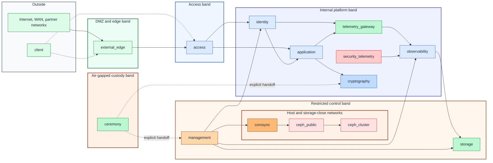

# Network architecture

## Table of contents

- [Purpose](#purpose)
- [Big picture](#big-picture)
- [Tier overlay](#tier-overlay)
- [Zone catalog](#zone-catalog)
- [VLAN ID strategy](#vlan-id-strategy)
- [Automation mapping](#automation-mapping)
- [Stage guidance](#stage-guidance)
- [Proxmox notes](#proxmox-notes)
- [Continue reading](#continue-reading)

## Purpose

Use this document as the shared network reference for the repository.

It gives you one stable set of zone names for:

- architecture and platform planning
- deployable Terraform guest network keys
- Proxmox bridge and VLAN mapping
- later service-specific guides such as the USB HSM deployment

Not every zone is required on Day 1. The point is to keep one consistent map so
the repository can grow without renaming networks every time a new sub-project
appears.

## Big picture

Use this left-to-right exposure model:



Figure: the zone catalog moves from DMZ-facing paths on the left toward
restricted control and air-gapped custody on the right.

Use only deployable guest networks in Terraform `network_zones`. Host-only
platform networks stay in platform operations docs and Proxmox host
configuration.

## Tier overlay

Tiers and network bands are separate dimensions.

| Network band | Common zones | Tier relationship |
| --- | --- | --- |
| DMZ and edge | `external_edge` | Tier 1 or Tier 2 interfaces |
| Access | `access` | user or administrator entry points |
| Internal platform | `identity`, `application`, telemetry, cryptography | Tier 1 by default |
| Restricted control | `management`, `storage`, host-only fabric | controlled interface networks |
| Air-gapped custody | `ceremony`, offline recovery paths | Tier 0 residency and recovery custody |

Tier 0 systems live in the air-gapped custody band. Custody handoffs transfer
approved artifacts and trust material; they are not routed network links.
Online service endpoints belong to connected tiers. Interface networks can
join connected tier consumers only when their dependency direction, owner,
policy, and consumers are documented. They never bridge the air gap.

## Zone catalog

Use these zone meanings:

| Zone key | What it is for | Typical users | Guest-facing today |
| --- | --- | --- | --- |
| `client` | reference-only client or endpoint network used when you reason about firewall policy | laptops, workstations, user endpoints, branch clients | reference only |
| `management` | host-management access such as Proxmox UI, API, SSH, IaC runners, bastions, and management endpoints | admins, automation helpers | yes |
| `access` | access, SSO, and controlled user-entry services | identity brokers, SSO portals, VPN, ZTNA, access gateways | yes |
| `identity` | identity, domain, DNS, and directory support services | identity authority replicas, directory support services, DNS | yes |
| `corosync` | cluster membership, quorum, and node coordination | Proxmox cluster nodes | no |
| `ceph_public` | Ceph client-facing storage traffic | hypervisors, storage clients, selected guests | usually no |
| `ceph_cluster` | Ceph replication, recovery, and back-end storage traffic | Ceph nodes only | no |
| `application` | shared internal application traffic and service consumers | secret services, APIs, apps, internal callers | yes |
| `observability` | telemetry backends, dashboards, and query endpoints | metrics, logs, traces, dashboards, and query services | yes |
| `telemetry_gateway` | telemetry routing and enrichment before backend storage | telemetry gateways, agents, relays, and routers | yes |
| `security_telemetry` | hardened security log and audit intake | syslog collectors, audit collectors, security event intake | yes |
| `cryptography` | live cryptography and issuing-CA service plane | HSM gateways, issuing CA services, signing APIs, PKI frontends | yes |
| `ceremony` | restricted custody, provisioning, recovery, and root-CA path | offline root CA, recovery hosts, provisioning hosts, ceremony helpers | sometimes |
| `storage` | storage service and archive access for guests that need it | archive writers, NAS gateways, object storage gateways | sometimes |
| `external_edge` | external edge, edge load balancers, ingress, and controlled egress | edge load balancers, selected edge services | yes |

Practical notes:

- in the current Proxmox pattern, `management` is the host-management network
  used to reach the hypervisor web UI, API, and SSH
- `access` is where you place identity brokers, SSO portals, VPN entry points,
  or other controlled user-entry services when they deserve their own subnet or
  VLAN
- domain, DNS, and shared identity services usually live on `identity`, such as
  identity authority replicas
- `application` is the shared internal application network
- `observability` is where telemetry backends and dashboards live
- `telemetry_gateway` is where telemetry is received, enriched, sampled, and
  routed before it reaches backends
- `security_telemetry` is the hardened intake path for syslog, audit, and
  selected security events
- `cryptography` is the live service microsegment for HSM-backed gateways,
  signing services, and the online issuing CA when you keep those systems
  together
- `storage` is for guest-facing archive or storage-service access; it is
  separate from host-only Ceph replication networks
- `ceremony` does not mean the USB device itself is networked; it is the
  restricted path around an offline root CA, recovery, provisioning, and
  custody-adjacent systems
- `client` is usually a reference-only zone for firewall rules and access paths
  rather than a repo-managed guest network
- `corosync`, `ceph_public`, and `ceph_cluster` become active when the platform
  grows into clustering or storage separation; keep them out of Terraform
  guest placement unless you intentionally deploy guests onto those networks

## VLAN ID strategy

Use one VLAN ID plan across the environment and decide it early.

The important part is not the exact numbers. The important part is that related
network types stay grouped so they are easier to sort, review, and extend later.

Use a range model such as this:

| VLAN ID range | Suggested use | Example zones |
| --- | --- | --- |
| `2-99` | critical control, access, identity, clustering, and storage | `management`, `access`, `identity`, host-only cluster and storage VLANs |
| `100-199` | shared internal application and observability networks | `application`, `observability` |
| `200-299` | telemetry, cryptography, and ceremony networks | `telemetry_gateway`, `security_telemetry`, `cryptography`, `ceremony` |
| `300-399` | edge-facing paths | `external_edge`, ingress, egress, reverse proxies |
| `400+` | local extensions and future segments | site-specific app, lab, or client-reference networks |

One example based on that pattern is:

| Zone key | Example VLAN ID |
| --- | --- |
| `management` | `10` |
| `access` | `11` |
| `identity` | `12` |
| `corosync` | `20` |
| `ceph_public` | `21` |
| `ceph_cluster` | `22` |
| `application` | `120` |
| `observability` | `130` |
| `storage` | `140` |
| `cryptography` | `220` |
| `ceremony` | `221` |
| `telemetry_gateway` | `230` |
| `security_telemetry` | `231` |
| `external_edge` | `320` |
| `client` | reference only |

## Automation mapping

Use the same guest-facing keys in Terraform `common.tfvars`:

```hcl
network_zones = {
  access = {
    bridge       = "access"
    cidr_ipv4    = "10.10.11.0/24"
    gateway_ipv4 = "10.10.11.1"
  }
  identity = {
    bridge       = "ident"
    cidr_ipv4    = "10.10.12.0/24"
    gateway_ipv4 = "10.10.12.1"
  }
  application = {
    bridge       = "app"
    cidr_ipv4    = "10.20.20.0/24"
    gateway_ipv4 = "10.20.20.1"
  }
  cryptography = {
    bridge       = "crypto"
    cidr_ipv4    = "10.20.21.0/24"
    gateway_ipv4 = "10.20.21.1"
  }
  ceremony = {
    bridge       = "cerem"
    cidr_ipv4    = "10.20.22.0/24"
    gateway_ipv4 = "10.20.22.1"
  }
  external_edge = {
    bridge       = "vmbr0"
    vlan_id      = 320
    cidr_ipv4    = "10.30.30.0/24"
    gateway_ipv4 = "10.30.30.1"
  }
}
```

Then place guests in Terraform setup vars by logical zone:

```hcl
default_platform_node_name = "pve01"

vm_instances = {
  "signer-gw-1" = {
    size             = "small"
    storage_class    = "local"
    disk_size_gb     = 30
    network_zone_key = "cryptography"
    tags             = ["hsm-gateway"]
  }
}
```

Use these field meanings:

| Field | Meaning | Current repository use |
| --- | --- | --- |
| `default_platform_node_name` | default platform node that receives guests | consumed by VM and LXC placement |
| `vm_instances.<key>` | stable logical guest key | joins Terraform placement with Ansible inventory |
| `vm_instances.<key>.tags` | Proxmox tags for filtering and ownership | consumed by VM and LXC placement |
| `network_zones.<key>.bridge` | SDN VNet ID or non-SDN Proxmox bridge name for that guest network | consumed by VM and LXC placement |
| `network_zones.<key>.vlan_id` | optional VLAN tag for non-SDN bridge tagging; omit for SDN VNets | consumed by VM placement |
| `network_zones.<key>.cidr_ipv4` | subnet for static guest addressing | used for static guest CIDR prefixes |
| `network_zones.<key>.gateway_ipv4` | default guest gateway for static addresses | consumed when Terraform builds cloud-init IP config |
| `vm_instances.*.network_zone_key` | which zone a VM belongs to | selects the bridge and optional VLAN |
| `lxc_instances.*.network_zone_key` | which zone an LXC belongs to | selects the bridge |

This is the intended split:

- put VM attachment and static IPv4 metadata in `network_zones`
- put guest hardware shape and zone placement in `vm_instances` or
  `lxc_instances`
- keep host-only platform networks, switch, firewall, and router
  implementation details outside Terraform

## Stage guidance

Use the guest catalog progressively. Host management stays outside Terraform
`network_zones`.

| Stage | Zones you usually need now | Zones you can leave as reference only |
| --- | --- | --- |
| shared private-domain services | `identity`, `cryptography`, optional `ceremony` | `access`, `application`, `external_edge`, `client`, host-only platform networks |
| early private cloud | `identity`, `cryptography`, `application`, optional `access`, optional `external_edge`, optional `ceremony` | `client`, host-only platform networks |
| observability and syslog | `observability`, `telemetry_gateway`, `security_telemetry`, optional `storage` | `access`, `client`, host-only platform networks |
| clustered platform | `identity`, `application`, optional `access`, optional `external_edge` | `cryptography`, `ceremony`, `client`, host-only platform networks |
| storage-heavy platform | `identity`, `application` | `access`, `external_edge`, `cryptography`, `ceremony`, `client`, host-only platform networks |
| HSM or signing lab | `identity`, `application`, `cryptography`, optional `ceremony`, optional `external_edge` | `access`, `client`, host-only platform networks |

This is why the Terraform examples only include networks where automation may
place guests. You do not need to run every network before the repository is
useful.

## Proxmox notes

For Proxmox in this repository:

- your switch and firewall design must already make the segmentation real
- Proxmox bridges expose those segments to guests
- a bridge may carry one flat network or multiple VLANs depending on your host
  design
- if you use VLAN-aware bridges, keep the bridge names stable and move the
  segmentation detail into `vlan_id`

Repository boundary:

- this repo maps guests into named zones
- this repo does not configure the physical switch, router, or firewall
- underlay networking still needs its own operational documentation

## Continue reading

- [Architecture overview](overview.md)
- [Proxmox host networking](../platforms/proxmox/network-prerequisites.md)
- [USB HSM active-active blueprint](../security/usb-hsm-active-active-blueprint.md)
