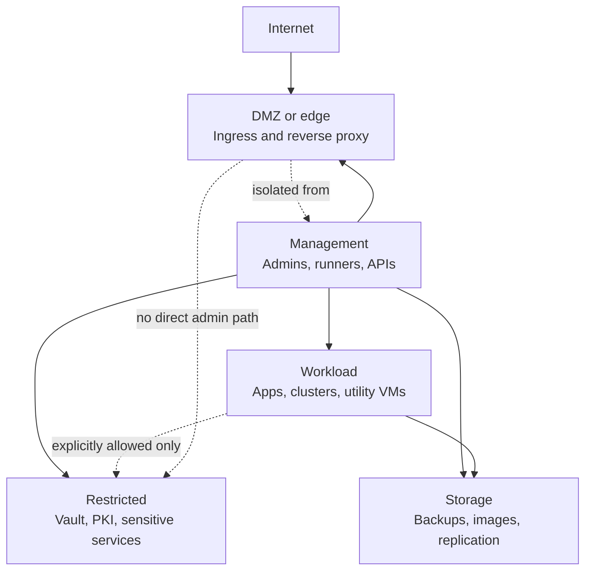
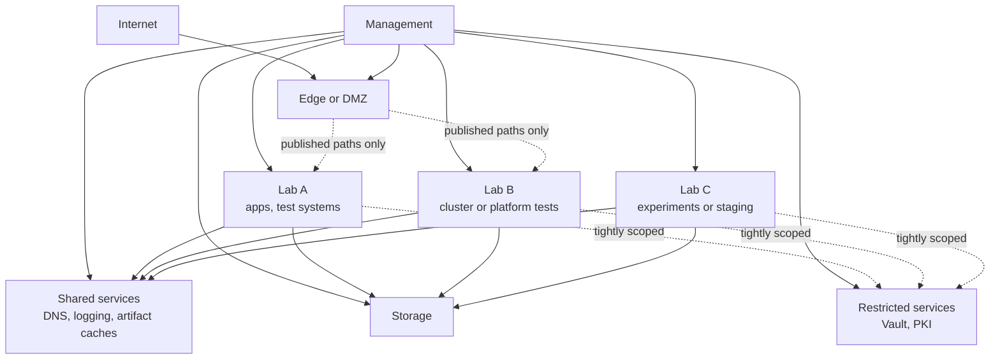
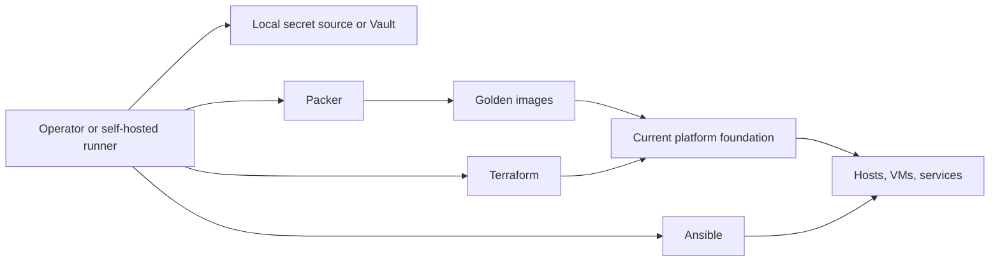
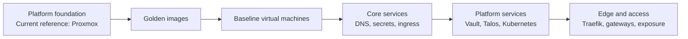
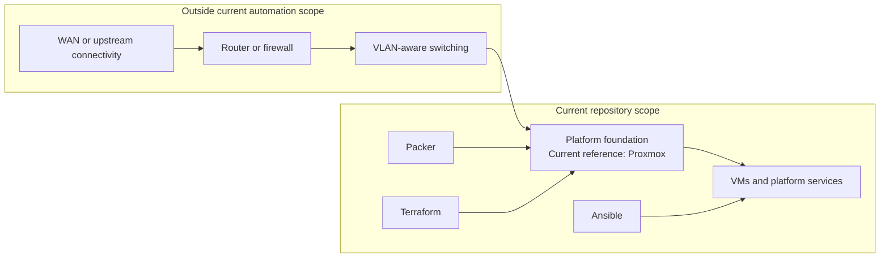
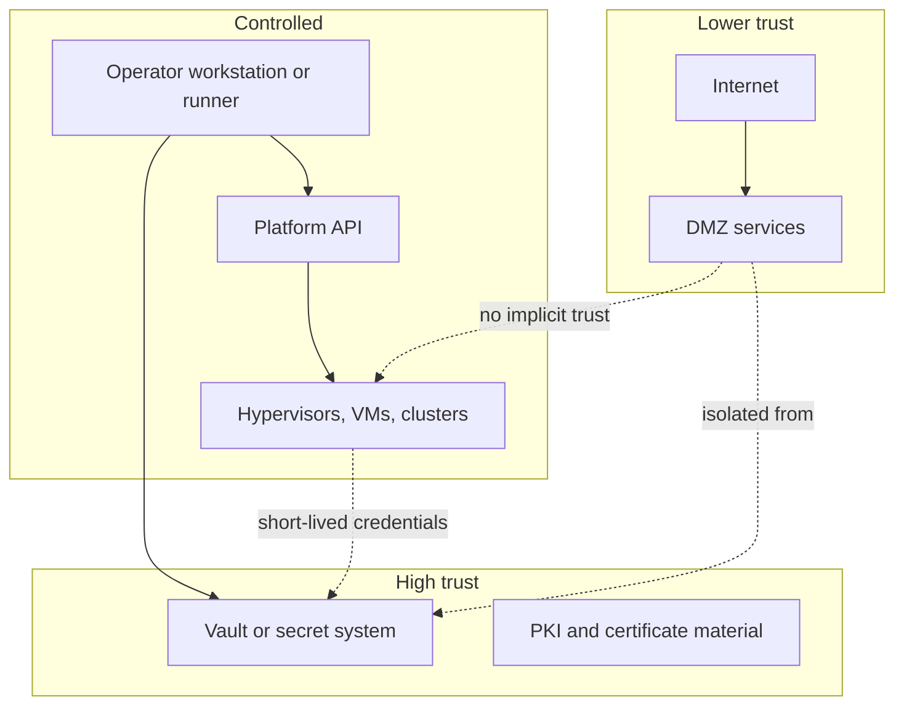

# Architecture overview

## Table of contents

- [Intent](#intent)
- [Private cloud design model](#private-cloud-design-model)
- [Mapping to public cloud concepts](#mapping-to-public-cloud-concepts)
- [Layered network model](#layered-network-model)
- [Multi-lab segmentation](#multi-lab-segmentation)
- [Automation flow](#automation-flow)
- [Platform progression](#platform-progression)
- [Network prerequisites](#network-prerequisites)
- [Current automation boundary](#current-automation-boundary)
- [Trust boundaries](#trust-boundaries)

## Intent

This baseline is organized around clear trust boundaries, layered networking,
and a strict separation between image build, infrastructure provisioning, and
configuration management. The goal is fast repeatability with a high security
posture and low operational drift.

## Private cloud design model

This repository should feel familiar to users coming from AWS or Google Cloud.
The goal is not to copy public cloud services one-to-one, but to use similar
patterns for separation, shared services, restricted services, and workload
placement so the homelab can evolve into a simple private cloud.

Core design ideas:

- separate management from workloads
- keep edge or DMZ services isolated from internal control paths
- provide shared services as common platform building blocks
- isolate sensitive services behind tighter trust boundaries
- segment labs or environments in a VPC-like way without overcomplicating it

## Mapping to public cloud concepts

| This repository | Familiar public cloud pattern |
| --- | --- |
| Management network | admin plane or management subnet |
| Edge or DMZ | ingress tier or public subnet |
| Shared services zone | shared services VPC, project, or hub |
| Lab network | workload VPC or application subnet |
| Restricted services | security services project or restricted subnet |
| Proxmox cluster | compute foundation |
| Golden images | machine images or templates |

These are pattern analogies, not feature-equivalent implementations.

## Layered network model

| Zone | Purpose | Access pattern |
| --- | --- | --- |
| Management | control plane and administration | tightly restricted |
| DMZ or edge | ingress and public entry points | minimized exposure |
| Workload | application and platform workloads | segmented by role |
| Storage | backups and replicated data | explicit allow-list only |
| Restricted | secrets, PKI, sensitive control services | highest trust boundary |

## Multi-lab segmentation

A simple model is to treat each lab or environment as its own workload segment
while reusing shared management, edge, storage, and restricted services.

This gives a simple private-cloud model that feels similar to VPC or project
segmentation without needing complex overlays from the start.

## Automation flow

## Platform progression

This repository should stay broader than the current platform implementation.
Proxmox is the current reference foundation, not the permanent identity.

## Network prerequisites

The current automation assumes the network underlay already exists.

Required capabilities outside this repository:

- VLAN-aware switching
- routing between networks where intentionally allowed
- firewall policy between management, edge, workload, storage, and restricted
  segments
- gateway or router support for upstream and inter-VLAN traffic
- DNS, DHCP, and IP planning aligned with the chosen segmentation model

Important current limitation:

- Proxmox can attach bridges and VLAN-tagged interfaces for guests
- this repository does not currently manage the external router, switch, or
  firewall configuration that makes those VLANs usable end-to-end

That means network segmentation must be designed and working before the full
platform automation is applied.

## Current automation boundary

Future network automation may include router or firewall integration, for
example through vendor APIs such as Ubiquiti, but that is not part of the
current baseline.

## Trust boundaries

