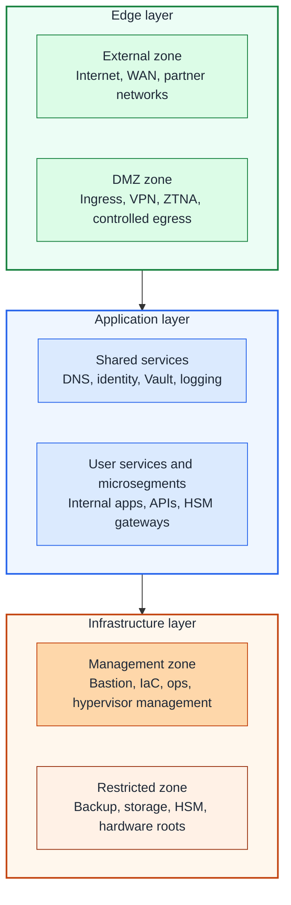
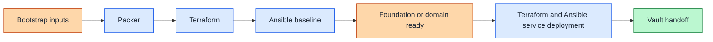

# Architecture overview

## Table of contents

- [Purpose](#purpose)
- [Goals](#goals)
- [Layered model](#layered-model)
- [Automation flow](#automation-flow)
- [Network references](#network-references)
- [Boundaries](#boundaries)

## Purpose

This repository is a private-cloud baseline built around clear trust
boundaries, layered networking, and a strict split between image creation,
resource provisioning, and configuration management.

The design is meant to stay stable as the environment grows. The number of
segments, hosts, and services can change without changing the core model.

## Goals

- clear separation of edge, application, and infrastructure concerns
- no implicit trust between zones
- controlled remote user and administrator access
- reusable structure for IaC and multi-cloud thinking
- clear placement of identity, secrets, and hardware-backed systems

## Layered model

Figure: trust increases as you move from edge-facing systems toward management
and restricted infrastructure services.

This is a pattern model, not a public-cloud feature match. Proxmox is the
current foundation layer, but the architecture is broader than a single
platform.

Proxy placement in this architecture:

- an edge proxy in `dmz` handles early ingress and controlled egress for
  infrastructure and host-based services
- a separate internal cluster proxy can be added later when Kubernetes becomes
  part of the platform

## Automation flow

Each tool has one primary job:

- Packer builds reusable images when custom templates are needed
- Terraform provisions bootstrap foundation or domain hosts first and later
  shared-service hosts
- Ansible applies baseline configuration first and then service-specific
  playbooks, such as Vault, on dedicated hosts

Figure: image build, foundation bootstrap, and later shared-service deployment
stay separate until the first Vault handoff.

Vault is treated as an early shared service that follows the bootstrap
foundation or domain layer, so the platform can reduce bootstrap-only secret
handling before broader service deployment.

## Network references

Use the shared zone catalog in
[Network zones and IaC mapping](network-zones-and-iac-mapping.md) when you pick
subnets, VLANs, Proxmox bridges, and guest placement keys. That document is the
repository source of truth for zone names such as `management`, `service`,
`hsm_gateway`, `dmz`, and `hsm`.

## Boundaries

Current repository scope:

- platform-facing automation
- reusable templates and images
- VM and container provisioning
- baseline guest and host configuration

Outside current scope:

- router, firewall, and switch underlay configuration
- end-to-end network fabric automation

Operating assumptions:

- management paths stay separate from workloads
- edge services do not get implicit access to management or restricted systems
- workload access to secrets and other high-trust services is explicit
- network segmentation must already exist before full platform automation
- the `dmz` edge proxy stays separate from any later Kubernetes-specific
  cluster proxy
