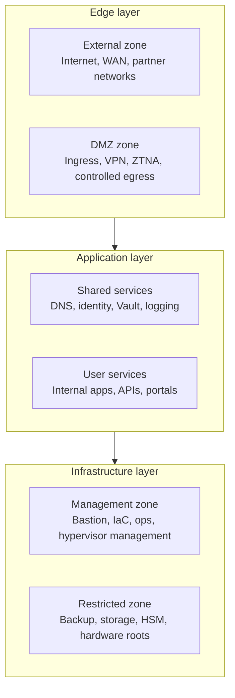

# Architecture overview

## Table of contents

- [Purpose](#purpose)
- [Goals](#goals)
- [Layered model](#layered-model)
- [Automation flow](#automation-flow)
- [Boundaries](#boundaries)

## Purpose

This repository is a private-cloud baseline built around clear trust
boundaries, layered networking, and a strict split between image creation,
resource provisioning, and configuration management.

The design is meant to stay stable as the environment grows. The number of
segments, hosts, and services can change without changing the core model.

## Goals

- clear separation of edge, application, and infrastructure concerns
- no implicit trust between zones
- controlled remote user and administrator access
- reusable structure for IaC and multi-cloud thinking
- clear placement of identity, secrets, and hardware-backed systems

## Layered model

Figure: trust increases as you move from edge-facing systems toward management
and restricted infrastructure services.

This is a pattern model, not a public-cloud feature match. Proxmox is the
current foundation layer, but the architecture is broader than a single
platform.

## Automation flow

Each tool has one primary job:

- Packer builds reusable images when custom templates are needed
- Terraform provisions the first managed Vault node and other platform resources
- Ansible applies baseline configuration and installs Vault on designated
  bootstrap hosts

Figure: image build, provisioning, and configuration stay separate until the
first Vault handoff.

Vault is treated as an early shared service so the platform can reduce
bootstrap-only secret handling before broader service deployment.

## Boundaries

Current repository scope:

- platform-facing automation
- reusable templates and images
- VM and container provisioning
- baseline guest and host configuration

Outside current scope:

- router, firewall, and switch underlay configuration
- end-to-end network fabric automation

Operating assumptions:

- management paths stay separate from workloads
- edge services do not get implicit access to management or restricted systems
- workload access to secrets and other high-trust services is explicit
- network segmentation must already exist before full platform automation
