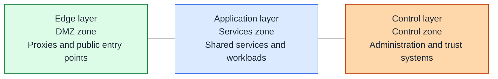
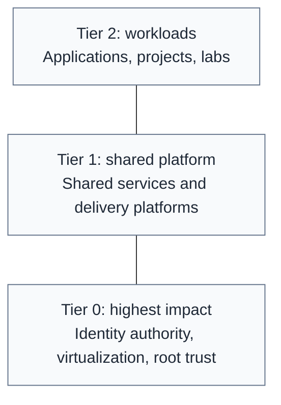
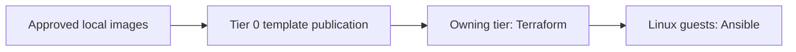

# Architecture overview

## Table of contents

- [Purpose](#purpose)
- [Goals](#goals)
- [Layered model](#layered-model)
- [Tiered model](#tiered-model)
- [Tier and zone view](#tier-and-zone-view)
- [Automation flow](#automation-flow)
- [Network references](#network-references)
- [Boundaries](#boundaries)

## Purpose

A private-cloud baseline with one guiding rule: **it should be easy to do right**.
Use two separate questions to place a system:

| Question | Model | Decides |
| --- | --- | --- |
| How much could its compromise damage or control? | Tier | owning repo, credentials, review, and recovery responsibility |
| What should be reachable from outside? | Network layer | subnet placement and firewall policy |

Tier 0 contains the highest-impact control systems, Tier 1 shared platform
services, and Tier 2 workloads. A tier is not a firewall zone. An air gap is
a separate protection for selected custody assets, not the definition of Tier 0.

For the wider platform scope, read [Private cloud model](private-cloud.md).
For the service backbone, read [Shared services](shared-services.md).

## Goals

- ownership and network protection are easy to distinguish
- lower-numbered tiers cannot be taken over through higher-tier credentials
- traffic is allowed by explicit service rules, not by labels
- control systems can recover without application workloads or hosted tooling
- reusable automation stays separate from each tier's inventory and state

## Layered model

Draw protection from outside inward, left to right: **Edge**, **Application**,
**Control**. The example firewall zones are `DMZ`, `Services`, and `Control`.

Lines show protective ordering, not permitted traffic or a required path.
Keep public entry points at the edge and expose only the required backend
listeners. Moving inward does not grant trust.

The Control layer is not the `management` network: administration, identity
authority, and cryptographic services can use separate networks within it.
Compute, storage, and networking support all layers. Offline custody is
separate from the connected network.

## Tiered model

Draw **Tier 2 at the top**, **Tier 1 in the middle**, and **Tier 0 at the bottom**.
Potential damage and required protection increase downward.

Lines show classification, not connectivity. Each tier has its own repository,
inventory, workload credentials, and state roots. Infrastructure administration
stays under Tier 0 control. Classify a system by what it can control,
not just its product name or whether it is online.

Tier 0 can provide connected services. Offline root keys and recovery copies
remain separately isolated. Tier 0 must still recover without Tier 1 or Tier 2;
see [Tier model](tier-model.md).

Tier 0 supplies hosts, networks, and templates before workloads are created.
Tier-local workload definitions remain separate from privileged execution;
see [Infrastructure control](infrastructure-control.md) for bootstrap and the
future Tier 2 request path.

## Tier and zone view

Keep ownership and network placement as separate columns, not a grid of
tier-prefixed zone names. Networks appear within the layers above.

| System / interface | Repo | Layer / example zone | Reason |
| --- | --- | --- | --- |
| Shared reverse proxy | Tier 1 | Edge / `DMZ` | publishes selected backend services |
| Source-control service | Tier 1 | Application / `Services` | supports project delivery |
| Project application | Tier 2 | Application / `Services` | owns a workload, not platform authority |
| Identity authority | Tier 0 | Control / `Control` | compromise can affect domain-wide access |
| Hypervisor admin API | Tier 0 | Control / `Control` | can control the guests beneath every tier |
| Offline root key or recovery copy | Tier 0 | isolated custody; no connected zone | must not be reachable through the live platform |

A shared zone does not mean a shared subnet or unrestricted access. Keep
subnets separate where trust or policy differs, and filter between them.
A service with multiple interfaces may need different placement for its
public listener, backend, and administration path.

| Term | What it decides |
| --- | --- |
| Tier | impact and repository ownership |
| Layer | outside-to-inside network protection |
| Firewall zone | a policy group, such as `DMZ` or `Services` |
| Network | a specific VLAN/subnet assigned to one zone |
| Firewall rule | allowed source, destination, protocol, and listener |

For example, a Tier 1 proxy in `DMZ` can publish a Tier 2 backend in
`Services`. The backend can use a Tier 0 identity endpoint through a scoped
rule. Neither connection grants administrative access to the provider.

## Automation flow

Each tool has one primary job:

- Tier 0 owns template creation, testing, and approval because images affect many guests.
- Shared code implements image publication, provisioning, and configuration.
- Terraform creates resources from the owning tier's inputs.
- Ansible configures supported Linux guests from the same inventory.
- Cluster bootstrap and reconciliation have their own lifecycle.

Packer remains optional for custom builds. Talos uses machine bootstrap rather
than Ansible guest configuration. Local tools, artifacts, credentials, and
state must allow recovery before hosted automation exists. See the
[Tier 0 path](../paths/tier-0/README.md).

## Network references

Use [Network placement](network.md) for zones, network purposes, and VLAN
examples; [firewall policy](../security/firewall-policy.md) for permitted flows;
and [Network inputs](../reference/network-inputs.md) for Terraform attachments.
[UniFi zone setup](../platforms/unifi/zone-firewall.md) translates that model
to one gateway implementation.

Record local names, tags, and number ranges in the generated architecture
repo's `docs/naming-conventions.md`. It is a short worksheet, not a second
network inventory.

## Boundaries

The kit supplies platform-facing automation, images, VM/container provisioning,
and host configuration. Switching, routing, and firewall policy remain
operator-managed prerequisites.

Separate administration from workload traffic, keep credentials scoped to
their impact, and test both allowed and denied flows. A simpler naming model
must not become a broader access policy.
