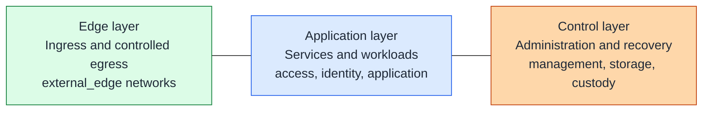
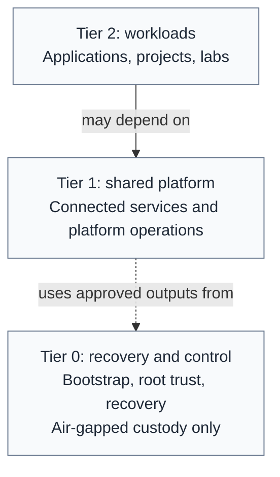
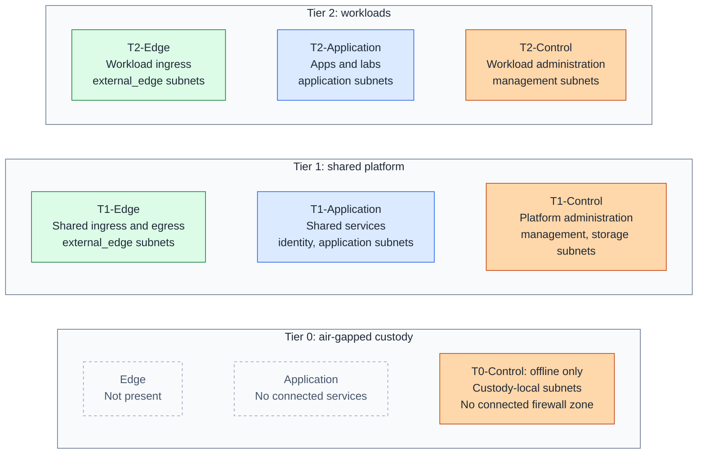
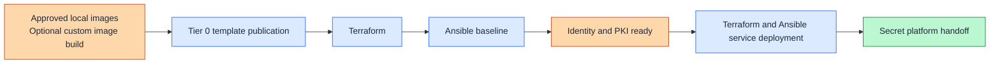

# Architecture overview

## Table of contents

- [Purpose](#purpose)
- [Goals](#goals)
- [Layered model](#layered-model)
- [Tiered model](#tiered-model)
- [Tier and zone view](#tier-and-zone-view)
- [Automation flow](#automation-flow)
- [Network references](#network-references)
- [Boundaries](#boundaries)

## Purpose

This repository is a private-cloud baseline built around enterprise-style trust
boundaries, layered networking, and a strict split between image creation,
resource provisioning, and configuration management.

The design is meant to stay stable as the environment grows. The number of
segments, hosts, and services can change without changing the core model, even
when the platform starts at homelab or small-datacenter scale.

The architecture uses Tier 0, Tier 1, and Tier 2 ownership. Tiers describe
dependency direction and recovery ownership: Tier 0 bootstraps and recovers the
platform, Tier 1 provides shared platform services, and Tier 2 hosts
application or project workloads. Read [Tier model](tier-model.md) before
splitting automation across generated downstream repositories.

For the repository definition of private cloud and the boundary between
Proxmox, Kubernetes, and OpenStack, read
[Private cloud model](private-cloud.md).
For the shared identity, PKI, secrets, and telemetry backbone, read
[Shared services model](shared-services.md).

## Goals

- clear separation of edge, application, and control concerns
- no implicit trust between zones
- controlled remote user and administrator access
- reusable structure for IaC and multi-cloud thinking
- clear placement of identity, secrets, and hardware-backed systems
- lower tiers can recover without higher-tier services

## Layered model

Security layers describe a capability's responsibility and the boundaries
around it. Draw them left to right: **Edge**, **Application**, then
**Control**.

Figure: security layers run from edge-facing functions on the left to
control on the right. Lines show conceptual order, not allowed
traffic or a required request path. Moving right never grants implicit trust.

The **Control layer** includes connected administration and separately isolated
recovery/custody functions. It is a functional boundary, not the `management`
network or a single tier. Compute, storage, and networking support every layer.

This is a pattern model, not a public-cloud feature match. Proxmox is the
current reference platform, but the architecture is broader than a single
platform.

Proxy placement in this architecture:

- an edge load balancer in `external_edge` handles early ingress and
  controlled egress for infrastructure and host-based services
- a separate internal cluster proxy can be added later when Kubernetes becomes
  part of the platform

## Tiered model

Tiers describe ownership, dependency direction, and recovery independence.
Draw **Tier 2 at the top**, **Tier 1 in the middle**, and **Tier 0 at the bottom**.

Figure: dependency arrows point down toward the provider; capabilities are
provided upward. The dashed link means an offline artifact handoff, not a live
connection into Tier 0. Tier 2 can also consume approved Tier 0 outputs.
Lower tiers must recover without higher-tier services.

Tier numbers do not identify network exposure or replace security layers.
Tier 1 and Tier 2 can each have edge, application, and control functions;
a control endpoint is not automatically Tier 0. Read the
[tier model](tier-model.md#dependency-rule) for the dependency and recovery rules.

## Tier and zone view

Place networks directly in the architecture: tiers are rows and security
layers are columns. A connected firewall zone groups subnets in one tier/layer
cell. Create only the cells your deployment needs; multiple subnets can share
a zone without gaining unrestricted access to each other.

Figure: one placement view for layers, tiers, firewall zones, and their subnets.
No traffic is implied. Tier 0's local services support custody and recovery;
they are not connected Application-zone services. Its air gap is an isolation
boundary, not a firewall deny rule.

| Term | What it decides |
| --- | --- |
| Layer | Edge, Application, or Control responsibility |
| Tier | ownership and recovery dependencies |
| Firewall zone | policy group such as `T1-Application` |
| Network | a specific VLAN/subnet assigned to that zone |
| Firewall rule | which source may initiate traffic to which destination and listener |

For example, an identity subnet belongs to `T1-Application`; Tier 2 clients
reach named identity endpoints through rules, not by joining its subnet.
Shared ingress in `T1-Edge` can publish a Tier 2 application without requiring
a separate `T2-Edge` network. These are service interfaces, not merged tiers.

Use [Network placement](network.md) to choose networks and zones, then the
[firewall policy matrix](../security/firewall-policy.md) to define traffic.

## Automation flow

Each tool has one primary job:

- Tier 0 owns image creation, update jobs, verification, and release approval;
  shared code implements the repeatable steps
- Packer is optional for custom image builds; approved vendor images can be
  imported directly as unconfigured templates
- Terraform provisions identity foundation hosts first and later shared-service
  hosts
- Ansible applies baseline configuration first and then service-specific
  playbooks, such as a secret platform, on dedicated hosts

Figure: image build, identity foundation bring-up, and later shared-service
deployment stay separate until the first secret-platform handoff.

The diagram shows the Linux service path. The dedicated Tier 0 cluster uses
an immutable OS template and its own machine bootstrap path instead of Ansible
guest configuration. Publication and recovery must work before that cluster
or its automation service exists; see the [Tier 0 shape](tier-model.md#tier-0-shape).

The secret platform is treated as an early shared service that follows the
identity foundation layer, so the platform can reduce first-run secret handling
before broader service deployment.

## Network references

The [network catalog](network.md#network-catalog) maps logical network names
such as `management`, `identity`, and `external_edge` into the same tier/layer
view. [Network inputs](../reference/network-inputs.md) maps that design to
Terraform and host attachments; [UniFi zone setup](../platforms/unifi/zone-firewall.md)
is a concrete firewall example. The repository does not apply gateway policy.

## Boundaries

Current repository scope:

- platform-facing automation
- reusable templates and images
- VM and container provisioning
- baseline guest and host configuration

Outside current scope:

- router, firewall, and switch underlay configuration
- end-to-end network fabric automation

Operating assumptions:

- host-management paths stay separate from workloads
- edge services do not get implicit access to host-management or restricted
  systems
- workload access to secrets and other high-trust services is explicit
- network segmentation must already exist before full platform automation
- the `external_edge` edge load balancer stays separate from any later
  Kubernetes-specific cluster proxy
