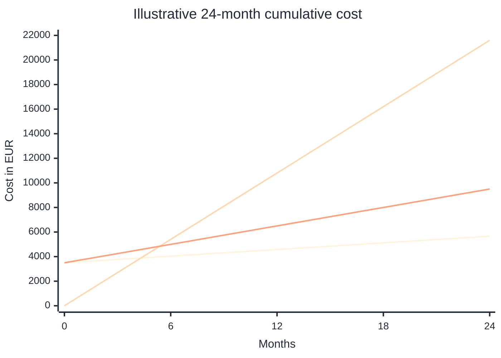
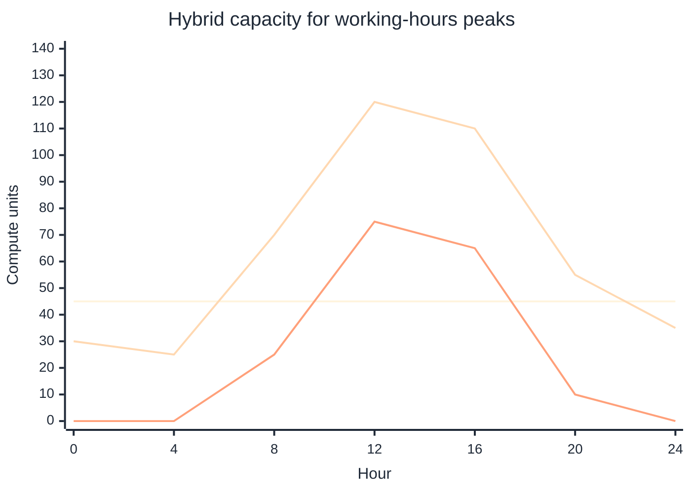

# Private cloud model

## Table of contents

- [Purpose](#purpose)
- [What cloud means here](#what-cloud-means-here)
- [Why own the baseline](#why-own-the-baseline)
- [Use public cloud deliberately](#use-public-cloud-deliberately)
- [Cost shape](#cost-shape)
- [Where this repository fits](#where-this-repository-fits)
- [Shared services first](#shared-services-first)
- [When Proxmox is the right layer](#when-proxmox-is-the-right-layer)
- [When Kubernetes changes the scale](#when-kubernetes-changes-the-scale)
- [When OpenStack becomes the better fit](#when-openstack-becomes-the-better-fit)
- [Practical decision table](#practical-decision-table)
- [References](#references)

## Purpose

Use this document to understand what this repository means by private cloud and
why the current reference path starts with Proxmox instead of OpenStack.

This is a scope guide, not a deployment guide.

## What cloud means here

Cloud is more than virtualization. A cloud model adds pooled resources, broad
network access, repeatable provisioning, and reduced manual interaction for the
people consuming the platform.[1]

A private cloud means those cloud capabilities are operated for one
organization. It can be hosted on-premises, in a small datacenter, or by a
provider, but the important part is that the environment serves a private
organization boundary rather than the public internet as a shared utility.[1]

## Why own the baseline

You should own and protect your data. Do not be naive about what that means:
control is not only where the VM runs. It is also who controls identity, private
keys, backups, logs, recovery paths, and the exit plan.

Owning the baseline gives you:

- local custody for the private domain, identity, PKI, and selected keys
- a known place where long-lived data and secrets live
- the ability to run when a cloud account, provider region, or internet link is
  unavailable
- a clean way to move workloads into or out of public cloud because the trust
  base stays yours

This also adds responsibility. If the platform owns the data, the platform must
own backup, restore, encryption, access control, and lifecycle decisions. CISA
describes the 3-2-1 rule as a trusted backup guideline: keep three copies, use
two storage media types, and keep one copy offsite.[15] For a private-cloud
baseline, that usually means:

| Copy | Example | Purpose |
| --- | --- | --- |
| production | Proxmox, Ceph, NAS, or application storage | live service data |
| local backup | Proxmox Backup Server, NAS snapshots, or offline media | fast local restore |
| offsite backup | encrypted public cloud bucket, another site, or removable media | disaster recovery |

Public cloud is useful for the offsite copy, but protect it as an untrusted
location unless the data classification says otherwise. Use client-side
encryption when the provider should store ciphertext only. AWS documents S3
client-side encryption as encrypting objects locally before S3 receives them,
and Azure Blob Storage supports encrypting data in the client application
before upload.[13][14]

## Use public cloud deliberately

This repository is not anti-cloud. Public cloud is excellent when the workload
is temporary, geographically distributed, or larger than the private baseline.
It is also useful when the homelab or small datacenter cannot be the full 24/7
business continuity story.

Use public cloud for:

- short-lived projects that need more compute than the local platform has
- peak workloads that do not justify buying hardware for the worst day of the
  year
- offsite encrypted backups and disaster-recovery copies
- public edge services when global reach matters
- experiments where speed matters more than long-term ownership

Avoid building the private baseline directly on provider-specific assumptions.
Lock-in usually appears when architecture depends on service-specific APIs,
identity models, event formats, or managed data models.

Examples:

| Pattern | Useful | Lock-in risk |
| --- | --- | --- |
| object storage | use S3-compatible tools for backups and artifacts | `S3` is an Amazon API, not a generic name for all object storage; provider-specific features can make migration harder [9] |
| S3-compatible private storage | Ceph Object Gateway can expose S3-compatible and Swift-compatible interfaces | compatibility is usually a large subset, not a promise that every provider-specific feature moves cleanly [10] |
| serverless events | Lambda can integrate with services such as DynamoDB, Kinesis, SQS, and MSK | event source mappings, retry behavior, permissions, and payloads become application architecture [11] |
| managed NoSQL | DynamoDB removes server operation and scales for key-value/document workloads | table design, capacity model, streams, and API choices can become an application rewrite later [12] |
| provider IAM and KMS | strong integration inside one cloud | policies, identities, key references, logs, and audit trails are not portable by default |

The practical rule: use public cloud where it gives clear value, but keep the
data model, encryption model, and deployment model portable when the workload
is expected to live for years.

## Cost shape

Private and public cloud costs behave differently. Private cloud has upfront
hardware cost and lower marginal cost for steady baseline workloads. Public
cloud has low upfront cost and strong elasticity, but always-on capacity can
become expensive if it runs every hour.

The numbers below are illustrative, in euros, and should be replaced with a
real quote for any purchase decision. Pricing note: example values were last
reviewed on 2026-05-02 and show the shape, not a provider price list. AWS
describes on-demand compute as pay-by-hour or second with no long-term
commitment, and Spot capacity as discounted spare capacity.[8]

Example assumptions:

| Model | Assumption |
| --- | --- |
| private baseline | `€3,500` upfront hardware plus `€90/month` power, storage, and offsite backup |
| public only | `€900/month` for always-on equivalent capacity |
| hybrid | private baseline plus public peak/offsite use averaging `€160/month` |

Figure: private infrastructure can pay off for steady baseline load, while
public cloud remains valuable for peaks, offsite copies, and short-lived
capacity. The hybrid model is often the useful middle: own the baseline, rent
the spikes.

Another common hybrid pattern is working-hours burst capacity. The private
cloud carries the steady service baseline and normal business workload. Public
cloud is used only for the horizontal scale-out window.

Figure: buy enough private capacity for the load that exists every day. Use
public cloud for the temporary horizontal scale that appears during business
hours, batch windows, campaigns, or seasonal events.

## Where this repository fits

This repository is a private-cloud baseline for a small platform team,
homelab-scale datacenter, or security-focused small business environment.

It aims for private-cloud operating patterns:

- infrastructure is described as code
- VM names, networks, identities, and secrets are repeatable
- platform setup starts from a known foundation
- services are separated by trust boundary and lifecycle
- disposable test environments are encouraged before production

It does not try to be a full self-service cloud portal on day one. The current
model assumes a small number of trusted platform administrators who own the
Proxmox cluster and control what is deployed.

## Shared services first

The first private-cloud capability is not a VM count. It is a shared trust
base that other paths can consume.

For this repository, that means:

- identity, DNS, and PKI for a private domain
- Vault or an existing secret platform for shared secrets
- syslog and observability for operational control
- HSM hardening paths for selected cryptographic keys

These services can be deployed by the repo or supplied by an existing
environment. Read [Shared services model](shared-services.md) for the reusable
service boundary and key-custody model.

## When Proxmox is the right layer

Use Proxmox when you need a strong virtualization foundation with low
operational overhead.

It is a good fit when:

- one platform owner or a small trusted team administers the cluster
- the environment needs VMs, containers, storage, backup, and clustering
  without a large cloud-control-plane project
- tenants are mostly projects, services, or teams represented through IaC
  reviews rather than self-service infrastructure administration
- you want the smallest reliable base for identity, PKI, Vault, edge services,
  and later Kubernetes

Proxmox is a virtualization management platform that integrates KVM, LXC,
software-defined storage, networking, clustering, and a web UI.[2]

That makes it a good small-platform foundation, but it is not the same thing as
a full multi-tenant IaaS cloud control plane.

## When Kubernetes changes the scale

Kubernetes is the next scale layer when most of the growth is application
workload growth rather than VM growth.

Use a smaller Proxmox foundation plus Kubernetes when:

- the platform team still owns the infrastructure
- application teams need repeatable deployment paths
- workloads are mostly containerized
- teams can consume namespaces, GitOps, policies, and platform services instead
  of creating their own VMs

Kubernetes manages containerized workloads and services with declarative
configuration and automation.[3] It can support multi-team patterns, but
Kubernetes itself notes that shared clusters require careful design around
security, fairness, noisy neighbors, RBAC, quotas, and network policy.[4]

For many smaller organizations, Proxmox plus Kubernetes gives enough cloud-like
behavior without taking on the operational cost of OpenStack.

## When OpenStack becomes the better fit

OpenStack becomes the stronger private-cloud fit when the environment needs a
real IaaS control plane for many tenants.

Move toward OpenStack when:

- multiple teams need to act as their own infrastructure administrators
- users need self-service VM, network, image, volume, quota, and project
  workflows
- tenant boundaries must be represented in the platform API itself
- delegated administration and project quotas are core requirements
- the operational cost of a larger control plane is justified by the number of
  internal consumers

OpenStack describes itself as a cloud operating system that controls large
pools of compute, storage, and networking resources and lets users provision
resources through a dashboard.[5] Its identity layer, Keystone, provides
multi-tenant authorization, and OpenStack projects are the ownership unit for
cloud resources.[6][7]

This is the point where Proxmox starts to look like a platform substrate, while
OpenStack is the user-facing private cloud.

## Practical decision table

| Need | Better fit | Why |
| --- | --- | --- |
| one trusted admin or small platform team | Proxmox | simpler operations and strong VM/container foundation |
| a few internal teams consuming reviewed IaC | Proxmox plus Ansible/Terraform | teams get repeatability without direct cluster admin rights |
| many app teams deploying containers | Proxmox plus Kubernetes | Proxmox hosts the base, Kubernetes becomes the app platform |
| teams need namespace-level app autonomy | Kubernetes | app teams can work through GitOps, namespaces, RBAC, and policy |
| teams need VM/network/storage self-service | OpenStack | tenant/project model is part of the cloud control plane |
| users must be their own infrastructure admins | OpenStack | delegated cloud administration is a first-class design goal |

For this repository, the default path is:

1. Proxmox as the reference virtualization foundation.
2. Terraform and Ansible for repeatable platform provisioning.
3. Identity, PKI, Vault, backup, and security foundations.
4. Kubernetes later for application-platform scale.
5. OpenStack only if the organization outgrows small-platform administration
   and needs true multi-tenant IaaS self-service.

## References

1. [NIST SP 800-145, The NIST Definition of Cloud Computing](https://csrc.nist.gov/pubs/sp/800/145/final)
2. [Proxmox VE overview](https://www.proxmox.com/en/proxmox-ve)
3. [Kubernetes concepts](https://kubernetes.io/docs/concepts/)
4. [Kubernetes multi-tenancy](https://kubernetes.io/docs/concepts/security/multi-tenancy/)
5. [OpenStack documentation](https://docs.openstack.org/)
6. [Keystone, the OpenStack Identity Service](https://files.openstack.org/docs/keystone/latest/index.html)
7. [OpenStack Keystone projects, users, and roles](https://static.openstack.org/docs/keystone/2024.1/admin/cli-manage-projects-users-and-roles.html)
8. [Amazon EC2 pricing](https://aws.amazon.com/ec2/pricing/)
9. [Amazon S3 API reference](https://docs.aws.amazon.com/AmazonS3/latest/API/Welcome.html)
10. [Ceph Object Gateway](https://docs.ceph.com/en/squid/radosgw/)
11. [AWS Lambda event source mappings](https://docs.aws.amazon.com/lambda/latest/dg/invocation-eventsourcemapping.html)
12. [Amazon DynamoDB documentation](https://aws.amazon.com/documentation-overview/dynamodb/)
13. [Amazon S3 client-side encryption](https://docs.aws.amazon.com/AmazonS3/latest/userguide/UsingClientSideEncryption.html)
14. [Azure Blob Storage client-side encryption](https://learn.microsoft.com/en-us/azure/storage/blobs/client-side-encryption)
15. [CISA, Back Up Business Data](https://www.cisa.gov/audiences/small-and-medium-businesses/secure-your-business/back-up-business-data)
