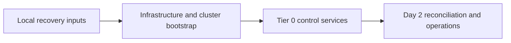
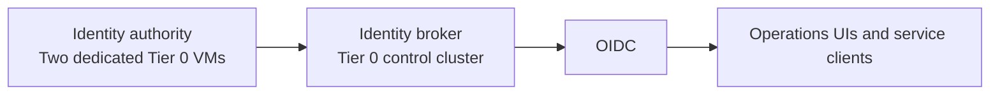

# Tier model

## Table of contents

- [Purpose](#purpose)
- [Tier meanings](#tier-meanings)
- [Dependency rule](#dependency-rule)
- [Tier and zone placement](#tier-and-zone-placement)
- [Repository role](#repository-role)
- [Tier 0 shape](#tier-0-shape)
- [Day 2 control services](#day-2-control-services)
- [Tier 1 and Tier 2 direction](#tier-1-and-tier-2-direction)
- [Mapping from the current repo](#mapping-from-the-current-repo)
- [Design guardrails](#design-guardrails)

## Purpose

Tiers divide the repositories by **potential impact**. Ask: if this system or
its deployment credentials were compromised, what else could it control?
The lower the tier number, the greater the potential damage.

Use [network layers](overview.md#layered-model) for outside-to-inside protection.
Do not turn a tier into a zone, VLAN range, or hostname prefix.

## Tier meanings

| Tier | Impact and responsibility | Typical examples |
| --- | --- | --- |
| Tier 0 | can control the foundation or trust of the whole environment | identity authority, privileged secrets, hypervisors, network administration, template publication |
| Tier 1 | can affect shared platform services and their consumers | source control, workload delivery, registries, shared ingress, platform observability |
| Tier 2 | affects a project, application, or lab | application VMs, project data, experiments |

Classify the instance and its privileges, not the product:

- an identity broker controlling administrator access belongs in Tier 0;
  an application-only broker may belong in Tier 1
- a runner with Tier 0 API credentials is Tier 0 automation, even if it only
  runs a small job
- a workload-local secret service is not automatically Tier 0
- a dashboard does not become Tier 0 merely because operators use it; its
  credentials and ability to change systems matter

Shared code and architecture documentation are support repositories, not
additional security tiers.

Tier 0 owns the hardware-facing control plane across all tiers: virtualization,
physical networking, storage administration, and all VM template lifecycles.
Workload definitions remain tier-local. See [Infrastructure control](infrastructure-control.md)
for the split between workload ownership and privileged execution.

## Dependency rule

Keep recovery independent of higher-numbered tiers:

- Tier 0 must recover without Tier 1 or Tier 2 services.
- Tier 1 must recover without Tier 2 workloads.
- Tier 2 may consume the shared platform and approved control-service interfaces.

Normal operation may use connected DNS, identity, secrets, or APIs from a
lower-numbered tier. That is a service dependency, not permission to administer
the provider. Keep client access separate from privileged administration.

Retain local code, reviewed artifacts, state, credentials, and recovery
instructions. A hosted source-control service, inventory app, dashboard, or
cluster UI must not be the only way to restore the systems underneath it.

Protect the full privileged change path at the target tier: runner, credentials,
approval, and accepted code. An ordinary Tier 1 or Tier 2 job must not be able
to alter Tier 0 simply by reaching its API.

## Tier and zone placement

A tier answers **who owns it and how much damage it can do**. A zone answers
**which network policy protects this interface**. The
[architecture examples](overview.md#tier-and-zone-view) show the two separately.

Use plain network-zone names such as `DMZ`, `Services`, and `Control`.
Several tiers may have interfaces in the same zone; that does not join their
subnets, credentials, or permissions. Create additional subnets or zones when
policy differs, not merely because another repository exists.

Tier 0 includes connected control systems. **Offline custody is a separate
boundary** for selected root keys, recovery copies, and ceremonies. No routed
connection, dual-homed host, VPN, or temporary allow rule may bridge an air gap.
Transfer approved material through the recorded custody procedure.

An online identity authority can therefore be Tier 0 in `Control`, while an
offline root key is also Tier 0 but has no connected firewall zone.

## Repository role

Each tier owns its Terraform resources, workload definitions, inventory, configuration, and separate
state roots. This does not grant workload users infrastructure administration;
Tier 0 owns the privileged execution authority and protects state access.
Terraform and Ansible use the same inventory inputs within that tier.

| Source / generated suffix | Owns |
| --- | --- |
| `tier-0` | high-impact control systems, template lifecycle, recovery, and custody assets |
| `tier-1` | shared platform instances |
| `tier-2` | application, project, and lab instances |
| `shared` | baseline roles, generic helpers, stateless sizes, and approved template references; never inventory, Terraform resources, or state |
| `architecture` | local conventions, design, service records, and runbooks |

See [Generated repository model](../reference/generated-repository-model.md)
for collection names, initialization, and refresh. Source folders mirror the
same ownership.

## Tier 0 shape

Tier 0 can include a dedicated control cluster, but its own recovery cannot
depend on that cluster being healthy.

Template publication is Day 0-1 work and runs locally before managed VMs, the
cluster, or a CI service exists. Day 2 can add hosted scheduling, not the first
ability to create templates.
Infrastructure automation continues to own the resources beneath the cluster;
cluster reconciliation owns the services above it. Keep approved images and
publication state recoverable outside the cluster.

See the [Day 0-3 deployment path](../paths/tier-0/README.md#deployment-order) and
[Tier 0 bootstrap](../paths/tier-0/bootstrap.md) for implementation choices,
deployment scope, and the remaining cluster-service starters.
Deployment phases describe readiness, not another ownership hierarchy.

## Day 2 control services

Deploy useful operational services early, without making them prerequisites
for restoring their own platform.

The inventory source of truth documents networks, hosts, ownership, and
recovery facts. It is a Day 2 consumer of repository inputs, not their only
source. An inventory app being unavailable must not prevent recovery.

## Tier 1 and Tier 2 direction

Tier 1 provides shared delivery and operating services. Tier 2 holds the
workloads using them. A shared ingress proxy can publish a Tier 2 application;
a shared collector can monitor it. Packet direction does not change repo
ownership or make that workload a prerequisite for platform recovery.

Separate privileged control from general workloads even when both use the
same hypervisor cluster. Review scope whenever a service gains credentials
or permissions affecting a lower-numbered tier.

The intended self-service path lets Tier 2 users request VM creation and updates
through automation enabled by Tier 0 GitOps. Tier 0 validates and executes those
requests without depending on Tier 2 to operate or recover. This is a
[design contract](infrastructure-control.md#delegated-provisioning), not an
implemented controller or permission to execute arbitrary workload code.

## Mapping from the current repo

These are the shipped setup owners, not automatic classification by product.

| Setup or resource | Default home | Placement note |
| --- | --- | --- |
| `foundation`, `vault`, `hsm` | Tier 0 | connected authority/control endpoints; isolate offline custody separately |
| template publication, `template-refresh`, `immutable-template` | Tier 0 | privileged image supply chain; approved local artifacts and scoped jobs |
| hypervisor and network administration | Tier 0 | can affect all guests or network boundaries |
| `edge`, `cache` | Tier 1 | Edge layer; no implied access to control administration |
| `development`, `podman-runner`, `observability` | Tier 1 | general platform scope; not privileged Tier 0 execution |
| `lab` and project workloads | Tier 2 | workload scope |
| template code and control-service playbooks/roles | Tier 0 | implementation stays with its owner |
| cross-tier guest modules and baseline helpers | Shared | common implementation, not deployment authority |

A different privilege scope may justify another owner. Document that decision
and migrate state deliberately; moving a folder does not change privileges
or network access.

## Design guardrails

- Keep Tier 0 small, strongly protected, and independently recoverable.
- Choose repository ownership by impact and network placement by exposure.
- Keep live state and credentials with one owner.
- Reuse shared code without sharing live inventories.
- Use plain names; put detailed assignments in inventory and policy.
- Preserve project-owned documentation when refreshing upstream guidance.
