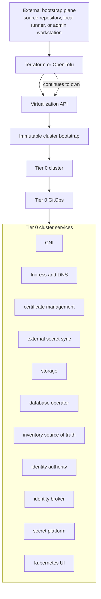

# Tier model

## Table of contents

- [Purpose](#purpose)
- [Tier meanings](#tier-meanings)
- [Dependency rule](#dependency-rule)
- [Tier and network bands](#tier-and-network-bands)
- [Repository role](#repository-role)
- [Tier 0 shape](#tier-0-shape)
- [Day 2 control services](#day-2-control-services)
- [Tier 1 and Tier 2 direction](#tier-1-and-tier-2-direction)
- [Mapping from the current repo](#mapping-from-the-current-repo)
- [Design guardrails](#design-guardrails)

## Purpose

Use this document as the shared architecture language for Tier 0, Tier 1, and
Tier 2 in this repository.

The repository is an upstream deployment kit. It can generate or refresh a
private set of downstream repositories for one homelab, small datacenter, or
smaller company. The tier model makes dependency direction, recovery
expectations, and network exposure boundaries explicit.

Think about the model in two dimensions:

- tiers stack bottom-up from Tier 0 to Tier 2
- network exposure runs left-to-right from DMZ-facing paths toward
  air-gapped custody

## Tier meanings

| Tier | Meaning |
| --- | --- |
| Tier 0 | Bootstrap, recovery, and control systems. Must recover without Tier 1 or Tier 2. |
| Tier 1 | Shared platform services. May depend on Tier 0, never on Tier 2. |
| Tier 2 | Application, user, project, and lab workloads. May depend on Tier 0 and Tier 1. |
| Shared | Reusable code, modules, roles, templates, and generated helpers. |
| Architecture | Environment documentation, decisions, diagrams, generated guidance, and runbooks. |

Setup names such as `foundation`, `edge`, `vault`, and `observability` identify
deployment capabilities. Tier ownership identifies the particular instance's
recovery and access boundary; functional layers describe its responsibility.

## Dependency rule

Capabilities are provided upward; the arrows below mean "provides to":

```text
Tier 0 -> Tier 1 -> Tier 2
```

Allowed patterns:

- Tier 1 can consume Tier 0 services.
- Tier 2 can consume Tier 0 and Tier 1 services.
- Shared code can be reused by any tier.
- Architecture documentation can describe every tier.

Forbidden patterns:

- Tier 0 must not require a hosted source-control service, identity authority,
  identity broker, inventory application, cluster-management platform,
  observability dashboard, or higher-tier cluster to recover.
- Tier 0 must not require Tier 1 or Tier 2 GitOps to rebuild core control
  services.
- Tier 1 must not require Tier 2 workloads to start or recover.
- Shared modules must not hide live environment state that belongs to a tier.

Tier 0 may use a source-controlled repository as an input, but its recovery
path must not depend on a source-control service hosted by Tier 1 or Tier 2.

## Tier and network bands

The tier model is vertical. Tier 0 is the bottom recovery layer, Tier 1 is the
shared platform layer, and Tier 2 is the workload layer.

The network model is horizontal. Exposure decreases as you move from
DMZ-facing paths on the left toward air-gapped custody on the right.

```text
DMZ/edge -> access -> internal platform -> restricted control -> air-gapped custody
```

Use the two dimensions together:

| Tier, bottom-up | DMZ / edge | Access | Internal platform | Restricted control | Air-gapped custody |
| --- | --- | --- | --- | --- | --- |
| Tier 2 | workload entry points | workload clients | applications and labs | scoped workload management | - |
| Tier 1 | shared ingress / egress | connected identity brokers | shared platform services | platform management | - |
| Tier 0 | - | - | - | - | bootstrap, control, root trust, recovery |

Tier 0 exists only in the air-gapped custody band. Handoffs from custody are
explicit transfers of approved artifacts, trust material, and recovery outputs.
They are not ordinary routed connections. Connected service interfaces belong
to the consuming network's owning tier; an online replica or broker must not
require a live connection into custody to start or recover.

A network can be a union between tiers only when it is deliberately designed as
an interface network. A valid union has a named owner, explicit firewall
policy, clear consumers, and no reverse dependency from a lower tier to a
higher tier. For example, a higher tier can consume an identity or OIDC
interface published from a lower tier, but that higher tier must not become
required to recover the lower tier.

## Repository role

This upstream repository is a deployment kit and reference baseline.

The expected operating model is:

1. download, fork, or mirror this repository
2. generate a private downstream repository set
3. edit owned downstream configuration and documentation there
4. pull upstream improvements from this repository
5. refresh generated content without overwriting local owned decisions

Downstream repository names use a configurable prefix. The default collection
is `homelab-iac/`, beside the upstream checkout. It contains the five repositories
below and has no Git history of its own. Changing the prefix renames both the
collection and its child repository names.

Example downstream set:

| Repository | Purpose |
| --- | --- |
| `homelab-tier-0` | Tier 0 infrastructure, Talos bootstrap, and Tier 0 GitOps |
| `homelab-tier-1` | shared platform services and higher-level control plane |
| `homelab-tier-2` | application, project, lab, and workload environments |
| `homelab-shared` | reusable provisioning modules, Ansible playbooks and roles, scripts, and templates |
| `homelab-architecture` | generated and owned documentation site for the actual environment |

Every tier owns its inventory, configuration, and infrastructure state. Both
provisioning and configuration automation consume that tier's host identity
inputs. Shared code contains no live inventory or state. The shared repository
is checked out as a parallel sibling and retained locally for recovery.

## Tier 0 shape

Tier 0 has this shape:

- a small external bootstrap plane exists only to create the first control path
- Terraform or OpenTofu creates the virtualization resources and first cluster
  machines
- an immutable cluster bootstrap path creates a dedicated Tier 0 cluster
- a GitOps reconciler is installed into the Tier 0 cluster
- GitOps manages Tier 0 cluster services after bootstrap
- Terraform or OpenTofu continues to own the infrastructure underneath the
  cluster

Tier 0 services may run on the Tier 0 cluster without becoming bootstrap
dependencies. An identity broker, inventory source of truth, secret platform,
or operations UI can be managed by Tier 0 GitOps, but Tier 0 recovery must
still work when that service is unavailable.



Day 0 and Day 1 are allowed to use an external bootstrap plane. Day 2 onward,
the Tier 0 cluster should be managed through its Tier 0 GitOps path while the
underlying virtualization resources remain managed by Terraform or OpenTofu.

The current reference implementation uses Proxmox, Talos, Flux, and Kubernetes
for those roles, but the architecture names the responsibilities first.

## Day 2 control services

Day 2 control services improve operations after the Tier 0 control path exists.
They are important early, but they must not become bootstrap prerequisites.

Use this capability order:

```text
identity authority
  -> identity broker
  -> OIDC interface
  -> Kubernetes UI, inventory source of truth, source control,
     observability dashboard, and cluster management where appropriate
```

The inventory source of truth belongs early because it documents addresses,
networks, racks, hosts, service ownership, and recovery facts. It is still a
Day 2 service: recovery must work from Tier 0 repository inputs and
operator-held material even when the inventory application is unavailable.

## Tier 1 and Tier 2 direction

Tier 1 is where broader shared platform services grow after Tier 0 is
recoverable. This can include a more capable application platform, shared
identity integration, application ingress, registry services, CI/CD runners,
source control, broader observability, and cluster management that do not need
to be part of the recoverable Tier 0 minimum.

Tier 2 is where application, project, lab, user, and tenant workloads belong.
Tier 2 should consume Tier 0 and Tier 1 services through explicit interfaces
instead of gaining broad access to lower tiers.

## Mapping from the current repo

Current content maps into the tier model like this:

| Current area | Tier home | Note |
| --- | --- | --- |
| Proxmox API, templates, and networks | Tier 0 or Architecture | runtime control vs local design |
| Terraform modules under `terraform/modules/` | Shared | reusable between tier repositories |
| Ansible roles and playbooks | Shared | consume only the owning tier's inputs |
| Inventory, group vars, and Terraform state | Owning tier | three independent inventories using the same mechanism |
| `foundation` identity path | Tier 0 or Tier 1 | only Tier 0 if part of recovery minimum |
| `edge` path | Tier 1 | DMZ-facing edge does not belong in custody |
| `cache` path | Tier 1 by default | any custody-local artifact store is a separate instance |
| `vault` path | Tier 0 and possibly Tier 1 | recovery secret platform vs workload secret platform |
| `observability` path | Tier 1 by default | Tier 0 can keep a smaller control view |
| source control, registry, runners, app Kubernetes | Tier 1 or Tier 2 | not Tier 0 bootstrap prerequisites |
| HSM and ceremony material | Tier 0 for custody; Tier 1 for connected gateways | no live edge backend inside custody |
| path and reference docs | Architecture | copied or linked into the docs site |

## Design guardrails

- Keep Tier 0 small enough to recover.
- Prefer explicit handoff files and documented interfaces between tiers.
- Keep generated files visibly marked so local owned edits are not overwritten.
- Keep local environment values out of this upstream repository.
- Keep tier-specific live state in the owning tier repository.
- Keep reusable modules, playbooks, and roles in the shared repository.
- Keep local decisions, diagrams, and runbooks in the architecture repository.
