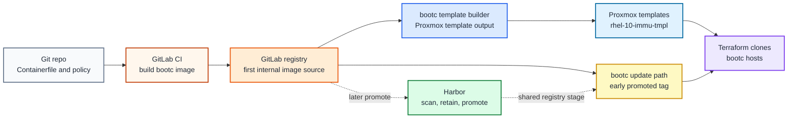

# Image-based Linux path

## Table of contents

- [Purpose](#purpose)
- [What image-based means](#what-image-based-means)
- [Security posture](#security-posture)
- [Dependency model](#dependency-model)
- [What this deploys](#what-this-deploys)
- [Reference workflow](#reference-workflow)
- [Template conversion flow](#template-conversion-flow)
- [Distro support](#distro-support)
- [Operating model](#operating-model)
- [Read more](#read-more)
- [References](#references)

## Purpose

Use this path when you want Linux servers to be managed from versioned
operating-system images instead of ad hoc package changes on each host.

The repository reference implementation is `bootc` for Fedora and Enterprise
Linux-like systems: build a bootable OCI image, publish it to a registry,
deploy or convert hosts to that image, and update the host by moving to a newer
image.

## What image-based means

Immutable Linux is a common shorthand, but image-based Linux is the more precise
term for this path. The whole machine is not read-only. The base operating
system comes from a versioned image and changes through image updates instead
of manual package changes on each host.

With image mode for RHEL, the root filesystem is immutable by default except
for `/etc` and `/var`, and most content comes from the container image.[1]
bootc applies the container image as the bootable host operating system; after
deployment, systemd still runs as normal and the system is not running inside an
outer container.[2]

## Security posture

Image-based Linux improves the platform security posture by reducing drift and
making the operating system an artifact.

| Benefit | Security effect | Still required |
| --- | --- | --- |
| image-based OS | every host can be traced back to a built image | image signing, scanning, and promotion rules |
| transactional updates | failed updates can roll back | maintenance windows and reboot handling |
| reduced host mutation | fewer package changes and snowflake hosts | separate handling for `/etc`, `/var`, secrets, and data |
| CI-built images | hardening changes go through review | protected branches, runners, and registry controls |
| registry-based delivery | updates can be promoted by tag or digest | registry availability, pull credentials, and retention policy |

This does not replace hardening. You still need identity, secrets, logging,
backup, endpoint hardening, and incident response. Immutable hosts make the
base system easier to reproduce and reason about; they do not make runtime
compromise impossible.

## Dependency model

Harbor is not required to start with bootc. The first useful internal path can
run during the GitLab stage by using a dedicated GitLab runner and GitLab's
built-in registry.

| Mode | Requirements | Use it when |
| --- | --- | --- |
| standalone pilot | local build host and temporary registry or image source | you want to learn the model first |
| GitLab-stage path | GitLab, a bootc runner, and GitLab registry | you want automated internal OS image builds before Kubernetes |
| shared registry path | GitLab CI/CD plus Harbor registry | you want scan, promotion, and private update delivery across platforms |
| hardened production path | signed images, protected tags, staged rollout, rollback tests | bootc becomes the normal server lifecycle |

Red Hat image mode docs list a container registry as a prerequisite, and bootc
docs note that private registries are common for fleets.[1][3] A local or
external registry can satisfy that prerequisite for a pilot. GitLab's built-in
registry is enough for the first internal bootc builds. Harbor is the repo
reference for the later shared registry stage.

## What this deploys

This path has a dedicated template-builder setup:

| Layer | File | Responsibility |
| --- | --- | --- |
| Terraform | `terraform/environments/image-template/terraform.tfvars` | deploys the temporary template-builder VM |
| Ansible inventory | `ansible/inventory/hosts.yml` | keeps the stable `image_template_builders` host group |
| Ansible vars | `ansible/group_vars/image_template.yml` | controls bootc image, registry auth, CA trust, and cleanup |
| Ansible role | `ansible/roles/image_template/` | installs bootc tooling and prepares the VM for template conversion |

The default is one builder VM named for the target template,
`rhel-10-immu-tmpl`. The builder starts as a normal VM so Ansible can configure
and verify it. Convert it to a Proxmox template only after the bootc image and
rollback behavior are tested.

## Reference workflow



Figure: GitLab can build and host the first bootc images. Harbor becomes the
shared registry authority later, when Kubernetes and broader image promotion
need it. Use the [Podman image runner guide](podman-runner.md) for the
Terraform and Ansible setup that creates the first bootc build runner.

## Template conversion flow

The first repository implementation should build on the existing Enterprise
Linux template work instead of replacing it.

Use this flow:

1. Create or reuse normal cloud-init templates such as `rhel-10-tmpl`,
   `alma-10-tmpl`, or `rocky-10-tmpl`.
2. Edit `terraform/environments/image-template/terraform.tfvars`.
3. Edit `ansible/group_vars/image_template.yml`.
4. Clone the template into a temporary conversion VM.
5. Use Ansible to install the bootc tooling required by the selected distro.
6. Switch or install the host to the target bootc image.
7. Reboot and verify `bootc status`, SSH access, cloud-init behavior, and
   rollback state.
8. Clean machine-specific state.
9. Convert the result into a dedicated image-based template such as
   `rhel-10-immu-tmpl`.
10. Point Terraform deployments at the bootc template only after the update and
    rollback workflow has been tested.

Plan the builder first:

```bash
bash scripts/deploy.sh image-template --env test --plan-only
```

Prepare the builder VM:

```bash
bash scripts/deploy.sh image-template --env test
```

After you have verified the bootc system, enable cleanup in
`ansible/group_vars/image_template.<env>.yml` or `image_template.yml`:

```yaml
image_template_prepare_for_template: true
```

Rerun Ansible, then set the builder VM to `template = true` and
`started = false` in `terraform/environments/image-template/terraform.tfvars`.
Run only Terraform for the final conversion:

```bash
bash scripts/deploy.sh image-template --env test --terraform-only
```

The BPG Proxmox provider supports converting a VM to a template by setting the
VM resource `template` attribute to `true`. Converting a template back to a
normal VM is not supported, so treat this as a one-way finalization step.[7]

For private bootc registries, place pull credentials where bootc can read
them. bootc documents `/etc/ostree/auth.json` as the private registry auth
location.[3]

This conversion path is useful when you already have Proxmox cloud templates
and want to introduce immutable hosts gradually. For larger scale, prefer
building disk images directly from the bootc image with the distro-supported
image tooling when that path is ready for the environment.

## Distro support

Do not assume every Enterprise Linux-like distro has the same image-based Linux
maturity.

| Distro family | Current guidance |
| --- | --- |
| RHEL | reference enterprise path for image mode and `rhel-bootc` images |
| Fedora | useful upstream and fast-moving bootc path, especially for testing |
| AlmaLinux | experimental bootc images exist; validate support before production |
| Rocky Linux | verify current upstream bootc image availability before use |
| CentOS Stream or SIG images | useful for experimentation when the specific SIG image matches the use case |

Keep separate templates for each OS and major release. If you keep both mutable
and image-based templates, use names such as `alma-10-tmpl` and
`alma-10-immu-tmpl` so the lifecycle is visible before a VM is cloned.

## Operating model

Use these rules for production bootc hosts:

- rebuild images on a schedule and when base image updates are published
- scan images before promotion
- promote by explicit tag or digest instead of treating `latest` as production
  policy
- stage updates with maintenance windows for critical services
- test rollback before broad rollout
- keep `/etc`, `/var`, secrets, and application data out of the base image
- keep pull credentials and registry trust material managed by the shared
  secret and PKI paths

bootc supports transactional upgrades and rollback. `bootc upgrade` queries
the image source and stages an updated image for the next boot, while rollback
keeps the previous deployment available.[4]

## Read more

- [Application platform path](README.md)
- [Container registry path](registry.md)
- [Development platform path](development.md)
- [Podman image runner guide](podman-runner.md)
- [Enterprise Linux template](../../platforms/proxmox/enterprise-linux-template.md)
- [Proxmox planning guidelines](../../platforms/proxmox/conventions.md)
- [Security principles](../../security/security-principles.md)

## References

1. [Red Hat image mode for RHEL](https://docs.redhat.com/en/documentation/red_hat_enterprise_linux/10/html/using_image_mode_for_rhel_to_build_deploy_and_manage_operating_systems/introducing-image-mode-for-rhel)
2. [bootc introduction](https://bootc.dev/bootc/)
3. [bootc registries and disconnected updates](https://bootc.dev/bootc/registries-and-offline.html)
4. [bootc upgrades and rollback](https://bootc.dev/bootc/upgrades.html)
5. [Fedora/CentOS bootc base images](https://fedora.gitlab.io/bootc/docs/bootc/base-images/)
6. [AlmaLinux bootc images](https://github.com/AlmaLinux/bootc-images)
7. [BPG Proxmox provider VM template conversion](https://github.com/bpg/terraform-provider-proxmox/blob/main/docs/resources/virtual_environment_vm.md)
