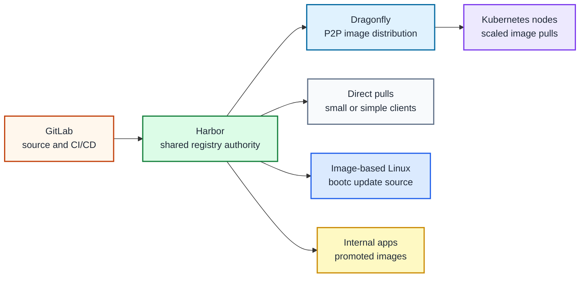

# Container registry path

## Table of contents

- [Purpose](#purpose)
- [What a registry does](#what-a-registry-does)
- [GitLab registry vs shared registry](#gitlab-registry-vs-shared-registry)
- [Reference direction](#reference-direction)
- [Harbor and Dragonfly roles](#harbor-and-dragonfly-roles)
- [What to plan](#what-to-plan)
- [Downstream platforms](#downstream-platforms)
- [Read more](#read-more)
- [References](#references)

## Purpose

Use this path when the private cloud needs a shared place to store, scan,
promote, and distribute OCI artifacts.

The first development platform can use the GitLab built-in container registry.
This path is for taking the registry capability further: Harbor as the shared
registry authority and Dragonfly as the image distribution acceleration layer
when Kubernetes becomes part of the platform.

Before Kubernetes exists, GitLab's own registry is the practical default. It is
good enough for early CI builds, first application images, and initial
image-based Linux experiments. Treat Harbor plus Dragonfly as the next registry
stage, not as something that must exist before the first GitLab deployment.

This is a path guide, not the Rancher walkthrough yet. The expected
implementation is a Kubernetes deployment later, managed through Rancher or the
chosen cluster operations flow.

## What a registry does

A container registry stores artifacts that other systems pull and run.

In this repository, that includes:

| Artifact | Used by |
| --- | --- |
| application images | Kubernetes workloads and internal services |
| image-based Linux builds | bootc hosts and Proxmox template workflows |
| runner helper images | CI/CD runners and build automation |
| platform images | GitOps controllers and cluster services |
| signed or scanned artifacts | promotion gates and release workflows |

The registry is not source control. GitLab owns source, merge requests, and
CI/CD. The registry owns promoted artifacts.

## GitLab registry vs shared registry

GitLab includes an integrated container registry for project images.[1] Use
that before Kubernetes exists or when you want the shortest path from repository
to image.

Move to this shared registry path when the registry becomes a platform service.

| Option | Best fit | Limit |
| --- | --- | --- |
| GitLab built-in registry | first GitLab deployment, pilots, project-local images | tied to GitLab lifecycle and project structure |
| Harbor | shared artifact authority across projects and platforms | needs registry operations, storage, TLS, and policy design |
| Harbor plus Dragonfly | larger Kubernetes and node fleets with many image pulls | adds another platform component to operate |

The normal repository direction is:

1. Deploy GitLab in the [development platform path](development.md).
2. Use the GitLab registry for the pre-Kubernetes stage.
3. Deploy Kubernetes when the application platform is ready for that layer.
4. Deploy Harbor when you want a shared registry boundary.
5. Add Dragonfly when image distribution and preheating become useful at scale.

## Reference direction

The long-term reference shape is:

Figure: GitLab builds images, Harbor owns promoted artifacts, and Dragonfly
helps distribute images when Kubernetes or larger node fleets make repeated
pulls expensive.

## Harbor and Dragonfly roles

Keep the product roles separate:

| Product | Role in this path |
| --- | --- |
| Harbor | shared OCI registry, projects, access control, retention, scanning, promotion |
| Dragonfly | image pull acceleration, P2P distribution, and preheating near clients |
| GitLab | source control and CI/CD that publishes images into the registry |
| Rancher | later operational entry point for deploying this stack on Kubernetes |

Harbor can be deployed on Kubernetes with Helm, including HA patterns when the
environment provides suitable ingress, database, Redis, and storage.[2]
Dragonfly is a CNCF project for P2P data distribution and acceleration.[3]
Dragonfly also documents Harbor integration for image preheating.[4]

## What to plan

Decide these before deploying the shared registry:

| Area | Decision |
| --- | --- |
| DNS | registry FQDN, later Dragonfly endpoints, and certificate names |
| TLS | private PKI certificate source and trust path for nodes |
| storage | registry artifact storage, backup, retention, and object storage option |
| identity | local users, OIDC/SSO integration, robot accounts, and project ownership |
| policy | project layout, retention rules, scan gates, and promotion tags |
| scaling | when direct pulls are enough and when Dragonfly should be added |
| recovery | Harbor database, configuration, artifact storage, and restore test |

Use Harbor first. Add Dragonfly when the platform has enough nodes, clusters,
or repeated image pulls that distribution acceleration is worth operating.

## Downstream platforms

Later paths can consume this registry for:

- image-based Linux builds and bootc updates
- Kubernetes application images
- CI/CD runner images
- GitOps controller images
- restricted-network image mirroring
- signed and scanned platform artifacts

For the first GitLab deployment, it is fine to use the GitLab registry until
the shared registry path exists.

## Read more

- [Application platform path](README.md)
- [Development platform path](development.md)
- [Podman image runner guide](podman-runner.md)
- [Image-based Linux path](image-based-linux.md)
- [Kubernetes platform path](kubernetes.md)
- [Shared services model](../../architecture/shared-services.md)
- [Private cloud maturity path](../private-cloud-maturity.md)

## References

1. [GitLab container registry](https://docs.gitlab.com/user/packages/container_registry/)
2. [Harbor high availability with Helm](https://goharbor.io/docs/edge/install-config/harbor-ha-helm/)
3. [Dragonfly CNCF project](https://www.cncf.io/projects/dragonfly/)
4. [Dragonfly Harbor preheat integration](https://d7y.io/docs/advanced-guides/open-api/preheat/#harbor)
