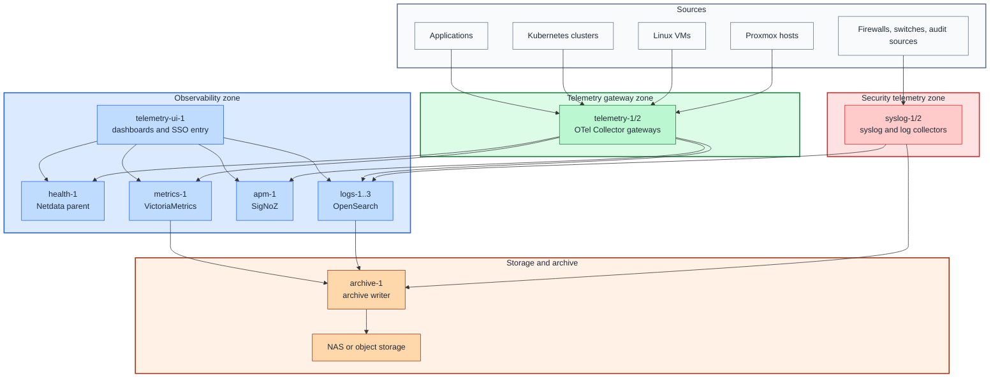

# Observability path

## Table of contents

- [Purpose](#purpose)
- [Reference stack](#reference-stack)
- [Target shape](#target-shape)
- [Network placement](#network-placement)
- [Traffic model](#traffic-model)
- [VM roles](#vm-roles)
- [Starting shape](#starting-shape)
- [IaC defaults](#iac-defaults)
- [Data routing](#data-routing)
- [Shared or isolated](#shared-or-isolated)
- [Operations model](#operations-model)
- [References](#references)

## Purpose

Use this system-control path after identity, PKI, and secret management are
available from this repo or from an existing environment, and you want central
control over platform health, logs, traces, audit events, and capacity signals.

The goal is not to force every signal into one product. The goal is to use one
clear telemetry backbone and route each signal to the backend that is best at
that job.

Use this as a shared service path by default. Isolate it per project only when
the project needs a separate retention, access, or trust boundary.

## Reference stack

Use these roles:

| Role | Reference implementation | Purpose |
| --- | --- | --- |
| telemetry backbone | `OpenTelemetry Collector` | receive, enrich, route, batch, and export telemetry signals |
| live health | `Netdata` | current node and service health, rack or NOC display |
| metrics store | `VictoriaMetrics` | durable metrics, PromQL/MetricsQL, capacity and infrastructure alerts |
| APM and traces | `SigNoZ` | service maps, traces, request latency, and application debugging |
| log and event store | `OpenSearch` | infrastructure logs, audit logs, security events, and investigation search |
| syslog compatibility | `rsyslog`, `syslog-ng`, `Fluent Bit`, or `Vector` | receive and normalize traditional log sources |
| archive writer | `MinIO`, NAS path, or object target | cold log archive, snapshots, and long-term retention |

OpenTelemetry is the center of the design because it provides a vendor-neutral
way to collect, process, and export traces, metrics, and logs.[1][2]

## Target shape

Figure: sources send telemetry to gateway layers first. Backends receive from
gateways, not directly from every source.

## Network placement

Use these zones:

| Zone | Hosts | Purpose |
| --- | --- | --- |
| `telemetry_gateway` | `telemetry-1`, `telemetry-2` | OpenTelemetry gateway collectors and routing |
| `security_telemetry` | `syslog-1`, `syslog-2` | hardened syslog, audit, and security event collectors |
| `observability` | `health-1`, `metrics-1`, `apm-1`, `logs-*`, `telemetry-ui-1` | observability backends and dashboards |
| `storage` | `archive-1`, NAS or object target access | cold archive, snapshots, and backup targets |

Keep this policy:

- sources send to telemetry gateways or security collectors
- telemetry gateways send to observability backends
- observability backends send snapshots or archives to storage
- users reach dashboards through SSO or controlled access
- sources do not connect directly to OpenSearch, SigNoZ, VictoriaMetrics, or
  Netdata parents unless you intentionally document an exception

## Traffic model

| From | To | Traffic |
| --- | --- | --- |
| sources | `telemetry_gateway` | OTLP, Prometheus scrape or remote write, selected logs |
| syslog and audit sources | `security_telemetry` | TLS syslog, agent-forwarded logs, audit events |
| `telemetry_gateway` | `observability` | metrics, traces, application logs, enriched resource attributes |
| `security_telemetry` | `observability` | normalized infrastructure logs and security events |
| `observability` | `storage` | snapshots, raw archive, compressed long-term logs |
| users | `telemetry-ui-1` | dashboard access through SSO or controlled ingress |

## VM roles

Use generic VM names and put exact products in tags, service variables, and the
path guide.

| VM role | Reference service | Default purpose |
| --- | --- | --- |
| `telemetry-1`, `telemetry-2` | OpenTelemetry Collector | telemetry routing, enrichment, batching, retry, and export |
| `syslog-1`, `syslog-2` | rsyslog, syslog-ng, Fluent Bit, or Vector | syslog intake, local buffer, normalization, forwarding |
| `health-1` | Netdata parent | live node and service health |
| `metrics-1` | VictoriaMetrics | durable metrics store and infrastructure alert source |
| `apm-1` | SigNoZ | traces, service maps, request latency, and app debugging |
| `logs-1`, `logs-2`, `logs-3` | OpenSearch | log, audit, and security event search |
| `telemetry-ui-1` | OpenSearch Dashboards, reverse proxy, SSO integration | one controlled entry point for dashboards |
| `archive-1` | MinIO gateway, NAS writer, or object writer | cold archive and snapshot target integration |

## Starting shape

Start with one of each role when you are proving the path:

| Host | Zone | Role |
| --- | --- | --- |
| `telemetry-1` | `telemetry_gateway` | OpenTelemetry gateway |
| `syslog-1` | `security_telemetry` | syslog and security collector |
| `health-1` | `observability` | Netdata parent |
| `metrics-1` | `observability` | VictoriaMetrics |
| `apm-1` | `observability` | SigNoZ |
| `logs-1` | `observability` | OpenSearch |
| `telemetry-ui-1` | `observability` | dashboard and SSO entry |
| `archive-1` | `storage` | archive writer |

Scale the path by adding `telemetry-2`, `syslog-2`, and `logs-2`/`logs-3`
when you need high availability, larger buffers, or real log retention.

## IaC defaults

The `observability` setup deploys the first useful system-control stack by
default. High-availability expansion is represented as commented Terraform
instances and matching commented inventory/IP examples.

Use this matrix for the default Terraform shape:

| Component | Terraform default | Inventory action | Zone |
| --- | --- | --- | --- |
| telemetry gateway | `telemetry-1` active, `telemetry-2` commented | `telemetry-1` present by default | `telemetry_gateway` |
| syslog collector | `syslog-1` active, `syslog-2` commented | `syslog-1` present by default | `security_telemetry` |
| live health | `health-1` active | `health-1` present by default | `observability` |
| metrics store | `metrics-1` active | `metrics-1` present by default | `observability` |
| APM and traces | `apm-1` active | `apm-1` present by default | `observability` |
| log store | `logs-1` active, `logs-2` and `logs-3` commented | `logs-1` present by default | `observability` |
| dashboard entry | `telemetry-ui-1` active | `telemetry-ui-1` present by default | `observability` |
| archive writer | `archive-1` active | `archive-1` present by default | `storage` |

Commented Terraform `vm_instances` are default `0` and should stay commented
until you also enable the matching Ansible inventory group and IP entry.

## Data routing

| Data type | Source | Collector | Backend |
| --- | --- | --- | --- |
| node health | Proxmox hosts, Linux nodes, important VMs | Netdata child or OTel agent | Netdata parent |
| historical metrics | Proxmox, Linux, Ceph, NAS, Kubernetes | OTel Collector, Prometheus scrape, or vmagent | VictoriaMetrics |
| traces | instrumented services | OTel Collector | SigNoZ |
| application logs | containers and applications | OTel Collector or Fluent Bit | SigNoZ and OpenSearch as needed |
| infrastructure logs | Linux, Proxmox, Ceph, NAS | syslog collector, Fluent Bit, or OTel Collector | OpenSearch |
| security events | auditd, sudo, SSH, identity, firewall, Falco | security telemetry collectors | OpenSearch security indices |
| raw archive | syslog, audit, selected logs | syslog collector or archive writer | NAS, MinIO, or object storage |

VictoriaMetrics supports Prometheus remote write, which keeps it a natural
metrics backend for Prometheus-compatible collectors and agents.[3] Netdata
parents centralize metrics from child agents for live visibility.[4] SigNoZ is
used here for OpenTelemetry-based APM and traces.[5] OpenSearch is used here
for log, observability, and security-event search.[6][7] Fluent Bit is one
reference option for lightweight log, metric, and trace collection or
forwarding.[8]

## Shared or isolated

Use one shared observability path for normal platform services and projects.
Put project, owner, environment, and network zone into telemetry attributes so
dashboards and searches can filter cleanly without deploying a stack per team.

Use a separate observability path when a project has:

- air-gapped network requirements
- high-risk workloads that should not share log storage
- separate legal or retention requirements
- separate operators who should not see other projects
- a need to destroy all telemetry with the project

Read [Shared services model](../../architecture/shared-services.md) for the
broader split between shared and multiplied services.

## Operations model

Use four operating views:

| View | Primary backend | Purpose |
| --- | --- | --- |
| live datacenter | Netdata | rack, node, service, thermal, disk, and saturation view |
| platform metrics | VictoriaMetrics | capacity, Ceph, Kubernetes, Proxmox, NAS, and trend view |
| application tracing | SigNoZ | service maps, latency, errors, traces, and debugging |
| security events | OpenSearch | authentication, audit, firewall, Falco, sudo, SSH, and incident search |

Do not alert from every tool independently without a routing rule. Keep the
alert hierarchy explicit:

- Netdata for immediate node and service health
- VictoriaMetrics for infrastructure and capacity alerts
- SigNoZ for application latency and error alerts
- OpenSearch for log, audit, and security-event alerts
- a central alert router or incident system for final notification routing

## References

1. [OpenTelemetry documentation](https://opentelemetry.io/docs/)
2. [OpenTelemetry signals](https://opentelemetry.io/docs/concepts/signals/)
3. [VictoriaMetrics Prometheus integration](https://docs.victoriametrics.com/victoriametrics/integrations/prometheus/)
4. [Netdata parent-child streaming](https://learn.netdata.cloud/docs/netdata-parents/parent-child-configuration-reference)
5. [SigNoZ APM and distributed tracing](https://signoz.io/docs/instrumentation/overview/)
6. [OpenSearch observability documentation](https://docs.opensearch.org/docs/observing-your-data/)
7. [OpenSearch getting started](https://docs.opensearch.org/docs/about/)
8. [Fluent Bit documentation](https://docs.fluentbit.io/manual)
