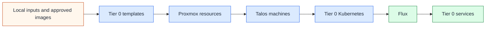

# Tier 0 bootstrap and recovery

## Table of contents

- [Purpose](#purpose)
- [Automation paths](#automation-paths)
- [Recovery rule](#recovery-rule)
- [Repository layout](#repository-layout)
- [Bootstrap phases](#bootstrap-phases)
- [Day 0 and Day 1](#day-0-and-day-1)
- [Day 2 onward](#day-2-onward)
- [Day 2 service sequence](#day-2-service-sequence)
- [What belongs in Tier 0](#what-belongs-in-tier-0)
- [What stays out of Tier 0](#what-stays-out-of-tier-0)
- [Implementation scope](#implementation-scope)
- [Read more](#read-more)

## Purpose

Use this path for the recoverable control foundation of the private cloud.

Tier 0 is where the environment keeps the systems and procedures needed to
bootstrap, repair, and recover the rest of the platform. Its inventory and
state belong to its own repository, with reusable automation in the shared
repository.

## Automation paths

The generated Tier 0 repo contains Linux VM setups for `foundation`, `vault`,
`hsm`, `template-refresh`, and `immutable-template`, plus a separate Talos and
Flux skeleton. These are owned by Tier 0,
but the Linux wrapper does not bootstrap Talos. Choose one lifecycle owner for
each service; a VM deployment and a cluster placeholder are not two owners of
the same instance.

Tier 0 also owns the image catalog, Proxmox template creation/update jobs, and
template publication state. Use the [template lifecycle](../../platforms/proxmox/template-lifecycle.md)
for AlmaLinux/Rocky and the [Talos template guide](../../platforms/proxmox/talos-template.md)
before cluster bootstrap. Shared code contains the reusable implementation.

Map Tier 0 networks to isolated custody infrastructure before applying these
examples. Connected identity, secrets, and HSM services belong in Tier 1.
See [Generated repository model](../../reference/generated-repository-model.md)
for setup placement, the per-tier inventory contract, and shared playbooks.

## Recovery rule

Tier 0 must remain recoverable without higher-tier services.

Do not make Tier 0 depend on:

- a hosted source-control service
- FreeIPA
- Keycloak
- Rancher or Fleet
- NetBox
- Grafana
- a Tier 1 or Tier 2 Kubernetes cluster
- Tier 1 or Tier 2 GitOps
- application workloads

An external bootstrap plane can exist for Day 0 and Day 1, but it should be
small, documented, and replaceable.

## Repository layout

The generated Tier 0 repository starts with this shape:

```text
homelab-tier-0/
  ansible/
    inventory/hosts.yml.example
    group_vars/
  terraform/
    common.tfvars.example
    templates/
    environments/
      foundation/
      vault/
      hsm/
      template-refresh/
      immutable-template/
  templates/
    proxmox.yml.example
  ci/
    gitlab-templates.yml.example
  scripts/
    check-shared.sh
    init-local-files.sh
    deploy.sh
  bootstrap/
    proxmox/
      main.tf
      network.tf
      tier0-vms.tf
      backend.tf
    talos/
      cluster.tf
      machines.tf
      patches/
  clusters/
    tier0/
      flux-system/
      infrastructure/
        cni/
        ingress/
        cert-manager/
        external-secrets/
        storage/
      databases/
        cloudnative-pg/
      applications/
        freeipa/
        netbox/
        keycloak/
        vault/
        headlamp/
```

`homelab` is only the default prefix. The generator allows another prefix and
produces the same tier structure with that name.

Services listed under `clusters/tier0/applications/` are managed by Tier 0
GitOps after the cluster exists. They are not allowed to become prerequisites
for rebuilding the Tier 0 cluster itself. For example, Keycloak, NetBox, and
Vault can be Tier 0 applications only if Tier 0 remains recoverable when they
are unavailable.

## Bootstrap phases



The important split is ownership:

| Layer | Owner after bootstrap | Notes |
| --- | --- | --- |
| Base templates and publication jobs | Tier 0 template root and local/CD workflow | works before the cluster and CI service exist |
| Proxmox resources | Terraform/OpenTofu | still owns VM placement and lifecycle |
| Talos machine config | Terraform/OpenTofu and Talos config | should be reproducible from Tier 0 repo inputs |
| Kubernetes add-ons | Flux | applied from `clusters/tier0/` |
| Tier 0 apps | Flux | must not require Tier 1 to start |
| local recovery material | operator-owned files or secret storage | never committed to upstream |

## Day 0 and Day 1

Day 0 and Day 1 create the minimum viable control path.

Expected flow:

1. prepare local bootstrap inputs
2. create or connect Proxmox access
3. publish and test a Talos template, then create control-plane and worker clones
4. bootstrap the Talos cluster
5. install Flux into the Tier 0 cluster
6. point Flux at the Tier 0 GitOps path
7. validate that Tier 0 can be restored from its own repository and recovery
   material

During this phase, it is acceptable to use a local workstation, a temporary
runner, or another small external bootstrap plane.

## Day 2 onward

After bootstrap, the operating model changes.

Terraform or OpenTofu continues to manage the infrastructure underneath the
cluster. Flux manages cluster resources and Tier 0 services from
`clusters/tier0/`.

Day 2 changes should follow this rule:

| Change type | Normal owner |
| --- | --- |
| VM count, CPU, memory, disks, networks | Terraform/OpenTofu |
| Talos machine config and cluster bootstrap inputs | Tier 0 bootstrap code |
| CNI, ingress, cert-manager, external-secrets, storage | Tier 0 GitOps |
| FreeIPA, Keycloak, Vault, Headlamp, NetBox, Tier 0 databases | Tier 0 GitOps |
| local recovery credentials and break-glass material | documented operator custody |

## Day 2 service sequence

Use this example order for early Tier 0 service deployment:

```text
FreeIPA
  -> Keycloak
  -> OIDC
  -> Headlamp
  -> NetBox
  -> Git/source control
  -> Grafana
  -> Rancher/Fleet where appropriate
```

The order is about dependency hygiene, not about making every service a Tier 0
bootstrap dependency.

NetBox or another inventory source of truth belongs early because it documents
networks, hosts, addresses, service ownership, racks, and recovery references.
It is still a Day 2 service. Keep enough inventory and recovery material in the
Tier 0 repository and operator custody to rebuild when NetBox is unavailable.

Source control, Grafana, Rancher, and Fleet may belong in Tier 1 in many
deployments. If they are represented in Tier 0, they are managed after
bootstrap and must not be required to recover the Tier 0 control path.

## What belongs in Tier 0

Tier 0 can include:

- Proxmox bootstrap definitions needed for Tier 0
- Talos cluster definitions
- base-image catalog, template publication and update jobs, and approved image recovery copies
- Flux bootstrap and reconciliation state
- minimum DNS, ingress, certificate, and storage services needed by Tier 0
- FreeIPA, Keycloak, NetBox, Headlamp, Vault, or equivalent control services
  after bootstrap when their absence does not block recovery
- NetBox or another inventory source of truth as an early Day 2 documentation
  and operations service
- Vault or another secret path when it is part of recovery
- key ceremony, HSM, and break-glass procedures
- small local observability for Tier 0 health

Keep each inclusion honest: if a component is not needed to recover the
platform, it may belong in Tier 1 instead.

## What stays out of Tier 0

Keep these out of the Tier 0 bootstrap dependency chain:

- GitLab as a required recovery dependency
- Rancher or Fleet as the Tier 0 bootstrap orchestrator
- NetBox as the only copy of recovery inventory
- Grafana as the only way to understand Tier 0 health
- application clusters
- general CI/CD runners (dedicated custody-local template jobs are a separate control function)
- broad observability, APM, and log search stacks unless they are explicitly
  required for Tier 0 recovery
- user or project workloads

These can still exist in Tier 1 or Tier 2.

## Implementation scope

The generator supplies split inventory examples, Linux Terraform roots, shared
playbooks and roles, tier launchers, and refresh tracking. Live local files are
created by the tier initializer.

The Talos bootstrap and Flux component directories remain editable skeletons.
They do not create a cluster or deploy the listed services. Complete and verify
their resources, offline dependencies, recovery procedure, and Day 2 readiness
gates before using that path. Kustomization list order does not implement the
service sequence above.

## Read more

- [Tier model](../../architecture/tier-model.md)
- [Generated repository model](../../reference/generated-repository-model.md)
- [Network architecture](../../architecture/network.md)
- [Secret strategy](../../security/secret-strategy.md)
- [Proxmox reference platform](../../platforms/proxmox/README.md)
- [Application platform path](../application-platform/README.md)
