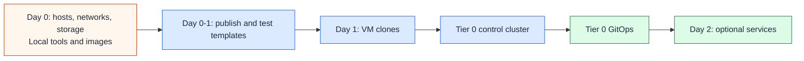

# Tier 0 bootstrap and recovery

## Table of contents

- [Purpose](#purpose)
- [Automation paths](#automation-paths)
- [Recovery rule](#recovery-rule)
- [Repository layout](#repository-layout)
- [Bootstrap phases](#bootstrap-phases)
- [Day 0 and Day 1](#day-0-and-day-1)
- [Day 2 onward](#day-2-onward)
- [Day 2 service sequence](#day-2-service-sequence)
- [What belongs in Tier 0](#what-belongs-in-tier-0)
- [What stays out of Tier 0](#what-stays-out-of-tier-0)
- [Implementation scope](#implementation-scope)
- [Read more](#read-more)

## Purpose

Use this path for the recoverable control foundation of the private cloud.

Tier 0 holds systems whose compromise can control the foundation or trust of
the environment, plus their bootstrap and recovery procedures. Its inventory and
state and service code belong to its own repository; only common helpers use the shared
repository.

That includes Proxmox, physical network and storage administration, and every
VM template lifecycle, even when the resulting VMs belong to Tier 1 or Tier 2.
See [Infrastructure control](../../architecture/infrastructure-control.md) for
workload ownership versus execution authority.

## Automation paths

The generated Tier 0 repo contains Linux VM setups for `foundation`, `vault`,
`hsm`, `template-refresh`, and `immutable-template`, plus a separate Talos and
Flux skeleton. These are owned by Tier 0,
but the Linux wrapper does not bootstrap Talos. Choose one lifecycle owner for
each service; a VM deployment and a cluster placeholder are not two owners of
the same instance.

Tier 0 also owns the image catalog, Proxmox template creation/update jobs, and
template publication state. Use the [template lifecycle](../../platforms/proxmox/template-lifecycle.md)
for AlmaLinux/Rocky and the [Talos template guide](../../platforms/proxmox/talos-template.md)
before cluster bootstrap. Tier 0 contains the full template implementation,
including its module, publication command, Packer definitions, and builder roles.

Place connected control services on protected networks and restrict their
administration to Tier 0 operators and automation. Offline keys, custody, and
selected recovery assets use a separate isolated fabric.
See [Generated repository model](../../reference/generated-repository-model.md)
for setup placement, the per-tier inventory contract, and code ownership.

## Recovery rule

Tier 0 must remain recoverable without higher-tier services.

Restoring Tier 0 must not require any of these services to be running first:

- a hosted source-control service
- FreeIPA
- Keycloak
- Rancher or Fleet
- NetBox
- Grafana
- a Tier 1 or Tier 2 Kubernetes cluster
- Tier 1 or Tier 2 GitOps
- application workloads

Normal operation may use connected Tier 0 identity and other control services.
Keep the break-glass path usable when those services are unavailable.

An external bootstrap plane can exist for Day 0 and Day 1, but it should be
small, documented, and replaceable.

## Repository layout

The generated Tier 0 repository starts with this shape:

```text
homelab-tier-0/
  ansible/
    playbooks/
    roles/
    requirements.yml
    inventory/hosts.yml.example
    group_vars/
  terraform/
    common.tfvars.example
    templates/
    modules/proxmox_templates/
    environments/
      foundation/
      vault/
      hsm/
      template-refresh/
      immutable-template/
  templates/
    proxmox.yml.example
  packer/
    templates/proxmox/
  ci/
    gitlab-templates.yml.example
  scripts/
    proxmox-templates.sh
    check-shared.sh
    init-local-files.sh
    deploy.sh
  bootstrap/
    proxmox/
      main.tf
      network.tf
      tier0-vms.tf
      backend.tf
    talos/
      cluster.tf
      machines.tf
      patches/
  clusters/
    tier0/
      flux-system/
      infrastructure/
        cni/
        ingress/
        cert-manager/
        external-secrets/
        storage/
      databases/
        cloudnative-pg/
      applications/
        freeipa/
        netbox/
        keycloak/
        vault/
        headlamp/
```

`homelab` is only the default prefix. The generator allows another prefix and
produces the same tier structure with that name.

The application directories are starter locations, not deployed services or
mandatory placement. Keep the Tier 0-authority instances here and place general
platform tools in Tier 1 when appropriate. Services managed by Tier 0 GitOps
must not become prerequisites for rebuilding that cluster. Tier 0 remains
recoverable when its identity, inventory UI, or secret service is unavailable.

## Bootstrap phases



The important split is ownership:

| Layer | Owner after bootstrap | Notes |
| --- | --- | --- |
| Base templates and publication jobs | Tier 0 template root and local/CD workflow | works before the cluster and CI service exist |
| Host, network, storage, and template control | Tier 0 operators and automation | authority applies to infrastructure serving every tier |
| Guest VM resources | existing tier-local Terraform roots | workload definitions stay tier-local; privileged execution is controlled by Tier 0 |
| Talos machine config | Terraform/OpenTofu and Talos config | should be reproducible from Tier 0 repo inputs |
| Kubernetes add-ons | Flux | applied from `clusters/tier0/` |
| Tier 0 apps | Flux | must not require Tier 1 to start |
| local recovery material | operator-owned files or secret storage | never committed to upstream |

## Day 0 and Day 1

Day 0 and Day 1 create the minimum viable control path, including templates
before the first managed VM. These operations are automated locally; hosted
scheduling is not required.

Expected flow:

1. prepare hosts, networking, storage, and protected local administrative access
2. retain local tools, approved images, provider artifacts, credentials, and recovery inputs
3. run the Tier 0 [local template workflow](../../platforms/proxmox/template-lifecycle.md#local-workflow)
   to publish and test the required Linux and Talos templates
4. create the first Linux guests or Talos control-plane and worker clones from approved templates
5. bootstrap the Talos cluster when using the cluster path
6. install Flux and point it at the Tier 0 GitOps definitions
7. validate that Tier 0 can be restored from its own repository and recovery
   material

During this phase, use a protected Tier 0 workstation or equivalent external
execution host. It must not need a VM template, workload runner, or hosted
service that this process is about to create. The image-import publisher has
no builder-VM dependency; later template-refresh builders do.

## Day 2 onward

After bootstrap, the operating model changes.

Terraform or OpenTofu continues to manage the infrastructure underneath the
cluster. Flux manages cluster resources and Tier 0 services from
`clusters/tier0/`.

Day 2 changes should follow this rule:

| Change type | Normal owner |
| --- | --- |
| VM count, CPU, memory, disks, guest attachments | tier-local definitions; Tier 0-controlled infrastructure execution |
| Physical hosts, host networks, storage, and template lifecycle | Tier 0 operators and automation |
| Talos machine config and cluster bootstrap inputs | Tier 0 bootstrap code |
| CNI, ingress, cert-manager, external-secrets, storage | Tier 0 GitOps |
| FreeIPA, Keycloak, Vault, Headlamp, NetBox, Tier 0 databases | Tier 0 GitOps |
| local recovery credentials and break-glass material | documented operator custody |

Tier 0 GitOps may later enable a provisioning service for Tier 2 VM creation and
update requests. Keep controller configuration, authorization, and execution
under Tier 0 ownership; retain tier-local workload definitions and state roots.
This is a future capability, not supplied by the current Flux skeleton. The
[request contract](../../architecture/infrastructure-control.md#delegated-provisioning)
defines the boundary and independence from Tier 2.

## Day 2 service sequence

Use this example order after bootstrap; each service stays in its owning tier:

```text
FreeIPA -> Keycloak -> OIDC -> service clients
```

Clients include Headlamp, NetBox, source control, Grafana, and Rancher/Fleet
where appropriate. They need the identity path, not each other in that order.
This sequence does not make them Tier 0 bootstrap dependencies.

NetBox or another inventory source of truth belongs early because it documents
networks, hosts, addresses, service ownership, racks, and recovery references.
It is still a Day 2 service. Keep enough inventory and recovery material in the
Tier 0 repository and operator custody to rebuild when NetBox is unavailable.

Source control, Grafana, Rancher, and Fleet may belong in Tier 1 when limited
to general platform scope. Any component with Tier 0 administrative authority
needs Tier 0 protection. Deploy it after bootstrap and keep a recovery path
that does not require it to be running.

## What belongs in Tier 0

Tier 0 can include:

- Proxmox, host, network, and storage control for the whole environment
- Talos cluster definitions
- base-image catalog, template publication and update jobs, and approved image recovery copies
- Flux bootstrap and reconciliation state
- infrastructure execution services and their request policy, when implemented
- minimum DNS, ingress, certificate, and storage services needed by Tier 0
- identity authorities, administrative brokers, privileged secrets, and cluster
  control UIs, deployed after bootstrap with independent recovery inputs
- key ceremony, HSM, and break-glass procedures
- small local observability for Tier 0 health

Classify each inclusion by its privileges and potential damage, not simply
whether it helps recovery. A system that can administer Tier 0 remains
Tier 0 even when it is optional for bootstrap.

## What stays out of Tier 0

Keep these out of the Tier 0 bootstrap dependency chain:

- GitLab as a required recovery dependency
- Rancher or Fleet as the Tier 0 bootstrap orchestrator
- NetBox as the only copy of recovery inventory
- Grafana as the only way to understand Tier 0 health
- application clusters
- general CI/CD runners (dedicated Tier 0 template jobs have their own privileged change path)
- broad observability, APM, and log search stacks unless they are explicitly
  required for Tier 0 recovery
- user or project workloads

General platform and project instances can still exist in Tier 1 or Tier 2;
Tier 0-privileged instances stay Tier 0 without becoming recovery prerequisites.

## Implementation scope

The generator supplies split inventory examples, Linux Terraform roots, tier-owned
playbooks and roles, common helpers, launchers, and refresh tracking. Live local files are
created by the tier initializer.

The Talos bootstrap and Flux component directories remain editable skeletons.
They do not create a cluster or deploy the listed services. Complete and verify
their resources, offline dependencies, recovery procedure, and Day 2 readiness
gates before using that path. Kustomization list order does not implement the
service sequence above.

## Read more

- [Tier model](../../architecture/tier-model.md)
- [Generated repository model](../../reference/generated-repository-model.md)
- [Network architecture](../../architecture/network.md)
- [Secret strategy](../../security/secret-strategy.md)
- [Proxmox reference platform](../../platforms/proxmox/README.md)
- [Application platform path](../application-platform/README.md)
