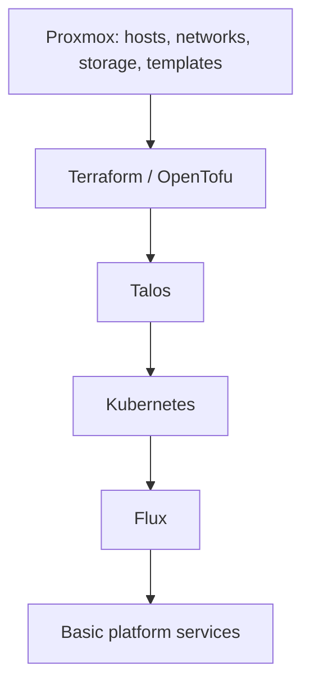
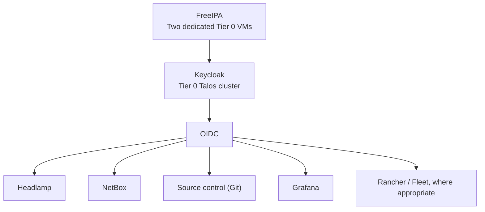

# Tier 0 bootstrap and recovery

For the deployment checklist, start with the [Tier 0 path](README.md).
This reference owns phase dependencies, recovery boundaries, and operational
handover. The shared [Talos procedure](../../platforms/talos/bootstrap.md) and
[cluster foundation](../application-platform/kubernetes.md#cluster-foundation)
own the reusable cluster installation steps.

## Table of contents

- [Recovery rule](#recovery-rule)
- [Automation paths](#automation-paths)
- [Bootstrap phases](#bootstrap-phases)
- [Day 0 bootstrap dependencies](#day-0-bootstrap-dependencies)
- [Day 1 cluster foundation](#day-1-cluster-foundation)
- [Day 2 service sequence](#day-2-service-sequence)
- [Day 3 operational handover](#day-3-operational-handover)
- [Implementation scope](#implementation-scope)

## Recovery rule

Tier 0 must remain recoverable without higher-tier services or services inside
the cluster being rebuilt. Normal operation may use connected identity, secrets,
and hosted tooling; keep a tested local break-glass path when they are unavailable.

| Retain outside the recovery target | Why |
| --- | --- |
| Tier 0 and shared checkouts, tools, provider artifacts, approved images | Publication and bootstrap must run without hosted source control or CI |
| Protected local credentials, machine configs, and cluster secrets | Login must not require the unavailable identity or secret service |
| Inventory, network/storage assignments, state, and recovery records | An inventory UI must not be the only copy |
| DNS/time, image access, and API access needed for bootstrap | The cluster cannot supply its own missing prerequisites |
| Tested etcd and application-data backups | Recreating VMs does not restore service data |

Use a protected Tier 0 workstation or equivalent external execution host for
Day 0-1. It must not require a template or runner that this process is about to
create. Isolate offline keys and custody separately from connected control
systems; see the [secret strategy](../../security/secret-strategy.md).

## Automation paths

Choose one lifecycle owner per service. A Linux VM setup and a cluster directory
are not two implementations to run against the same service instance.

| Resource or change | Owner and current entry point |
| --- | --- |
| Hosts, physical networks, storage, HA, and SDN | Tier 0 operators; [Proxmox preparation](../../platforms/proxmox/README.md#first-deployment-order) |
| All base templates and publication jobs | Tier 0 `terraform/templates/` and [local/CD workflow](../../platforms/proxmox/template-lifecycle.md) |
| Linux authority VMs | Tier 0 `foundation`, `vault`, and `hsm` setups through shared helpers |
| Builder VMs after initial publication | Tier 0 `template-refresh` and `immutable-template` setups |
| Talos VMs and machine configuration | Operator [bootstrap procedure](../../platforms/talos/bootstrap.md); complete tier-owned skeletons before automating |
| Cluster add-ons and service definitions | Intended GitOps path `clusters/tier0/`; starter directories currently contain no deployments |
| Workload VM definitions and state | Existing tier-local roots; privileged execution remains under Tier 0 authority |
| VM relocation after creation | Proxmox operators/HA; [placement contract](../../platforms/proxmox/cluster-ha.md#terraform-against-the-cluster) |

For full file locations, use the [automation layout](../../reference/infrastructure-automation-layout.md).
For classification and what belongs elsewhere, use the [tier model](../../architecture/tier-model.md).

## Bootstrap phases

**Day 0/1 builds the platform. Day 2 adds identity and connects its clients.
Day 3 completes access handover and recovery testing.**

This is the intended Day 0/1 automation flow, not a shipped end-to-end installer.
Current wrappers call `terraform`; OpenTofu is a design option, not a validated
drop-in command here. The Talos resources are still skeletons; use the
[operator-run procedure](../../platforms/talos/bootstrap.md) until they are implemented.
CNI must work before Flux can reconcile ordinary cluster services.

FreeIPA's dedicated VMs can start after the template gate without Kubernetes.
Initial publication runs locally, without builder VMs or hosted CI; later CD
reuses the same Tier 0 implementation and state.

## Day 0 bootstrap dependencies

Use existing services or prepare independent bootstrap instances. Do not first
host these dependencies inside the cluster they must create or restore.

| Dependency | Bootstrap requirement |
| --- | --- |
| Proxmox, networks, storage, templates | Complete the [host checklist](../../platforms/proxmox/README.md#first-deployment-order) and [template publication](../../platforms/proxmox/template-lifecycle.md#local-workflow), including Talos images |
| DNS, time, and TLS trust | Available before FreeIPA, cert-manager, or Vault; record temporary and permanent owners |
| Source control (Git) | A reachable repository for Flux plus an external recovery checkout; initial access must not require Day 2 SSO |
| OCI registry | Reachable approved image/chart sources or prepared mirrors; independent pull access and retained recovery artifacts |
| CI/bootstrap runner | A protected Tier 0 execution host; local commands are sufficient, hosted CI is optional |
| Terraform state | One owner per root, protected backups, and serialized writes; use a local backend or an independently available remote backend |
| Bootstrap credentials | Scoped infrastructure/source/artifact access and protected cluster recovery material outside the target cluster |

Day 0 does not require installing a full development platform. The supplied
general source-control, registry, and runner paths are Tier 1 services, not
Tier 0 recovery prerequisites. A Tier 0 deployment source or runner must protect
its accepted code and credentials at Tier 0, even when a product is used elsewhere.
Keep the local publication path before any builder VM can exist.

If tooling or state later moves into the cluster, retain a tested independent
recovery path. Migrate the existing state deliberately; never create a second
state owner. The supplied bootstrap backend is local; remote-backend setup is
an operator choice, not something the generator provisions.

## Day 1 cluster foundation

Follow [Talos bootstrap](../../platforms/talos/bootstrap.md), then the shared
[cluster foundation checklist](../application-platform/kubernetes.md#cluster-foundation).
That checklist owns CNI, Flux, SOPS, storage, certificates, ingress, and CNPG
ordering for both Tier 0 and Tier 1.

Do not wait for Vault to decrypt the manifests that will deploy Vault. Keep the
initial SOPS key and source credentials recoverable outside the cluster; see
[GitOps bootstrap secrets](../../security/secret-strategy.md#gitops-bootstrap-secrets).

## Day 2 service sequence

Deploy selected control services after their Day 1 dependencies pass. Each
instance stays in its owning tier, whether it runs on a VM or in Kubernetes.

| Service | Dependency and check |
| --- | --- |
| FreeIPA | Two dedicated Tier 0 VMs, `idm-1` and `idm-2`, via the [identity foundation](../shared-services/identity.md); verify replication, DNS, and PKI before changing bootstrap dependencies |
| Keycloak | Inside the Tier 0 Talos cluster; connect to the FreeIPA pair, prepare its database/TLS, and test OIDC clients and group mappings |
| Vault | Follow the [Vault guide](../shared-services/vault.md); verify initialization, recovery access, audit, and backups before clients depend on it |
| NetBox | Add inventory documentation early, after its database, cache, storage, and access path are ready; retain recovery exports outside it |
| Headlamp | Verify control-cluster access with scoped permissions and test OIDC without removing emergency access |
| Monitoring | Add control-service health, audit visibility, and alerts; test delivery and retain an independent way to detect cluster outages |

These arrows describe identity integration, not a mandatory install chain for
every client. Source control already provides bootstrap access on Day 0; Day 2
adds OIDC for supported normal logins. Clients do not depend on each other in
the order shown. Test normal login here, then complete the access handover on
Day 3. Vault has its own recovery/authentication path and is not an OIDC
prerequisite for bootstrapping the cluster.

Enable backups when each stateful service is introduced, not only on Day 3.
None becomes a mandatory dependency for recovering its own platform.

General platform instances belong in Tier 1. Instances with Tier 0 authority
need Tier 0 protection, independent of product name. Before installing cluster
services, implement and verify their manifests and dependency gates; directory
names and Kustomization list order do not enforce this sequence.

## Day 3 operational handover

Tighten and prove the controls established during bootstrap:

1. Review operator, service-account, runner, and GitOps RBAC. Test denied actions
   as well as permitted ones; keep ordinary Tier 1/2 users out of Tier 0 administration.
2. Switch supported normal human logins to OIDC after testing identity outages
   and group-to-role mappings. Automation keeps scoped machine credentials.
3. Revoke temporary tokens and remove routine use of bootstrap administrators.
   Disable or restrict bootstrap credentials only after testing protected local
   break-glass access; retain the keys needed for independent recovery.
4. Restore state, cluster data, and representative service backups in an isolated
   test. Prove recovery without the identity, secret, inventory, or hosted
   automation services being restored; include [HA failure checks](../../platforms/proxmox/cluster-ha.md#prove-failover).
5. Record owners, backup locations, recovery steps, and test results in the
   generated architecture repo's project-owned recovery runbook.

## Implementation scope

The generator provides working template-publication entry points, Linux Terraform
roots, tier-owned playbooks/roles, common helpers, and split inventory examples.
Local initialization creates the operational input files; generation deploys nothing.

`bootstrap/proxmox/`, `bootstrap/talos/`, and the Flux component directories are
editable **skeletons**. They do not provision a cluster, install Flux, or deploy
the listed services. Use the operator guide now; automate only after defining
resource ownership, state adoption, offline artifacts, and recovery checks.

FreeIPA is owned only by the VM `foundation` setup, not cluster reconciliation.
Refresh preserves project-owned cluster files: older collections may still have
an `applications/freeipa/` placeholder. Review and retire that unused reference
manually; check deployed resources and pruning behavior before removing anything.

Future Tier 2 VM creation/update requests may be accepted by automation enabled
in Tier 0 GitOps. The controller, authorization, and execution stay Tier 0-owned;
definitions and state stay tier-local. This is not supplied by the skeletons.
See the [delegated request contract](../../architecture/infrastructure-control.md#delegated-provisioning).
