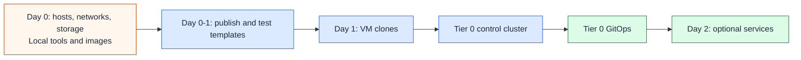

# Tier 0 bootstrap and recovery

For the deployment checklist, start with the [Tier 0 path](README.md).
This reference owns recovery boundaries, lifecycle ownership, and the Day 2
service sequence. The shared [Talos procedure](../../platforms/talos/bootstrap.md)
owns the cluster installation steps.

## Table of contents

- [Recovery rule](#recovery-rule)
- [Automation paths](#automation-paths)
- [Bootstrap phases](#bootstrap-phases)
- [Day 2 service sequence](#day-2-service-sequence)
- [Implementation scope](#implementation-scope)

## Recovery rule

Tier 0 must remain recoverable without higher-tier services or services inside
the cluster being rebuilt. Normal operation may use connected identity, secrets,
and hosted tooling; keep a tested local break-glass path when they are unavailable.

| Retain outside the recovery target | Why |
| --- | --- |
| Tier 0 and shared checkouts, tools, provider artifacts, approved images | Publication and bootstrap must run without hosted source control or CI |
| Protected local credentials, machine configs, and cluster secrets | Login must not require the unavailable identity or secret service |
| Inventory, network/storage assignments, state, and recovery records | An inventory UI must not be the only copy |
| DNS/time, image access, and API access needed for bootstrap | The cluster cannot supply its own missing prerequisites |
| Tested etcd and application-data backups | Recreating VMs does not restore service data |

Use a protected Tier 0 workstation or equivalent external execution host for
Day 0-1. It must not require a template or runner that this process is about to
create. Isolate offline keys and custody separately from connected control
systems; see the [secret strategy](../../security/secret-strategy.md).

## Automation paths

Choose one lifecycle owner per service. A Linux VM setup and a cluster directory
are not two implementations to run against the same service instance.

| Resource or change | Owner and current entry point |
| --- | --- |
| Hosts, physical networks, storage, HA, and SDN | Tier 0 operators; [Proxmox preparation](../../platforms/proxmox/README.md#first-deployment-order) |
| All base templates and publication jobs | Tier 0 `terraform/templates/` and [local/CD workflow](../../platforms/proxmox/template-lifecycle.md) |
| Linux authority VMs | Tier 0 `foundation`, `vault`, and `hsm` setups through shared helpers |
| Builder VMs after initial publication | Tier 0 `template-refresh` and `immutable-template` setups |
| Talos VMs and machine configuration | Operator [bootstrap procedure](../../platforms/talos/bootstrap.md); complete tier-owned skeletons before automating |
| Cluster add-ons and service definitions | Intended GitOps path `clusters/tier0/`; starter directories currently contain no deployments |
| Workload VM definitions and state | Existing tier-local roots; privileged execution remains under Tier 0 authority |
| VM relocation after creation | Proxmox operators/HA; [placement contract](../../platforms/proxmox/cluster-ha.md#terraform-against-the-cluster) |

For full file locations, use the [automation layout](../../reference/infrastructure-automation-layout.md).
For classification and what belongs elsewhere, use the [tier model](../../architecture/tier-model.md).

## Bootstrap phases



This shows the control-cluster route; Linux authority VMs can start after the
template gate without Kubernetes. Initial template publication runs locally,
without builder VMs or hosted CI. Optional later CD reuses the same Tier 0
implementation and state. Before relying on either route, test recovery without
the identity, secret, inventory, or hosted automation services being restored.

## Day 2 service sequence

Use this example identity order after bootstrap; each instance stays in its
owning tier:

```text
FreeIPA -> Keycloak -> OIDC -> service clients
```

Clients include Headlamp, NetBox, source control, Grafana, and Rancher/Fleet
where appropriate. They need the identity path, not each other in that order.
Keep local emergency access; none becomes a mandatory Tier 0 recovery dependency.

Add NetBox or another inventory source of truth early on Day 2, after its
database, storage, identity integration, and backups are ready. Keep enough
inventory and recovery material outside it to rebuild when it is unavailable.

General platform instances belong in Tier 1. Instances with Tier 0 authority
need Tier 0 protection, independent of product name. Before installing cluster
services, implement and verify their manifests and dependency gates; directory
names and Kustomization list order do not enforce this sequence.

## Implementation scope

The generator provides working template-publication entry points, Linux Terraform
roots, tier-owned playbooks/roles, common helpers, and split inventory examples.
Local initialization creates the operational input files; generation deploys nothing.

`bootstrap/proxmox/`, `bootstrap/talos/`, and the Flux component directories are
editable **skeletons**. They do not provision a cluster, install Flux, or deploy
the listed services. Use the operator guide now; automate only after defining
resource ownership, state adoption, offline artifacts, and recovery checks.

Future Tier 2 VM creation/update requests may be accepted by automation enabled
in Tier 0 GitOps. The controller, authorization, and execution stay Tier 0-owned;
definitions and state stay tier-local. This is not supplied by the skeletons.
See the [delegated request contract](../../architecture/infrastructure-control.md#delegated-provisioning).
