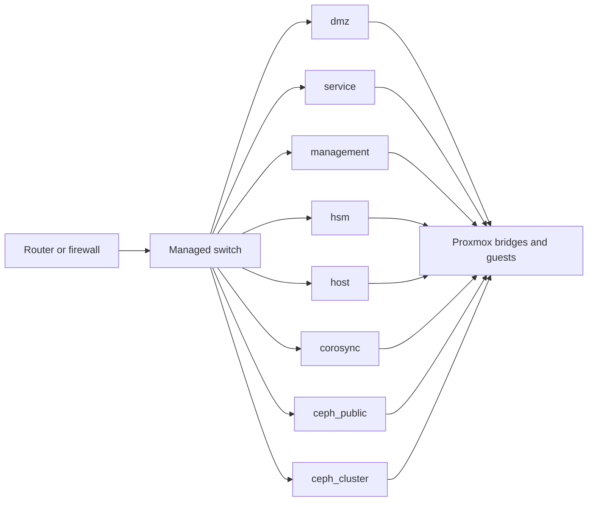

# Proxmox network prerequisites

## Table of contents

- [Purpose](#purpose)
- [Design intent](#design-intent)
- [Repository zone catalog](#repository-zone-catalog)
- [Required external capabilities](#required-external-capabilities)
- [Suggested network segments](#suggested-network-segments)
- [Responsibility boundary](#responsibility-boundary)
- [Validation checklist](#validation-checklist)

## Purpose

Proxmox can present bridges and VLAN-tagged networks to guests, but it does not
replace the external network design needed to make segmentation work. This
repository assumes switching, routing, and firewalling already support the
chosen design.

## Design intent

Use the private-cloud network model described in the architecture overview.

Read more in [Architecture overview](../../architecture/overview.md).

## Repository zone catalog

Use [Network zones and IaC mapping](../../architecture/network-zones-and-iac-mapping.md)
as the repository source of truth for:

- zone names such as `management`, `service`, `dmz`, and `hsm`
- the `network_zones` keys used in Terraform
- the bridge, VLAN, and subnet values you fill in locally

This document stays Proxmox-specific. The zone catalog holds the shared logical
model so it does not have to be repeated in every platform guide.

## Required external capabilities

The surrounding network should provide:

- VLAN-aware switching
- routing between allowed segments
- firewall policy between trust zones
- gateway or router support for north-south and east-west traffic
- DNS and DHCP aligned with the selected segmentation model

## Suggested network segments

Keep the model simple at first. The important part is predictable separation
between edge, service, management, host, storage, and restricted HSM-adjacent
paths.

Use the shared zone names from the architecture reference even if your first
Proxmox deployment starts with only `management` and `service`.

## Responsibility boundary

Current scope of this repository:

- consume existing Proxmox bridges and VLAN-backed networks
- place guests into the intended segments
- document the network assumptions clearly

Current out-of-scope areas:

- programming the external router or firewall
- managing switch VLAN configuration
- creating DHCP, DNS, or upstream routing policies automatically

Future integrations may automate parts of this boundary, but they are not
assumed today.

## Validation checklist

Before running automation, confirm:

- VLANs exist end-to-end on the external network
- routed paths exist only where intended
- firewall rules reflect trust boundaries
- management access is restricted to trusted sources
- guest networks can reach only the services they are meant to reach
