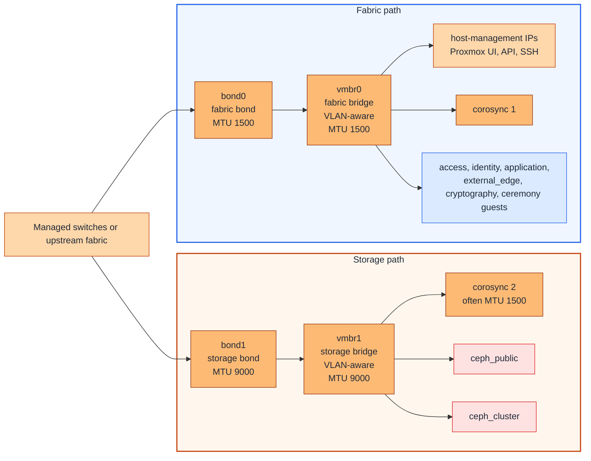

# Proxmox host networking

## Table of contents

- [Purpose](#purpose)
- [Shared network reference](#shared-network-reference)
- [What to implement on Proxmox](#what-to-implement-on-proxmox)
- [Recommended host pattern](#recommended-host-pattern)
- [Bonds and bridges](#bonds-and-bridges)
- [Storage fabric OVS/RSTP](#storage-fabric-ovsrstp)
- [Optional SDN for guest networks](#optional-sdn-for-guest-networks)
- [Host-side VLANs](#host-side-vlans)
- [VLAN strategy](#vlan-strategy)
- [MTU planning](#mtu-planning)
- [Single-trunk fallback](#single-trunk-fallback)
- [Host-side notes](#host-side-notes)
- [Validation checklist](#validation-checklist)

## Purpose

Use this guide to decide how the chosen network design is implemented on
Proxmox hosts.

It focuses on host uplinks, bonds, bridges, VLAN-aware bridges, and the
host-side paths often needed for `management`, `corosync`, and Ceph.

This guide does not redefine the global network model. It assumes the external
switching, routing, and firewalling already exist.

In this Proxmox guide, `management` means the host-management network used to
reach the Proxmox web UI, API, and SSH.

## Shared network reference

Use [Network architecture](../../architecture/network.md)
as the source of truth for:

- zone names such as `management`, `access`, `identity`, `application`,
  `cryptography`, `external_edge`, and `ceremony`
- the deployable guest `network_zones` keys used in Terraform
- the SDN VNet ID or non-SDN bridge, optional VLAN tag, and subnet values you
  fill in locally

This page stays Proxmox-specific and explains how those logical zones are
presented on the hosts.

## What to implement on Proxmox

On the Proxmox side, decide and document:

- which NICs are used for the primary uplinks
- whether those uplinks are bonded
- which bridge carries the normal fabric traffic
- which bridge carries storage traffic when you separate storage
- whether the bridges are VLAN-aware
- whether guest/workload networks consume Proxmox SDN VNets or non-SDN
  bridge-and-VLAN tagging
- whether any trunks allow native or untagged VLANs at all
- whether `corosync`, `ceph_public`, or `ceph_cluster` use shared or dedicated
  uplinks
- where the Proxmox host-management, `corosync`, and Ceph IPs live
- which MTU is used on each bond, bridge, and VLAN-backed path

## Recommended host pattern



Figure: one strong clustered Proxmox pattern is to keep normal platform VLANs
on a fabric bond and bridge, and keep Ceph plus a second Corosync path on a
separate storage bond and bridge.

## Bonds and bridges

Use stable host-side components such as these:

| Component | Typical use | MTU | Notes |
| --- | --- | --- | --- |
| `bond0` | fabric bond | `1500` | use for the main host-management, guest, access, identity, and application trunk |
| `vmbr0` | fabric bridge | `1500` | keep it VLAN-aware and do not allow native VLANs so untagged traffic does not land on the wrong network |
| `bond1` | storage bond | `9000` | use for storage-heavy traffic when Ceph benefits from jumbo frames |
| `vmbr1` | storage bridge | `9000` | use OVS with RSTP for direct/full-mesh storage fabric; otherwise keep it VLAN-aware and limited to storage VLANs plus the second Corosync VLAN |
| extra copper ports | optional dedicated Corosync paths | `1500` | prefer using them for `corosync 1` and `corosync 2` when you want extra cluster stability and separation instead of sharing those paths on `vmbr0` and `vmbr1` |

Bonding and bridge notes:

- if you use `802.3ad` for `bond0` or `bond1`, configure the switch side for
  LACP too
- in UniFi this is exposed through port
  [aggregation](https://help.ui.com/hc/en-us/articles/360007279753-UniFi-USW-Configuring-Link-Aggregation-Groups-LAG-?source=post_page---------------------------)
- on other switch platforms, the same setup is often presented more explicitly
  as dynamic `LACP` on the member ports or a port-channel
- keep `vmbr1` VLAN-aware and allow only the needed storage VLANs and the
  second Corosync VLAN on it, for example `20-22`
- keep `vmbr0` VLAN-aware and carry the remaining allowed VLAN IDs there, for
  example `10-12 120 220-221 320`

## Storage fabric OVS/RSTP

For a three-node direct/full-mesh storage fabric, use Open vSwitch with RSTP on
the storage bridge. This follows the
[Proxmox full-mesh Ceph pattern](https://pve.proxmox.com/wiki/Full_Mesh_Network_for_Ceph_Server)
and gives the storage fabric a faster loop-recovery mechanism than classic
Linux bridge STP.

Use this for the storage side only:

- install `openvswitch-switch` on every Proxmox node before switching the
  storage fabric to OVS
- keep the fabric side, host-management, and guest SDN underlay separate from
  this storage bridge unless your design intentionally collapses them
- do not mix Linux bridge or Linux bond members inside the same OVS path
- adapt NIC names, IP addresses, MTU, and path costs per node
- prefer a switched storage fabric when the cluster will grow beyond three
  nodes

Minimal storage-fabric shape:

```text
node-1 ens18 ----- ens19 node-2
node-2 ens18 ----- ens19 node-3
node-3 ens18 ----- ens19 node-1
```

Example `/etc/network/interfaces` pattern for `vmbr1`:

```ini
auto ens18
iface ens18 inet manual
    ovs_type OVSPort
    ovs_bridge vmbr1
    ovs_mtu 9000
    ovs_options other_config:rstp-enable=true other_config:rstp-path-cost=150 other_config:rstp-port-admin-edge=false other_config:rstp-port-auto-edge=false other_config:rstp-port-mcheck=true vlan_mode=native-untagged

auto ens19
iface ens19 inet manual
    ovs_type OVSPort
    ovs_bridge vmbr1
    ovs_mtu 9000
    ovs_options other_config:rstp-enable=true other_config:rstp-path-cost=150 other_config:rstp-port-admin-edge=false other_config:rstp-port-auto-edge=false other_config:rstp-port-mcheck=true vlan_mode=native-untagged

auto vmbr1
iface vmbr1 inet static
    address 10.15.15.50/24
    ovs_type OVSBridge
    ovs_ports ens18 ens19
    ovs_mtu 9000
    up ovs-vsctl set Bridge ${IFACE} rstp_enable=true other_config:rstp-priority=32768 other_config:rstp-forward-delay=4 other_config:rstp-max-age=6
    post-up sleep 10
```

Verify RSTP after applying the host network change:

```bash
ovs-appctl rstp/show
```

## Optional SDN for guest networks

Use SDN as a Proxmox-side convenience for VM-facing networks. This repository
only needs the final VM attachment name.

Short guardrails:

- use SDN for guest/workload networks such as `identity`, `application`,
  `external_edge`, `cryptography`, `ceremony`, labs, and tenant networks
- do not move host-management, Corosync, `ceph_public`, `ceph_cluster`, or
  other Proxmox/Ceph transport networks into SDN
- keep `bond0`/`vmbr0` and optional `bond1`/`vmbr1` as the stable underlay
- test SDN on a non-critical guest network before using it broadly
- stage bridge, LACP, VLAN, and SDN changes instead of changing everything at
  once

Use the current
[Proxmox SDN documentation](https://pve.proxmox.com/pve-docs/chapter-pvesdn.html)
for exact UI fields. For this repo, a VLAN-backed SDN setup usually looks like:

1. Confirm the underlay bridge, usually `vmbr0`, is VLAN-aware and trunked on
   the switch.
2. In Proxmox, open `Datacenter` -> `SDN` -> `Zones` and create a VLAN zone.
   Use a short zone ID and point it at the underlay bridge, such as `vmbr0`.
3. Open `Datacenter` -> `SDN` -> `VNets` and create one VNet per guest
   network. Keep VNet IDs short, ideally eight characters or fewer, such as
   `app`, `ident`, `crypto`, `edge`, or `tenant1`.
4. Set the VNet VLAN tag to the real VLAN carried by the underlay trunk. Use
   the Proxmox Alias or description fields for longer human-readable names.
5. Apply the SDN configuration from the main SDN panel and verify that the VNet
   exists on the intended nodes before Terraform attaches guests to it.
6. Skip Proxmox SDN subnets unless you intentionally use Proxmox IPAM, DHCP, or
   routed SDN features. This repo still provides static guest IPs through
   Terraform cloud-init values in `network_zones`.

Map the result into `terraform/common.tfvars`:

```hcl
network_zones = {
  application = {
    bridge       = "app" # SDN VNet ID
    cidr_ipv4    = "10.20.20.0/24"
    gateway_ipv4 = "10.20.20.1"
  }

  external_edge = {
    bridge       = "vmbr0" # non-SDN bridge
    vlan_id      = 320     # VM NIC is tagged
    cidr_ipv4    = "10.30.30.0/24"
    gateway_ipv4 = "10.30.30.1"
  }
}
```

## Host-side VLANs

In this Proxmox pattern, focus the host-side VLAN plan on the VLANs that the
hosts themselves use.

| VLAN or path | Recommended bridge or port | MTU | Notes |
| --- | --- | --- | --- |
| `management` | `vmbr0` | `1500` | keep the web UI, API, and SSH reachable before automation starts; do not move this into SDN |
| `corosync 1` | dedicated `eth` port if possible, else `vmbr0` | `1500` | keep the first Corosync path on the fabric side |
| `corosync 2` | dedicated `eth` port if possible, else `vmbr1` | `1500` | keep the second Corosync path away from the first one |
| `ceph_public` | `vmbr1` | `9000` | separate from guest traffic when possible; do not move this into SDN |
| `ceph_cluster` | `vmbr1` | `9000` | keep distinct from `ceph_public` for Ceph replication and recovery; do not move this into SDN |

Guest networks such as `access`, `identity`, `application`, `external_edge`,
`cryptography`, and `ceremony` can be consumed either through Proxmox SDN VNets
or through non-SDN bridge-and-VLAN tagging on `vmbr0`.

## VLAN strategy

This is not Proxmox-specific, but it makes the Proxmox bridge configuration
easier to keep readable. Read more in
[Network architecture](../../architecture/network.md#vlan-id-strategy).

Recommended practice:

- record deployable guest network attachments in Terraform `network_zones` so
  automation matches the host implementation
- for SDN, record the VNet ID as `bridge` and omit `vlan_id`
- for non-SDN networking, record the Linux bridge as `bridge` and set
  `vlan_id` to tag the VM NIC
- keep host-only platform VLANs in the Proxmox host/network documentation
- decide the reserved VLAN ID ranges early because later changes are harder
  across bridges, guests, switches, and firewalls
- group related VLAN IDs so bridge expressions stay easier to read, for
  example `10-12 120 220-221 320` on `vmbr0` instead of one long ad hoc list

## MTU planning

Keep MTU explicit in the host design.

Recommended practice:

- keep the fabric side on `1500` MTU unless you have a clear reason to raise it
- keep the storage side on `9000` MTU since Ceph traffic benefits from jumbo
  frames
- ensure the switch is configured for jumbo frames when you use MTU above
  `1500`
- set MTU explicitly on the bonds, bridges, and VLAN-backed paths that need it
- if a bridge carries any `9000` MTU VLANs, the bridge itself cannot stay below
  that requirement
- a second Corosync VLAN can still stay at `1500` even when the storage bridge
  itself is `9000`
- keep VM MTU decisions aligned with the Proxmox-side network design; this
  repository does not carry MTU in the shared Terraform guest network catalog

## Single-trunk fallback

If the environment cannot justify or support a separate storage bond, collapse
the design onto one main bonded trunk.

Use this fallback when:

- the host does not have enough ports
- the storage uplinks are not fast enough to justify separation
- Ceph traffic is not heavy enough to deserve its own bond

Practical Ceph threshold examples:

- treat `25+ Gbit` as a more natural floor for NVMe-backed Ceph separation
- treat `10+ Gbit` as a more natural floor for HDD-backed Ceph separation

When you use the single-trunk fallback:

- set the bridge MTU high enough for the Ceph networks if they need `9000`
- keep explicit MTU settings on the Proxmox host paths

## Host-side notes

- put host IPs on bridges or VLAN subinterfaces, not on the physical slave NICs
- use descriptions on each bond, bridge, and VLAN so it is obvious what they
  carry, for example `fabric bridge`, `management port`, or `ceph cluster port`
- start with a simple host network layout before adding more complex bond
  separation, and add the fabric or storage split later if you do not need it
  on day one
- this repository does not configure the physical switch, router, or firewall

## Validation checklist

Before running automation, confirm:

- every node has the expected bond and bridge layout
- host-management access is working on every node
- VLAN tags exist end-to-end on the underlay where needed
- guest bridge names or SDN VNet IDs line up with the local `network_zones`
  values
- SDN VNets exist before Terraform attaches VMs to them
- SDN VNets are only used for guest/workload networks, not host-management,
  Corosync, or Ceph transport networks
- no bridge or trunk is accidentally carrying an untagged or native VLAN
- no host IPs are left on bond slaves or physical NICs by mistake
- both Corosync networks are present and placed on the intended paths if
  clustering is in use
- `ceph_public` and `ceph_cluster` are separated when Ceph is in use
- the storage bridge and Ceph paths use the expected `9000` MTU when that is
  part of the design
- MTU, routes, and host-side naming are consistent across the nodes that should
  be interchangeable
