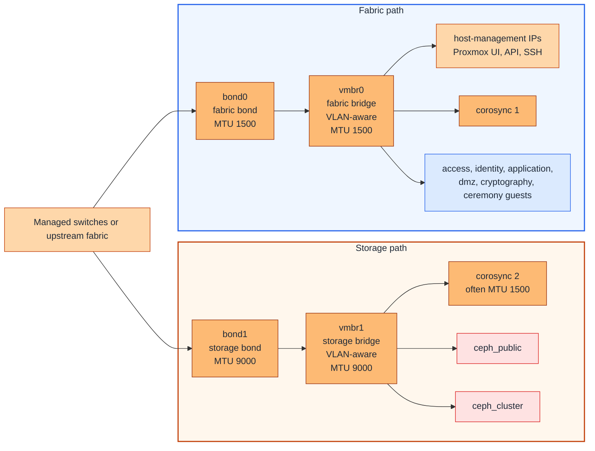

# Proxmox host networking

## Table of contents

- [Purpose](#purpose)
- [Shared network reference](#shared-network-reference)
- [What to implement on Proxmox](#what-to-implement-on-proxmox)
- [Recommended host pattern](#recommended-host-pattern)
- [Bonds and bridges](#bonds-and-bridges)
- [Host-side VLANs](#host-side-vlans)
- [VLAN strategy](#vlan-strategy)
- [MTU planning](#mtu-planning)
- [Single-trunk fallback](#single-trunk-fallback)
- [Host-side notes](#host-side-notes)
- [Validation checklist](#validation-checklist)

## Purpose

Use this guide to decide how the chosen network design is implemented on
Proxmox hosts.

It focuses on host uplinks, bonds, bridges, VLAN-aware bridges, and the
host-side paths often needed for `management`, `corosync`, and Ceph.

This guide does not redefine the global network model. It assumes the external
switching, routing, and firewalling already exist.

In this Proxmox guide, `management` means the host-management network used to
reach the Proxmox web UI, API, and SSH.

## Shared network reference

Use [Network zones and IaC mapping](../../architecture/network-zones-and-iac-mapping.md)
as the source of truth for:

- zone names such as `management`, `access`, `identity`, `application`,
  `cryptography`, `dmz`, and `ceremony`
- the `network_zones` keys used in Terraform
- the bridge, VLAN, and subnet values you fill in locally

This page stays Proxmox-specific and explains how those logical zones are
presented on the hosts.

## What to implement on Proxmox

On the Proxmox side, decide and document:

- which NICs are used for the primary uplinks
- whether those uplinks are bonded
- which bridge carries the normal fabric traffic
- which bridge carries storage traffic when you separate storage
- whether the bridges are VLAN-aware
- whether any trunks allow native or untagged VLANs at all
- whether `corosync`, `ceph_public`, or `ceph_cluster` use shared or dedicated
  uplinks
- where the Proxmox host-management, `corosync`, and Ceph IPs live
- which MTU is used on each bond, bridge, and VLAN-backed path

## Recommended host pattern

Figure: one strong clustered Proxmox pattern is to keep normal platform VLANs
on a fabric bond and bridge, and keep Ceph plus a second Corosync path on a
separate storage bond and bridge.

## Bonds and bridges

Use stable host-side components such as these:

| Component | Typical use | MTU | Notes |
| --- | --- | --- | --- |
| `bond0` | fabric bond | `1500` | use for the main host-management, guest, access, identity, and application trunk |
| `vmbr0` | fabric bridge | `1500` | keep it VLAN-aware and do not allow native VLANs so untagged traffic does not land on the wrong network |
| `bond1` | storage bond | `9000` | use for storage-heavy traffic when Ceph benefits from jumbo frames |
| `vmbr1` | storage bridge | `9000` | keep it VLAN-aware and limit it to the storage VLANs plus the second Corosync VLAN |
| extra copper ports | optional dedicated Corosync paths | `1500` | prefer using them for `corosync 1` and `corosync 2` when you want extra cluster stability and separation instead of sharing those paths on `vmbr0` and `vmbr1` |

Bonding and bridge notes:

- if you use `802.3ad` for `bond0` or `bond1`, configure the switch side for
  LACP too
- in UniFi this is exposed through port
  [aggregation](https://help.ui.com/hc/en-us/articles/360007279753-UniFi-USW-Configuring-Link-Aggregation-Groups-LAG-?source=post_page---------------------------)
- on other switch platforms, the same setup is often presented more explicitly
  as dynamic `LACP` on the member ports or a port-channel
- keep `vmbr1` VLAN-aware and allow only the needed storage VLANs and the
  second Corosync VLAN on it, for example `20-22`
- keep `vmbr0` VLAN-aware and carry the remaining allowed VLAN IDs there, for
  example `10-12 120 220-221 320`

## Host-side VLANs

In this Proxmox pattern, focus the host-side VLAN plan on the VLANs that the
hosts themselves use.

| VLAN or path | Recommended bridge or port | MTU | Notes |
| --- | --- | --- | --- |
| `management` | `vmbr0` | `1500` | keep the web UI, API, and SSH reachable before automation starts |
| `corosync 1` | dedicated `eth` port if possible, else `vmbr0` | `1500` | keep the first Corosync path on the fabric side |
| `corosync 2` | dedicated `eth` port if possible, else `vmbr1` | `1500` | keep the second Corosync path away from the first one |
| `ceph_public` | `vmbr1` | `9000` | separate from guest traffic when possible |
| `ceph_cluster` | `vmbr1` | `9000` | keep distinct from `ceph_public` for Ceph replication and recovery |

Guest VLANs such as `access`, `identity`, `application`, `dmz`,
`cryptography`, and `ceremony` are carried on the fabric bridge `vmbr0` and
selected on each VM NIC by
assigning the intended VLAN tag to that VM.

## VLAN strategy

This is not Proxmox-specific, but it makes the Proxmox bridge configuration
easier to keep readable. Read more in
[Network zones and IaC mapping](../../architecture/network-zones-and-iac-mapping.md#vlan-id-strategy).

Recommended practice:

- record the chosen VLAN IDs in Terraform `network_zones` so the IaC matches
  the host implementation
- decide the reserved VLAN ID ranges early because later changes are harder
  across bridges, guests, switches, and firewalls
- group related VLAN IDs so bridge expressions stay easier to read, for
  example `10-12 120 220-221 320` on `vmbr0` instead of one long ad hoc list

## MTU planning

Keep MTU explicit in the host design.

Recommended practice:

- keep the fabric side on `1500` MTU unless you have a clear reason to raise it
- keep the storage side on `9000` MTU since Ceph traffic benefits from jumbo
  frames
- ensure the switch is configured for jumbo frames when you use MTU above
  `1500`
- set MTU explicitly on the bonds, bridges, and VLAN-backed paths that need it
- if a bridge carries any `9000` MTU VLANs, the bridge itself cannot stay below
  that requirement
- a second Corosync VLAN can still stay at `1500` even when the storage bridge
  itself is `9000`
- set MTU explicitly for VMs too when mixed-MTU designs exist, especially when
  a single bridge must stay at `9000` for Ceph

## Single-trunk fallback

If the environment cannot justify or support a separate storage bond, collapse
the design onto one main bonded trunk.

Use this fallback when:

- the host does not have enough ports
- the storage uplinks are not fast enough to justify separation
- Ceph traffic is not heavy enough to deserve its own bond

Practical Ceph threshold examples:

- treat `25+ Gbit` as a more natural floor for NVMe-backed Ceph separation
- treat `10+ Gbit` as a more natural floor for HDD-backed Ceph separation

When you use the single-trunk fallback:

- set the bridge MTU high enough for the Ceph networks if they need `9000`
- keep explicit MTU settings on the VM interfaces and host paths

## Host-side notes

- put host IPs on bridges or VLAN subinterfaces, not on the physical slave NICs
- use descriptions on each bond, bridge, and VLAN so it is obvious what they
  carry, for example `fabric bridge`, `management port`, or `ceph cluster port`
- start with a simple host network layout before adding more complex bond
  separation, and add the fabric or storage split later if you do not need it
  on day one
- this repository does not configure the physical switch, router, or firewall

## Validation checklist

Before running automation, confirm:

- every node has the expected bond and bridge layout
- host-management access is working on every node
- VLAN tags exist end-to-end on the underlay where needed
- bridge names and VLAN IDs line up with the local `network_zones` values
- no bridge or trunk is accidentally carrying an untagged or native VLAN
- no host IPs are left on bond slaves or physical NICs by mistake
- both Corosync networks are present and placed on the intended paths if
  clustering is in use
- `ceph_public` and `ceph_cluster` are separated when Ceph is in use
- the storage bridge and Ceph paths use the expected `9000` MTU when that is
  part of the design
- MTU, routes, and host-side naming are consistent across the nodes that should
  be interchangeable
