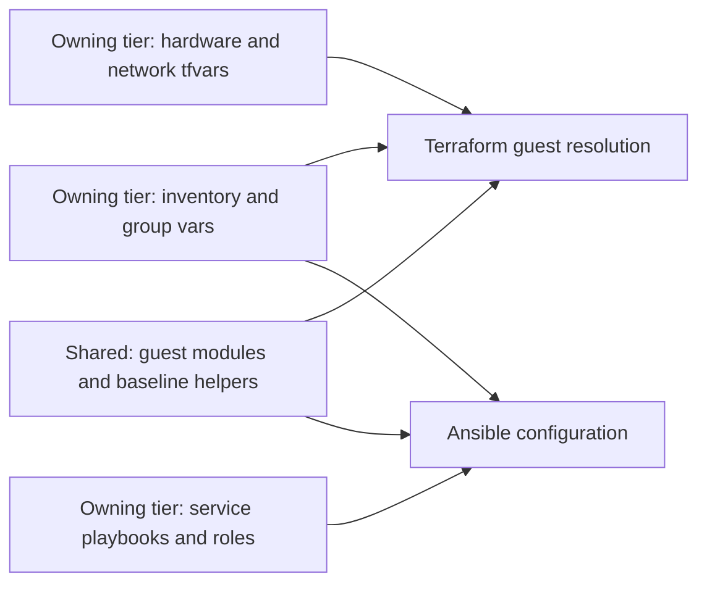

# Generated repository model

## Table of contents

- [Purpose and prerequisites](#purpose-and-prerequisites)
- [Repository ownership](#repository-ownership)
- [Inventory contract](#inventory-contract)
- [Setup ownership](#setup-ownership)
- [Run the generated automation](#run-the-generated-automation)
- [Shared code and recovery](#shared-code-and-recovery)
- [Refresh and local ownership](#refresh-and-local-ownership)
- [Automation ownership upgrade](#automation-ownership-upgrade)
- [Implementation scope](#implementation-scope)
- [References](#references)

## Purpose and prerequisites

From the cloned kit, create the collection with one command:

```bash
bash scripts/init-tier-repos.sh
```

Use `--prefix mylab` to name it `mylab-iac/` with `mylab-*` repos inside.
Use `--root /path/to/parent` to create the collection beneath that directory;
the default parent is beside this kit checkout, independent of your current
working directory. Add `--dry-run` to preview without writing.

The generator requires Python 3.9 or later and PyYAML. An existing Python
environment containing PyYAML needs no additional install. If it is missing:

```bash
python3 -m pip install -r scripts/tier-repos/requirements.txt
```

Native Windows can invoke
`python scripts/tier-repos/generate.py` with the same arguments. Run deployments
from Linux or WSL with the [deployment tooling](../getting-started/local-setup.md).
Generation needs no server, provider credentials, or hosted source control.
It creates directories and files; it does not initialize Git or create remotes.

## Repository ownership

| Repository | Owns |
| --- | --- |
| `<prefix>-tier-0` | control service code and inputs, host administration, complete template workflows, bootstrap |
| `<prefix>-tier-1` | platform service playbooks and roles, inventory, Terraform roots, cluster definitions |
| `<prefix>-tier-2` | workload playbooks, inventory, Terraform roots, project and application definitions |
| `<prefix>-shared` | cross-tier guest modules, baseline roles, common precheck and deployment helpers |
| `<prefix>-architecture` | copied upstream docs and environment-owned design, decisions, service records, runbooks |

The collection directory groups five sibling repositories and is not itself a
Git repository. The prefix defaults to `homelab`:

```text
parent/
  upstream-kit/
  homelab-iac/
    homelab-tier-0/
    homelab-tier-1/
    homelab-tier-2/
    homelab-shared/
    homelab-architecture/
```

Each child can have its own private Git history and remote. Generation does
not nest a collection repository around them or move existing checkouts.
Shared **code** is separate from shared **services**: a platform service still
has an owning tier, inventory, and state.

Tier 0 owns hardware-facing administration and all VM template lifecycles.
Tier-local workload definitions and state roots remain in place; they are not
a grant of infrastructure privileges to repository users. Current deployment
commands are operator-run. Future Tier 0-controlled execution accepts bounded
workload requests, not arbitrary code; see
[Infrastructure control](../architecture/infrastructure-control.md).

The upstream source already has this split: `tier-0/`, `tier-1/`, `tier-2/`,
and `shared/` map directly to their prefixed repository names. The generator
copies those payloads and adjusts sibling shared paths; it does not partition
an aggregate inventory or define setups in Python. Each source tier owns its
`.deployment-setups`, inventory example, and Terraform roots. See the
[source layout](infrastructure-automation-layout.md) for maintenance paths.

Each tier has the same operational layout:

```text
<prefix>-tier-N/
  .deployment-setups
  .generated-files.json
  env.local.example
  ansible/
    ansible.cfg
    playbooks/control-node.yml
    playbooks/<setup>.yml
    roles/                         # service-specific roles where needed
    inventory/hosts.yml.example
    group_vars/all.yml.example
    group_vars/all.env.yml.example
    group_vars/<setup>.yml.example
  terraform/
    common.tfvars.example
    environments/<setup>/
      main.tf
      variables.tf
      terraform.tfvars.example
  scripts/
    check-shared.sh
    init-local-files.sh
    deploy.sh
```

The initializer creates ignored working files from these examples. It creates
only setups listed in that tier's `.deployment-setups`. Actual credentials,
inventory, group vars, state, and local overrides are never copied from upstream.

Every root README is a developer-owned starter, not a refresh target. The
architecture repository includes `docs/naming-conventions.md` and project
templates alongside `docs/auto-docs/`. Start with
[Project documentation](project-documentation.md) for that layout and existing-collection upgrades.

## Inventory contract

There are three independent inventories, one per tier. Within each tier,
Terraform and Ansible consume the **same** inventory and group vars. Terraform
does not generate a second inventory after provisioning.



| File in the owning tier | Responsibility |
| --- | --- |
| `ansible/inventory/hosts.yml` | stable logical host keys and service groups |
| `ansible/group_vars/all.yml` | hostname decoration, domain, connection and baseline settings |
| `ansible/group_vars/<setup>.yml` | `platform_host_ips` and service settings |
| `terraform/common.tfvars` | platform placement, guest networks, template and storage mappings |
| `terraform/environments/<setup>/terraform.tfvars` | VM/LXC definitions keyed by those inventory host keys |

The shared `environment_guests` module reads the tier's YAML to resolve names
and IPs. The wrapper supplies the same ordered vars files to both tools:

1. `all.yml`
2. `<setup>.yml`
3. `all.<env>.yml`, when `--env` is used
4. `<setup>.<env>.yml`, when `--env` is used
5. any `--ansible-vars` files, in command-line order

Later top-level values replace earlier ones. Supply the complete
`platform_host_ips` map in an overlay; partial maps are not recursively merged.
Setup stems use underscores for `podman_runner`, `immutable_template`, and
`template_refresh`, matching the upstream conventions.

State and Terraform working data stay under each tier's
`.terraform/state/<setup>/<environment>/` and
`.terraform/data/<setup>/<environment>/`. `--env test` and production therefore
remain separate within each of the three repositories.

NetBox or another inventory application is an early Day 2 documentation service.
Recovery uses local tier inputs and operator-held material without querying it.
An exported inventory snapshot can be reviewed into a tier later; the generator
does not implement a live inventory-application integration.

## Setup ownership

The generator assigns existing setup examples as follows:

| Tier | Setups | Placement condition |
| --- | --- | --- |
| Tier 0 | `foundation`, `vault`, `hsm`, `immutable-template`, `template-refresh` | high-impact control and template builders; protected networks and recoverable local artifacts |
| Tier 1 | `edge`, `cache`, `development`, `observability`, `podman-runner` | connected platform services, edge and general runners |
| Tier 2 | `lab` | lab and workload instances |

Tier 0 also owns the template module, publication script, Packer definitions,
`terraform/templates/`, `templates/proxmox.yml.example`, and the seed-only
`ci/gitlab-templates.yml.example`. The
[template publisher](../platforms/proxmox/template-lifecycle.md) is a separate
Terraform-only workflow for unbooted AlmaLinux, Rocky Linux, and Talos images;
it is not a Linux guest setup in `.deployment-setups`. Its catalog has no guest
IPs or credentials. Template-builder VMs retain the normal inventory contract.

The setup name describes a capability; its tier describes the instance's
potential impact and ownership. Connected identity authorities, privileged
secret systems, signing services, and hypervisor administration can belong in
Tier 0. Application-scoped variants may belong in another tier. Isolate offline
root keys and custody separately; being online does not make a system Tier 1.

The generator preserves reference network values. Review bridge, subnet,
gateway, template, and VMID values against the actual environment.

Use the [network plan](../architecture/network.md#example-network-plan) and
[firewall policy](../security/firewall-policy.md) to prepare those attachments.
Tier numbers do not determine zones or subnets. Matching logical network keys
also do not imply a shared network; generation does not configure isolation.

To deploy a capability in another tier, add its Terraform root and example
vars there, register it in `.deployment-setups`, and add its playbook and precheck
mapping. Add only that tier's hosts and IPs. Extract common roles only when
multiple tiers need them; guest modules already live in shared. Give it distinct resource IDs
and state; do not transfer ownership by applying a second state to existing VMs.

The Tier 0 `hsm` run targets HSM hosts only and never runs edge ingress.
Connected service endpoints and any independently owned proxy need an explicit
interface policy. An offline custody HSM must never become a live edge backend.

## Run the generated automation

First complete Tier 0's [Day 0-1 template publication](../platforms/proxmox/template-lifecycle.md#local-workflow)
and verify the template IDs in the consuming tier's mappings. Hosted CI and the
control cluster are not prerequisites for that local workflow.

From `homelab-iac/homelab-tier-0`, initialize local working files for the Linux setup:

```bash
bash ../homelab-shared/scripts/init-local-files.sh --setup foundation --env test
```

Replace `homelab` if you used another prefix. Edit the initialized local files
and confirm network placement and permissions, then review a plan from that directory:

```bash
bash ../homelab-shared/scripts/deploy.sh foundation --env test --plan-only
```

After reviewing the plan, use the same deployment command without `--plan-only`.
The existing [script options](repository-scripts.md) apply in every tier.
In a private source checkout, start in `tier-0/` and use
`bash scripts/init-local-files.sh` or `bash scripts/deploy.sh ...`.
These same tier-local shortcuts work in generated repositories. Direct shared
calls use `../shared/scripts/` in the source checkout. The kit root is not a
deployment context.

## Shared code and recovery

Shared scripts detect the tier root from the current working directory and
check the shared code before running. The tier's `scripts/` entry points remain
shortcuts to that same implementation and also work from other directories.
Run direct shared-script commands from the tier root. Ansible
uses tier-local service playbooks and roles, with shared baseline roles as a
fallback. Each tier's precheck imports the common checks with its own collection
requirements. The generated config uses Ansible's native role path. [1]

Tier 0's `scripts/proxmox-templates.sh` is a separate local command with a local
Terraform module; image publication needs no shared checkout. Run it from the
Tier 0 root in both source and generated layouts.

Terraform roots use literal relative module sources such as
`../../../../<prefix>-shared/terraform/modules/environment_guests`. Terraform
resolves local module paths relative to the calling module. [2]

Keep the sibling names stable. Arbitrary `SHARED_REPO_DIR` overrides are not
supported because both tools must resolve the same code checkout. Record a
reviewed shared revision in environment decisions and retain that checkout,
required providers, collections, images, and recovery inputs outside the systems
being recovered. Keep an offline copy where the recovery design requires it.
An available local copy is required; a running source-control service is not.
Repository separation scopes automation inputs, but does not enforce permissions
or network policy by itself.

## Refresh and local ownership

The shared `templates/proxmox-catalog.tfvars` is seeded once as project-owned,
like root READMEs. It holds approved consumer references, not template recipes
or guest inventory. Tier 0 controls promotion; all tiers consume the same file.
Refresh preserves its contents and recorded deletions. See the
[catalog contract](../platforms/proxmox/template-catalog.md).

After updating the upstream kit, run this from its checkout:

```bash
bash scripts/init-tier-repos.sh --refresh
```

Reuse the same `--prefix` and `--root` flags as creation if customized.
Add `--dry-run` to preview. Refresh does not run the local-file initializer or
deployment scripts.

`.generated-files.json` records hashes for generated code, examples, launchers,
and documentation. Keep it with the downstream repository.
Generated `.gitattributes` keeps text files at LF line endings so checkout on
another operating system does not invalidate those hashes or break Bash scripts.

| File condition | Refresh behavior |
| --- | --- |
| New upstream file, never generated at that path | create it |
| Managed file still matches its recorded generated hash | update from the kit |
| Locally edited or unrecognized existing file | preserve and report it |
| Previously generated file deleted locally | preserve the deletion |
| Live inventory, local vars, credentials, state | never targeted |
| Root READMEs, project docs, bootstrap/cluster skeletons, CI starter, `.deployment-setups` | seed once; preserve thereafter, even when unchanged |

Source files retain their syntax and use the manifest for provenance. Every
auto-doc has a visible do-not-edit notice. A marker alone never
authorizes overwriting a file. Files produced by the older marker-only
generator are preserved when their origin cannot be verified by the manifest.
Refresh does not delete retired files, merge local edits, or commit changes.
Review reported preserved files and upstream removals before adopting an update.
Keep local guides and diagrams in `docs/owned/` and project conventions in
`docs/naming-conventions.md`; upstream guidance updates under `docs/auto-docs/`.
A locally edited example or shared module is also
preserved, so adopting upstream changes to it requires a manual comparison.

Existing READMEs become owned without being rewritten. Earlier
`docs/generated/upstream/` copies remain untouched; follow the
[documentation upgrade steps](project-documentation.md#existing-collections)
to update local links and review legacy docs.

For an older flat layout, move the existing child checkouts together into the
collection directory before refreshing, preserving their manifests, local files,
and Git histories. The generator does not move or import those repositories.

Older collections placed template builder setups in Tier 1. Refresh adds the
new Tier 0 roots without moving live inputs/state or editing owned setup lists.
Follow the [template ownership migration](../platforms/proxmox/template-lifecycle.md#existing-collections)
before applying them. Old files are preserved for review, not silently retired.

The upstream source split does not relocate generated inputs or state: their
tier-relative paths are unchanged. Private copies of the former aggregate
source tree need a deliberate migration of ignored files and state into the
owning tier before deployment. Generation never imports or moves that local data.

## Automation ownership upgrade

Older collections kept all service roles, playbooks, Packer definitions, and
template publication code in shared. Refresh creates these at their owning-tier
paths but preserves the old shared files, even when unchanged. It reports them
for review; it does not merge customizations into the new locations.

Before deploying after this update:

1. Refresh all five repositories together and review preserved-file reports.
2. Compare old shared files with the new tier files and port local changes.
   Check locally edited `ansible.cfg`, wrappers, and prechecks: service playbooks
   now live in the tier, with local roles searched before shared baseline roles.
3. Update developer-owned READMEs and CI jobs. Template jobs run
   `bash scripts/proxmox-templates.sh` from Tier 0 and no longer need a shared
   checkout or `TIER0_SHARED_COMMIT`. The CI starter is not overwritten.
4. Discard old saved plans and replan from the owning tier using existing state.
   Moving the template module source does not change its resource addresses.
   No inventory, credentials, or state is moved by this code-only update.
5. After checking all consumers, retire old shared copies manually. Do not leave
   competing old and new jobs active against the same infrastructure.

If template-builder inputs and state still belong to Tier 1, also complete the
separate [template ownership migration](../platforms/proxmox/template-lifecycle.md#existing-collections).

## Implementation scope

Generation includes the existing Linux Terraform/Ansible setups, split inventory
examples, shared automation, and upstream documentation. The Talos bootstrap,
Flux reconciliation, cluster applications, and documentation website remain
skeletons. Kustomization resource lists group files; they do not enforce the
Day 2 deployment sequence. See the [Tier 0 path](../paths/tier-0/README.md).

Offline checks run with:

```bash
python3 -B -m unittest discover -s tests -p 'test_tier*.py' -v
```

Native Ansible syntax checks require the common and Tier 0 collections from
the [local tooling prerequisites](../getting-started/local-setup.md#deployment-machine).
Tests do not install packages or connect to hosts; Windows skips native tool checks.

## References

1. [Ansible configuration and relative paths](https://docs.ansible.com/projects/ansible/latest/reference_appendices/config.html#relative-paths-for-configuration), accessed 2026-09-15.
2. [Terraform module sources](https://developer.hashicorp.com/terraform/language/modules/configuration), accessed 2026-09-15.
