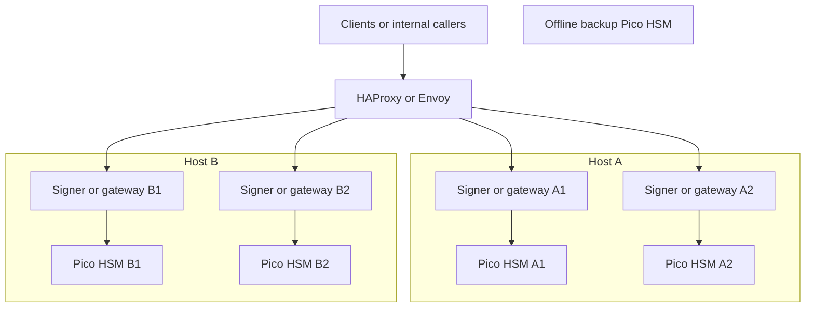

# Pico HSM Active-Active Blueprint

## Table of contents

- [Purpose](#purpose)
- [Target topology](#target-topology)
- [What active-active means here](#what-active-active-means-here)
- [What this gives you](#what-this-gives-you)
- [What it does not give you](#what-it-does-not-give-you)
- [Where this fits with Vault and OpenBao](#where-this-fits-with-vault-and-openbao)
- [Network planning](#network-planning)
- [Host roles](#host-roles)
- [Tools](#tools)
- [Provisioning and replication flow](#provisioning-and-replication-flow)
- [Operational model](#operational-model)
- [Comparison to enterprise HSM designs](#comparison-to-enterprise-hsm-designs)
- [When to use fewer or more devices](#when-to-use-fewer-or-more-devices)
- [Read more](#read-more)

## Purpose

Use this guide to plan a practical open-source HSM design with:

- `2` active hosts
- `2` Pico HSM devices per host
- `1` offline backup Pico HSM

Use this after [HSM getting started](hsm-planning-and-comparison.md) when you
already know you want the repository's concrete USB HSM deployment pattern.

This is a good fit when you want:

- a serious homelab HSM pattern
- an open-source-first PKCS#11 workflow
- active-active service continuity at the application layer
- a design that teaches real operator habits for later PKI or signing systems

This guide is the real-world USB HSM example for the repository. It shows what
this pattern solves, where it helps, and where its limits still matter.

## Target topology

Use this topology:



Figure: four active Pico HSM replicas behind stateless gateways, plus one
offline recovery device.

Repository recommendation:

- keep one gateway process pinned to one local Pico HSM
- avoid pretending the four HSMs are one native cluster
- keep the backup Pico HSM offline except during restore tests or controlled
  backup refresh

## What active-active means here

In this design, "active-active" means:

- the same approved exportable key material is restored onto four independent
  Pico HSM devices
- four stateless gateway instances can serve requests in parallel
- the load balancer routes traffic only to healthy gateways whose local HSMs
  have the expected key inventory

It does not mean:

- native HSM clustering
- automatic multi-device replication
- shared sessions across devices
- one write instantly appearing on all HSMs

This is active-active at the service layer, not at the HSM fabric layer.

## What this gives you

This improves a homelab meaningfully:

- one host can fail and service can continue on the other host
- one Pico HSM can fail and the remaining replicas can keep serving traffic
- parallel request capacity is better than a single-device design
- you can practice controlled key rollout, restore, failover, and recovery
- you get a credible hardware-backed PKCS#11 platform without enterprise HSM
  cost

## What it does not give you

Be explicit about the limits:

- no native clustered HSM guarantees
- no built-in quorum replication between the four active devices
- no automatic consistency management
- no compliance-equivalent story to major enterprise network HSM platforms

If you need those guarantees, this design is the wrong target. Use a real
enterprise HSM platform or a vendor-supported native HSM cluster model.

## Where this fits with Vault and OpenBao

For this repository, use this Pico HSM design in one of these ways:

- later PKI, signing, or bootstrap protection
- recovery or bootstrap protection for `Vault A` in a `Vault A` plus `Vault B`
  Transit auto-unseal design

Do not treat this topology as the direct Day 1 Vault Community Edition seal
path.

Open-source platform guidance:

- `Vault Community Edition`: use Shamir first, then use Pico HSM for later
  bootstrap or PKI hardening
- `Vault Community Edition` later hardening: use Pico HSM to protect recovery or
  bootstrap material for `Vault A`, while `Vault B` uses Transit auto-unseal
- `OpenBao`: if native open-source PKCS#11 seal is a hard requirement, evaluate
  OpenBao as a separate platform decision

## Network planning

Keep the network simple and deliberate.

Use at least these paths:

| Network | Purpose | Should carry |
| --- | --- | --- |
| management | admin SSH, configuration, metrics | operator access, automation |
| service | client traffic to gateways | TLS or mTLS application traffic |
| backup or recovery | optional restricted maintenance path | restore drills, backup refresh |

Design rules:

- do not expose raw USB devices over the network
- do not expose a generic PKCS#11 endpoint directly to callers
- keep HSM access host-local through OpenSC or equivalent middleware
- expose only the gateway or signer service to the rest of the environment
- keep the offline backup device off the network and disconnected by default
- protect gateway traffic with TLS, and prefer mTLS for internal callers when
  the service is security-critical

## Host roles

Use these roles:

| Role | Count | Purpose |
| --- | --- | --- |
| load balancer | `1-2` | health checks and traffic distribution |
| gateway hosts | `2` | run signer or PKI application instances |
| local Pico HSM devices | `2` per host | one HSM per gateway instance |
| offline backup device | `1` | recovery and backup validation only |

Guidance:

- do not attach one Pico HSM to multiple hosts
- keep each active device local to one host
- keep one source-of-truth HSM for provisioning and rollout

## Tools

Use open-source tools wherever possible.

Recommended host-side tools:

- `pcscd` for smart-card service access
- `OpenSC` for PKCS#11 integration and utilities
- `pkcs11-tool` for object inspection, import, export, wrap, and restore
- `openssl` for key and certificate validation
- `p11tool` when useful for extra PKCS#11 inspection and testing
- `HAProxy` or `Envoy` for app-aware load balancing
- `systemd` to keep gateway processes deterministic

Useful verification commands:

```bash
opensc-tool -l
pkcs11-tool --list-slots
pkcs11-tool --list-objects --pin <PIN>
openssl x509 -in cert.pem -text -noout
```

For Pico HSM, prefer standard middleware and tools instead of inventing custom
host tooling unless you have a very specific application need.

## Provisioning and replication flow

Use one-way controlled replication.

1. Choose one active device as the source-of-truth HSM.
2. Initialize the source device with the intended PIN, labels, domains, and key
   policy.
3. Generate or import the production keys on the source device.
4. Create the DKEK or wrap-key material and split custody as required.
5. Export the approved objects under wrap.
6. Restore the wrapped objects onto the other three active devices.
7. Restore the same approved objects onto the offline backup Pico HSM.
8. Verify IDs, labels, and required objects on all five devices.
9. Only then place the four active gateways into service.

Treat this as release management for keys, not as organic cluster sync.

## Operational model

Run the service as stateless request handling.

Safe routing rules:

- route requests only to healthy gateway instances
- mark a gateway unhealthy if its local HSM is missing required objects
- fail over only among nodes whose inventories are verified equal
- keep sessions local to the gateway and local HSM pair

Safe change rules:

- make key changes on the source-of-truth HSM
- export under wrap
- restore to peers
- verify inventories
- then switch or broaden traffic

Operational risks to plan for:

- key drift between replicas
- partial rollout of new key inventory
- shared operator credentials across too many hosts
- losing both active and backup custody material at the same time

## Comparison to enterprise HSM designs

This Pico HSM pattern is valuable, but it is not the same as enterprise network
HSM architecture.

| Topic | Pico HSM active-active pattern | Enterprise network HSM |
| --- | --- | --- |
| Cost | low | high |
| Tooling | open-source-heavy | vendor-heavy |
| Key replication | orchestrated by you | often supported by vendor workflow |
| HA semantics | service-layer failover | usually stronger built-in HA features |
| Compliance story | practical, but limited | much stronger formal certification posture |
| Learning value | excellent | excellent, but expensive |

This is the right way to frame the gain:

- for a homelab, it is a serious improvement over one USB HSM on one host
- it builds operator skill that transfers to larger environments
- it gives you real hardware-backed custody and failure handling
- it does not give you enterprise HSM guarantees just because four devices are
  active

## When to use fewer or more devices

Use this rough sizing rule:

| Shape | Good fit |
| --- | --- |
| `1` active plus `1` offline backup | learning, offline CA, very small lab |
| `2` active plus `1` offline backup | small service or small PKI |
| `4` active across `2` hosts plus `1` offline backup | serious homelab active-active design |
| more than `4` active USB HSMs | only when measured throughput or separation-of-duty needs justify the extra complexity |

For most homelabs, `4` active plus `1` offline backup is already the upper end
of what is worth operating before enterprise network HSM tradeoffs start to look
more attractive.

## Read more

- [HSM getting started](hsm-planning-and-comparison.md)
- [Vault HSM hardening options](vault-hsm-hardening-options.md)
- [Vault bootstrap](../getting-started/vault-bootstrap.md)
