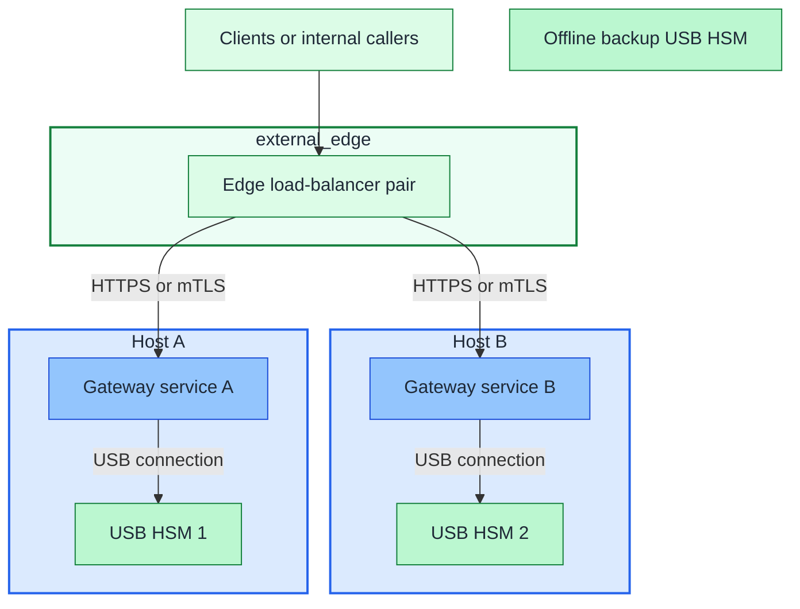

# USB HSM Active-Active Deployment Guide

## Table of contents

- [Purpose](#purpose)
- [Prerequisite](#prerequisite)
- [Default deployment](#default-deployment)
- [What you configure](#what-you-configure)
- [IaC used for this](#iac-used-for-this)
- [How to shape the deployment](#how-to-shape-the-deployment)
- [How to maintain it](#how-to-maintain-it)
- [References](#references)

## Purpose

Use this guide when you want to deploy the USB HSM pattern from this repo.

Classify the service by the authority of its keys: domain-wide signing belongs
in Tier 0; a narrowly scoped platform service may belong in Tier 1. Connected
Tier 0 gateways use protected Control networks. Offline root-key custody is a
separate deployment and must never become a live edge backend. See
[setup ownership](../reference/generated-repository-model.md#setup-ownership).

The shipped `hsm` setup provisions hosts and applies the OS baseline only.
Device configuration, gateway software, authorization, and ingress integration
remain operator work; this is not a complete HSM service deployment.

It stays focused on:

- what you need to configure
- what the Terraform and Ansible layers deploy
- what you still do manually around the HSM devices
- what to maintain after the first rollout

The current reference implementation is `Pico HSM`. You can keep the same
topology with `SoftHSM` when you want a software-only rehearsal path, or adapt
it to other USB-backed PKCS#11 devices such as `YubiHSM 2` [1][2][3][4][5].

## Prerequisite

Before you start:

- the shared-service edge load-balancer set is already deployed in
  `external_edge`
- the deployment machine already has `ansible-core` and `terraform`
- the edge load-balancer hosts exist in their owning repo's inventory
- the edge owner has approved the specific gateway endpoint contract; gateway
  administration is not exposed through it
- the ingress example needs integration before it can publish a service; it
  only renders a backend snippet, not a frontend, validation, or reload

For the load-balancer prerequisite, start with
[Edge proxy path](../paths/shared-services/edge.md).

## Default deployment

The default shape in this repo is:

- the deployed edge load-balancer set from the `edge` setup
- `2` gateway hosts on the `cryptography` network in the Control zone
- `1` local USB HSM or software token per gateway host
- `0-1` helper or recovery VM in `ceremony`
- `1` offline backup device or equivalent recovery artifact



Figure: the default path is the deployed shared-service edge load-balancer in
front of two gateway hosts, one local USB HSM per host, and one offline backup
device.

Keep these boundaries:

- one gateway service talks only to one local token
- the deployed edge load balancer stays in the shared-service layer and is a
  prerequisite here
- active devices are independent replicas, not a native HSM cluster
- USB or PKCS#11 access stays host-local

## What you configure

Before you deploy, fill in these inputs.

### Network zones

These are logical `network_zones` attachment keys, not firewall-zone names. Use
[Network architecture](../architecture/network.md).

The gateway deployment uses:

| Network key | Use in this guide |
| --- | --- |
| `cryptography` | active gateway hosts and optional issuing CA placement |
| `ceremony` | optional helper, recovery VM, or root-CA path when you want a separate ceremony network |

These existing networks are only references here:

| Network key | Why it still matters here |
| --- | --- |
| `external_edge` | already deployed edge load balancer or load-balancer set reaches the cryptography hosts |
| `management` | admin access, automation, and metrics reach the HSM hosts |
| `application` | shared internal callers may reach the cryptography hosts if you expose them internally |
| `identity` | identity or PKI dependencies may still need controlled reachability to issuing services on the cryptography network |

The linked source examples belong to Tier 0, including connected gateways
whose keys carry Tier 0 authority. Edit the owning tier's Terraform inputs.
A separate, lower-impact deployment needs its own host keys, VMIDs, IPs, and
state; do not move root-trust authority into Tier 1 merely to make it reachable.

- [`terraform/common.tfvars.example`](../../tier-0/terraform/common.tfvars.example)
  for the default platform node, shared storage, deployable guest networks,
  template IDs, and SSH keys
- [`terraform/deployments/hsm/terraform.tfvars.example`](../../tier-0/terraform/deployments/hsm/terraform.tfvars.example)
  for the gateway and helper layer

Set the values your environment needs for `cryptography` and optional
`ceremony`, such as bridge, VLAN, subnet, gateway, and addressing conventions.
Use the site network plan for `external_edge`, `management`, `identity`, and
`application`. Do not copy another tier's entire inventory or state to publish
an endpoint.

### Firewall openings

Scope these candidate rules to named hosts and approved listeners, not entire
networks. The keys below identify networks; use their actual zone assignments
from the site plan. Ports alone do not authorize signing operations.

| Source network / host | Destination network / host | Default port or protocol | Purpose |
| --- | --- | --- | --- |
| `external_edge` | `cryptography` | `8443/TCP` | deployed edge load balancer to gateway service |
| approved Tier 0 admin host in `management` | `cryptography` | `22/TCP` | SSH, Ansible, and troubleshooting |
| custody-local admin host | `ceremony` | `22/TCP` if required | local administration without a connected-network route |
| `application` | `cryptography` | `8443/TCP` optional | internal callers using the same gateway service endpoint |
| offline `ceremony` | connected `cryptography` | none | approved offline transfer only |

Keep these boundaries:

- the default gateway backend port in this repo is `8443/TCP` through
  `hsm_proxy_ingress_backend_port` in `ansible/inventory/hosts.yml`, with the
  same default in `roles/hsm_proxy_ingress`
- the default Ansible SSH port in this repo is `22/TCP`
- if you change the gateway service port from `8443`, update both the firewall
  rule and `hsm_proxy_ingress_backend_port`
- do not open extra metrics or observability ports unless you explicitly
  configure and need them
- do not expose raw USB devices or generic PKCS#11 endpoints over the network
- keep USB or token access host-local on each gateway
- an offline helper does not create a route between `ceremony` and connected networks

### VM layout

Edit the `vm_instances` maps to match the shape you want.

| Component | Terraform default | Inventory action | Current example range | Edit here |
| --- | --- | --- | --- | --- |
| gateway VMs | `hsm-1`, `hsm-2` active | `hsm-1`, `hsm-2` present by default | `1-8` | `terraform/deployments/hsm/terraform.tfvars` |
| helper VMs | `crypto-admin-1` commented, default `0` | uncomment `crypto-admin-1` when enabled | `0-2+` as needed | `terraform/deployments/hsm/terraform.tfvars` |

The deployed edge load balancer stays in the shared-service layer. Start here with
the gateway and helper hosts.

The Tier 0 inventory examples include `hsm-1` and `hsm-2`. If you add or
remove HSM hosts, update both the Terraform `vm_instances` map and the Ansible
IP map in their owning repo. Use distinct allocations for additional instances.

### HSM mode

Choose one of these before rollout:

| Mode | What changes |
| --- | --- |
| `Pico HSM` | hardware attach, device initialization, backup or restore ceremony [2][3] |
| `SoftHSM` | no USB device, software token per host [1] |
| `YubiHSM 2` | same host pattern, but connector or product-specific runtime details may differ [4][5] |

Keep the host layout the same across all three modes.

## IaC used for this

These source paths provide the reusable host pattern. Inputs are Tier 0-owned
by default; connectivity does not change that ownership:

| IaC path | Used for here | You edit |
| --- | --- | --- |
| [`terraform/common.tfvars.example`](../../tier-0/terraform/common.tfvars.example) | tier-wide Terraform inputs, including the default platform node | your local `terraform/common.tfvars` |
| [`terraform/deployments/hsm/terraform.tfvars.example`](../../tier-0/terraform/deployments/hsm/terraform.tfvars.example) | deploys the gateway VMs and optional helper VMs | `terraform/deployments/hsm/terraform.tfvars` based on `.example` |
| [`ansible/inventory/hosts.yml.example`](../../tier-0/ansible/inventory/hosts.yml.example) | stable HSM host keys and inventory groups | your local `ansible/inventory/hosts.yml` |
| [`ansible/group_vars/all.yml.example`](../../tier-0/ansible/group_vars/all.yml.example) | shared Ansible defaults and the default environment | your local `ansible/group_vars/all.yml` |
| [`ansible/group_vars/all.env.yml.example`](../../tier-0/ansible/group_vars/all.env.yml.example) | environment-specific hostname decoration and domain | your local `ansible/group_vars/all.<env>.yml` |
| [`ansible/group_vars/hsm.yml.example`](../../tier-0/ansible/group_vars/hsm.yml.example) | Tier 0 HSM host IPs; edge hosts stay in their own repo | your local `ansible/group_vars/hsm.yml` |
| [`ansible/playbooks/hsm.yml`](../../tier-0/ansible/playbooks/hsm.yml) | reruns baseline OS preparation on the HSM hosts | inventory and host variables |
| [`ansible/playbooks/ingress.yml`](../../tier-1/ansible/playbooks/ingress.yml) | renders an HAProxy backend snippet from the supplied `hsm_gateways` inventory group | endpoint references and edge configuration in the edge-owning repo |
| [`scripts/deploy.sh`](../../tier-0/scripts/deploy.sh) | repository wrapper for the mapped precheck, Terraform, and Ansible flow | choose the `hsm` setup when you are ready to run it |

The `hsm` wrapper runs only the HSM baseline; it never configures edge ingress.
The Tier 1 ingress example reads `hsm_gateways` from the supplied inventory;
it does not discover another tier's endpoints or state. The edge owner must
maintain approved endpoint references and integrate the snippet into HAProxy,
including listener policy, validation, and reload. Gateway lifecycle and
credentials remain in the gateway-owning repo.

Use the shared ownership rule from
[Infrastructure automation layout](../reference/infrastructure-automation-layout.md):
Ansible inventory owns stable logical host keys and service groups. Ansible
`all` group vars own hostname decoration and domain. HSM group vars own the
HSM rollout IP map, while the HSM Terraform environment owns hardware
placement and Proxmox tags.

## How to shape the deployment

Shape the HSM deployment around one stable service pattern and then change the size by
data only.

- keep the edge load balancer in the shared-service layer and treat it as a
  prerequisite here
- keep the default `2` gateway hosts unless you have measured reasons to change
  the count
- grow or shrink gateway and helper counts only through `vm_instances`
- keep active gateways in `cryptography`
- enable `ceremony` only when you really want a helper, recovery, or root-CA
  adjacency path
- keep lifecycle inventory aligned with ownership: `hsm_gateways` and optional
  `crypto_admin` in the gateway repo; `edge_load_balancers` in the edge repo
- keep one local token or software token per gateway host
- keep the live traffic path and the ceremony path separate even when they use
  the same HSM product family

When you are ready to run the setup, use the repository deployment wrapper with
the `hsm` setup. Keep the exact execution flow in the wrapper rather than
repeating it in this guide. That wrapper also checks the required local config
files for the setup before it runs.

After the wrapper run:

- attach the intended USB HSM device to each gateway host, or initialize one
  software token per host if you are using `SoftHSM` [1]
- validate host-local PKCS#11 access on every gateway host before sending any
  traffic through the edge load balancer
- initialize one device as the source of truth, create the intended keys, and
  replicate only the approved wrapped objects to the other active device and
  the offline backup [2][3][4][5]
- test gateway health, device loss, host loss, and restore from the offline
  backup before you treat the setup as production-ready

Useful local checks:

```bash
opensc-tool -l
pkcs11-tool --list-slots
pkcs11-tool --list-objects --pin <PIN>
openssl x509 -in cert.pem -text -noout
```

## How to maintain it

Keep maintenance simple and repeatable.

### Health checks

Treat a gateway as healthy only when:

- the service is reachable
- login and session setup work against the expected local token
- a harmless crypto operation succeeds with the expected key label or ID

Do not rely on slot visibility or object listing alone.

### Device identity

Keep one gateway bound to one expected local token:

- do not rely on transient slot numbering alone
- pin by stable reader, token label, serial, or similar identity when possible
- start gateway services only after the expected local token is present
- fail closed when the expected token is missing or mismatched

### Replica updates

When you change key material:

1. change it on the source-of-truth device
2. export under the approved wrap or backup process
3. restore to the other active device
4. refresh the offline backup device
5. verify labels, IDs, and expected objects before returning traffic

Do not treat the offline backup device as a routine active peer.

### Routine checks

Keep at least these checks in your normal maintenance cycle:

- verify gateway health from the edge load-balancer path
- verify local PKCS#11 access on each gateway host
- compare expected object inventory across active devices
- test restore from the offline backup on a controlled schedule
- review whether your current `vm_instances` layout still matches the load

## References

1. [SoftHSM](https://www.softhsm.org/) (accessed 2026-09-19)
2. [PicoKeys Documentation: Capability map](https://docs.picokeys.com/picohsm/features/) (accessed 2026-09-19)
3. [PicoKeys Documentation: Backup and restore](https://docs.picokeys.com/picohsm/backup-restore/) (accessed 2026-09-19)
4. [Yubico: YubiHSM PKCS#11 Module](https://developers.yubico.com/yubihsm-shell/yubihsm-pkcs11.html) (accessed 2026-09-19)
5. [Yubico: yubihsm-connector](https://developers.yubico.com/yubihsm-connector/) (accessed 2026-09-19)
