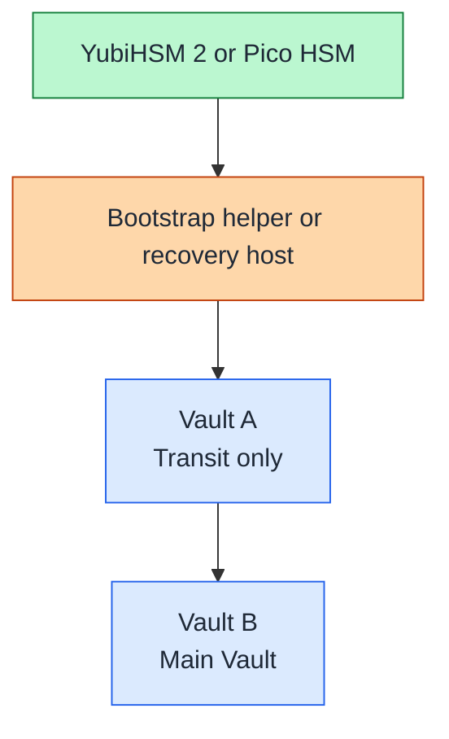

# Vault HSM hardening options

## Table of contents

- [Purpose](#purpose)
- [Day 1 position](#day-1-position)
- [Candidate devices](#candidate-devices)
- [Community Edition paths](#community-edition-paths)
- [Recommended OSS architecture](#recommended-oss-architecture)
- [What this gives you](#what-this-gives-you)
- [What this does not give you](#what-this-does-not-give-you)
- [Planned guide scope](#planned-guide-scope)
- [Decision rule](#decision-rule)
- [Read more](#read-more)
- [References](#references)

## Purpose

Use this as the authoritative repository note for how on-premises HSMs fit into
the Vault path. Keep Day 1 bootstrap simple here, and move the detailed HSM
tradeoffs into this document rather than repeating them across the rest of the
docs.

## Day 1 position

For this repository, an on-premises HSM is a later hardening step, not a Day 1
dependency.

Use this order:

1. bootstrap one dedicated Vault VM
2. use Shamir seal for the first node
3. move shared secrets into Vault
4. evaluate HSM-backed hardening and PKI workflows later

Important Vault note:

- Vault documents the `pkcs11` seal as a Vault Enterprise feature [1]
- Vault documents Transit auto-unseal across Vault versions, which is why it is
  the repository's preferred later hardening path for Community Edition [2][3]

## Candidate devices

Current on-premises device paths worth highlighting for Vault hardening:

- `YubiHSM 2`: mature PKCS#11 option; Yubico documents both a PKCS#11 module
  and a connector-based communication model [4][5]
- `Pico HSM`: small on-premises PKCS#11-capable device; PicoKeys docs describe
  both PKCS#11 support and wrapped backup or restore through DKEK workflows [6][7]

Repository positioning:

- `Pico HSM` is a strong open-source-friendly learning and implementation path
  for homelabs that want to practice real PKCS#11, operator custody, bootstrap,
  and PKI workflows
- `YubiHSM 2` is a practical next step when you want a more mature commercial
  device path, cleaner vendor tooling, and the option of a FIPS-capable device
  for business-facing or regulated environments
- the operational patterns learned on `Pico HSM` should transfer well to
  `YubiHSM 2`, because both fit the same general PKCS#11 and hardware-backed
  key-custody model [4][6]

## Community Edition paths

For Vault Community Edition, there are two realistic paths:

1. use the supported Transit auto-unseal pattern with a separate small Vault
   cluster that acts as the unseal service for the main Vault cluster [2][3]
2. evaluate OpenBao later if native open-source PKCS#11 seal is a hard
   requirement for your environment [8]

The first path is the repository default for later HSM hardening. It keeps
Vault bootstrap simple while still letting the operational trust chain depend on
hardware-backed secrets.

## Recommended OSS architecture

For an open-source-first hardening path, use two Vault clusters:

- `Vault A`: small hardened Vault used only for Transit auto-unseal
- `Vault B`: main application Vault used by workloads and operators
- `YubiHSM 2` or `Pico HSM`: protects the smallest possible bootstrap or
  recovery secret set for `Vault A`

Use this trust flow:

Figure: the HSM protects recovery or bootstrap material for `Vault A`, and
`Vault A` provides Transit auto-unseal for the main Vault.

Repository guidance for this pattern:

- keep `Vault A` boring and small
- enable only what `Vault A` needs for the unseal role, mainly `transit`, an
  audit device, and a minimal auth path for `Vault B`
- create one dedicated transit key such as `autounseal`
- keep HSM access off normal cluster nodes where possible
- prefer one dedicated bootstrap or recovery host with PKCS#11 access instead
  of attaching the HSM to every Vault node

This means the HSM does not directly protect the main Vault barrier key in
Community Edition. Instead it protects the bootstrap or recovery path for the
small Vault that unseals the main Vault.

## What this gives you

This architecture gives you a useful open-source compromise:

- routine restarts of the main Vault do not require operators to enter Shamir
  shares
- the operational trust chain is not anchored only in ordinary host storage
- the HSM protects a much smaller and easier-to-audit secret set
- you can keep the main Vault focused on application and shared secrets

## What this does not give you

This is not the same as Vault Enterprise HSM seal [1].

Do not describe this pattern as:

- native HSM seal for Vault Community Edition
- HSM-wrapped Vault root or barrier keys
- Enterprise-style seal wrapping
- compliance-equivalent to native PKCS#11 seal support

For those claims, Vault Enterprise is the supported path [1].

## Planned guide scope

The broader USB HSM guide set should cover:

1. device initialization, PIN handling, backup, and operator custody
2. PKCS#11 middleware setup on the admin host and the target Linux VM
3. validation with `pkcs11-tool` and `openssl`
4. Vault A and Vault B layout for Transit auto-unseal in Community Edition
5. a tiny bootstrap or recovery helper flow for HSM-protected recovery
6. Vault Enterprise HSM seal as an advanced optional track
7. OpenBao lab evaluation as a separate platform decision track
8. future PKI workflows around HSM-held CA or signing keys
9. recovery expectations, replacement procedures, and what is still kept offline

Keep Vault bootstrap and HSM hardening as separate tracks in that guide so the
basic Vault path stays easy to follow.

## Decision rule

Use this rule of thumb:

- want the fastest secure bootstrap: use Shamir first
- want the best open-source compromise: use `Vault A` plus `Vault B` with
  Transit auto-unseal and keep the HSM on the `Vault A` bootstrap or recovery
  path [2][3]
- want native open-source PKCS#11 seal: evaluate OpenBao in a lab first [8]
- want the most direct supported PKCS#11 seal path: use Vault Enterprise [1]
- want stronger on-premises key custody for later PKI work: evaluate YubiHSM 2
  or Pico HSM after Vault is already running

## Read more

- [HSM getting started](hsm-planning-and-comparison.md)
- [USB HSM active-active blueprint](usb-hsm-active-active-blueprint.md)
- [Vault bootstrap](../getting-started/vault-bootstrap.md)
- [Secret strategy](secret-strategy.md)

## References

1. [HashiCorp Developer: HSM PKCS11 seal configuration](https://developer.hashicorp.com/vault/docs/configuration/seal/pkcs11) (accessed 2026-04-19)
2. [HashiCorp Developer: Transit seal configuration](https://developer.hashicorp.com/vault/docs/configuration/seal/transit) (accessed 2026-04-19)
3. [HashiCorp Developer: Transit auto-unseal best practices](https://developer.hashicorp.com/vault/docs/configuration/seal/transit-best-practices) (accessed 2026-04-19)
4. [Yubico: YubiHSM PKCS#11 Module](https://developers.yubico.com/yubihsm-shell/yubihsm-pkcs11.html) (accessed 2026-04-19)
5. [Yubico: yubihsm-connector](https://developers.yubico.com/yubihsm-connector/) (accessed 2026-04-19)
6. [PicoKeys Documentation: Supported features](https://docs.picokeys.com/picohsm/features/) (accessed 2026-04-19)
7. [PicoKeys Documentation: Backup and restore](https://docs.picokeys.com/picohsm/backup-restore/) (accessed 2026-04-19)
8. [OpenBao: pkcs11 seal](https://openbao.org/docs/2.3.x/configuration/seal/pkcs11/) (accessed 2026-04-19)
